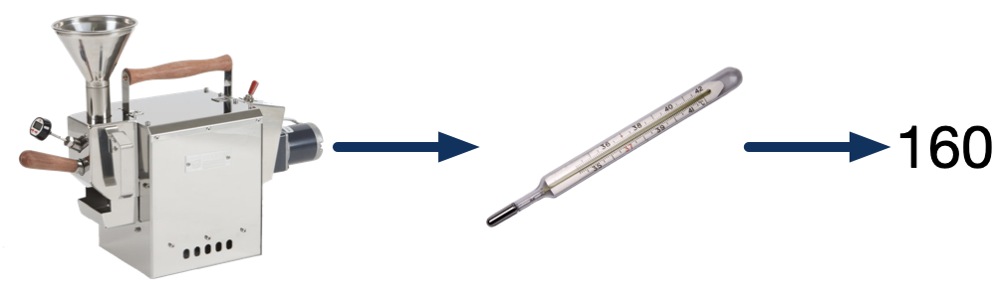
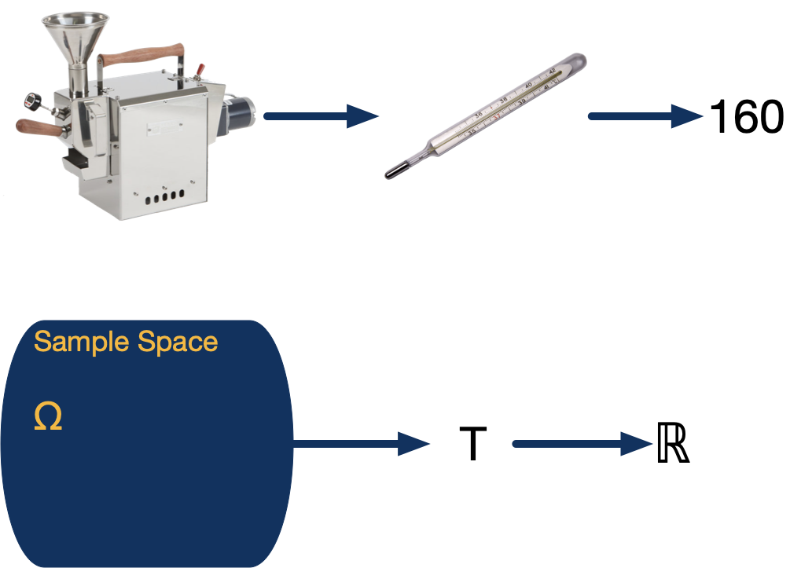
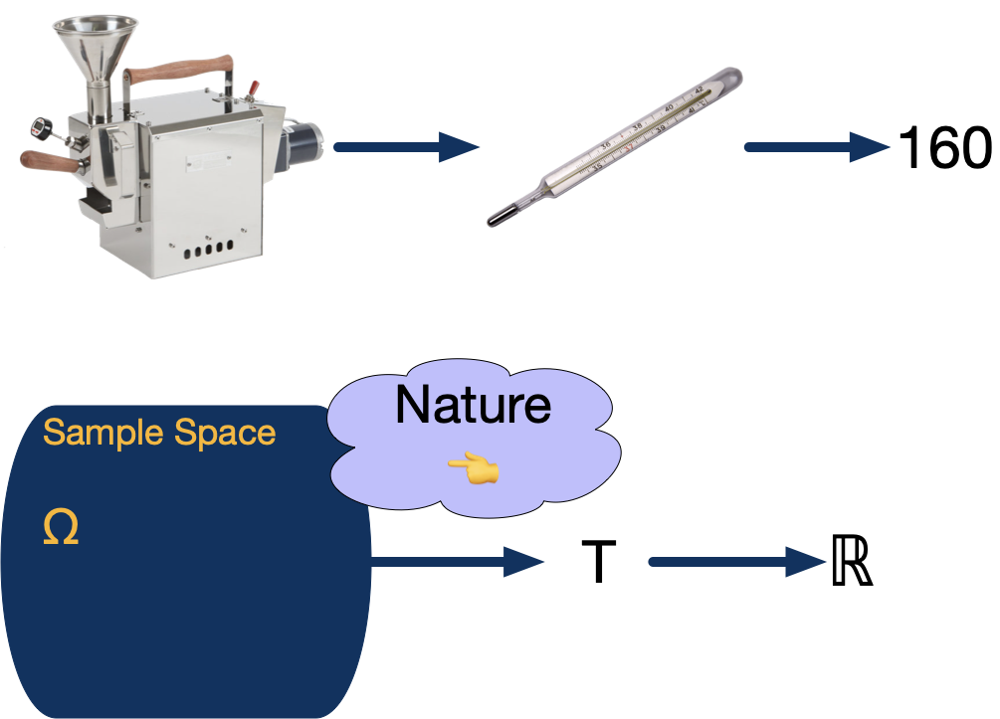

# Introduction

## Plan for the Week

Two sections:

1. Defining random variables
2. Joint distributions

- This is a foundation week.
- Random Variables are building blocks of statistical models.
- Thinking of the analogy with Jazz music, you'll want your understanding of them to be rock solid.
- So we're going to be very mathematically precise in defining what these are.

## Plan for the Week (cont.)

At the end of this week, you will be able to:

- Understand how random variables fit as a part of statistical modeling
- Apply the mathematical tools we have for characterizing random variables
- Solve problems by applying properties of expectation and variance

# Part 1: Introducing Random Variables

## What Is a Random Variable?

**Intuition:**

- A model for where the numbers in data come from.
- Like a regular variable but with uncertainty about its value (with some probability of taking on different values).

**Definition:**

> Given probability space $(\Omega, S, P)$, a *random variable* is a measurable function from $\Omega$ to $\mathbb{R}$.

- A Random Variable is the fundamental building block of a statistical model, but what is it?
- Intuitively, we're used to variables in our datasets. They have one value. But as statisticians, we need a way to model variables acknowledging that different values are possible.
- Finally, we have the formal definition that you'll see in your textbook. A random variable is a function from a probability space to $\mathbb{R}$. This one, unfortunately, leaves students scratching their heads. It doesn't seem to capture the intuition.

## What Is a Random Variable (Formally)?

{width=100%}

- I'm going to try to make the formal definition make more sense. And I'll do it by telling a very stylized story about how a variable gets the value it has.
- This story is about something I do in my spare time, which is roast coffee. It has three characters.
- The first character is my coffee roaster. This is in the actual real world. It has some state: the atoms are moving with some velocity, the proteins in the beans are in some configuration - hopefully the proteins aren't burnt.
- Because I'm serious about my roasting, I want some data. So the second character is this thermometer. It represents measurement or observation. Think of the state of the roaster as an input to the thermometer.
- The final character is the output of the thermometer: a regular old variable. 160 degrees.

## What Is a Random Variable (Formally)?

{width=100%}

- Now as statisticians, we think that there must be some randomness in that number. In other words, if you could magically rewind time and start roasting again, you might get a different number.
- You might not actually believe this - if we could recreate the start of the experiment EXACTLY, down to the location of atoms, maybe you think you'd get the same number. But at least as statisticians, we want a model for how this number was created that involves randomness. Here's how we do it...
- First, we need a probability space. Each outcome in this space represents one possible state of my coffee roaster. There is a probability function that tells you how probable different states are.
- Next, we have the random variable. This is like the thermometer, but it doesn't give us a single number. It's a function that takes in any outcome - any state of the coffee roaster.
- Finally, the last character is the real numbers. The random variable is a function from $\Omega$ to the reals.

## What Is a Random Variable (Formally)?

{width=100%}

- That's the setup. Let's see what happens when the experiment runs.
- First, nature reaches in and selects one possible outcome. Remember this represents one possible arrangement of all the atoms in my roaster.
- Use annotation, label outcome $\omega$, draw arrow to $T$, draw another arrow to 160.

...