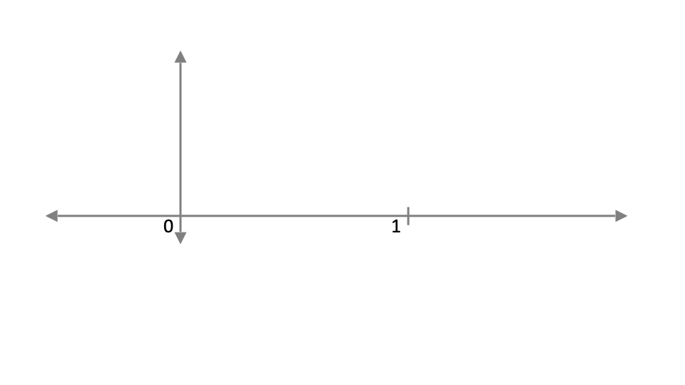
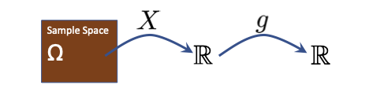
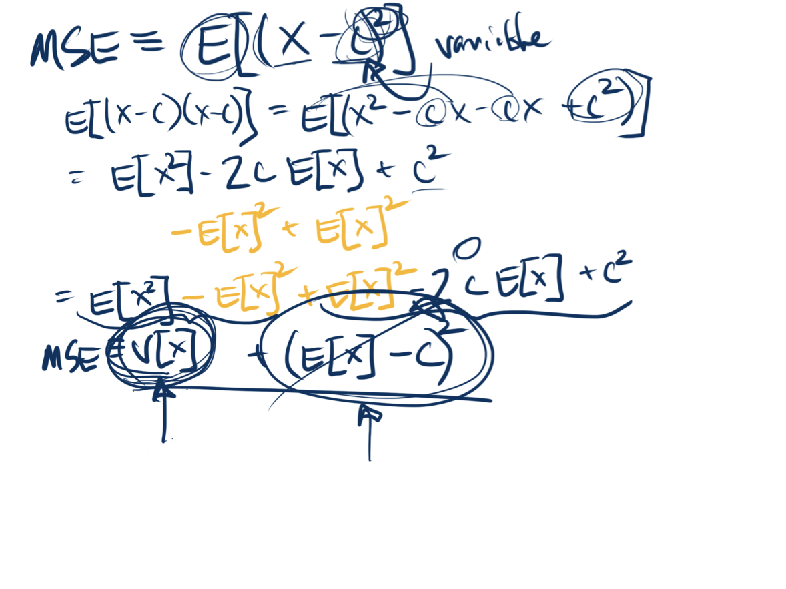
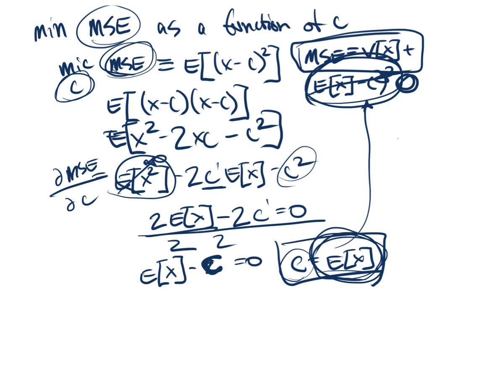
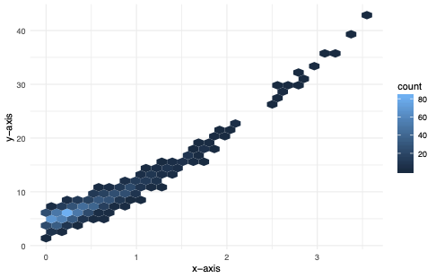
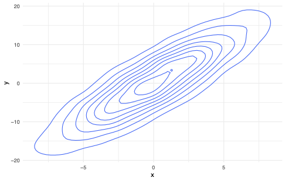
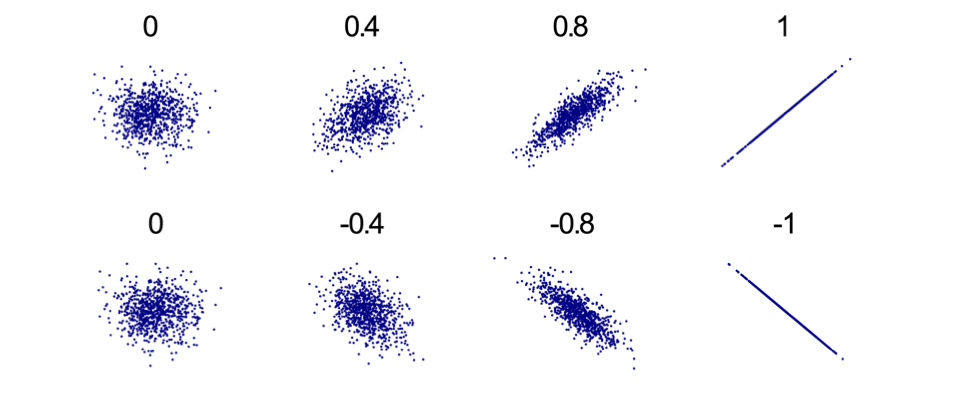
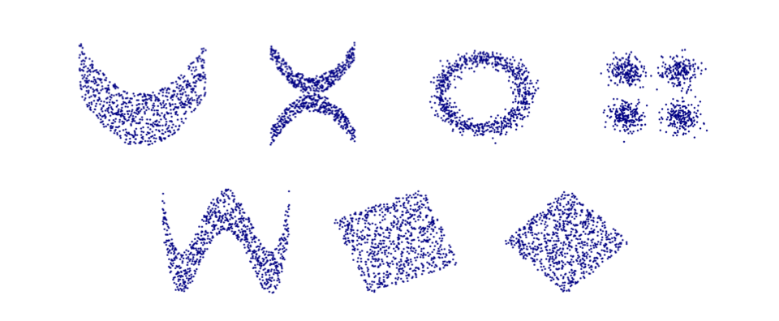

# 

## 

\maketitle

# The Importance of Summarizing Distributions

## 

\hspace{-1cm}

 Image: stephenwolfram.com. Data Science of the Facebook World.

::: {.notes}

- probability distributions are really flexible objects.  that's a great strength because they can represent a lot of different things
- The number of friends on a social network.
:::

## 

\hspace{-1cm}

::: {.notes}

- The location of photons in a physics experiment.
:::

## 

\hspace{-1cm}

::: {.notes}

- The liberal or conservative lean of members of congress.
- All of these example only use one random variable, and their distributions have very different shapes.
- To represent all of these, we need a flexible mathematical object.  We can change a distribution in an infinite number of ways.  move it up a bit in one place, move it down in another.  That's what we need to represent the rich variety of phenomena that we want to model.
- But there's a down side to all this flexibility...
:::

## The Downside of Flexibility
Highly flexible objects present obstacles.
  
- Cannot specify density for every value \note[item]{we can't select a density for every possible point - that's an infinite number of choices.  and how could I ever communicate those choices to you?}
- Cannot communicate or reason about every value \note[item]{Even if I could somehow transmit that information to
      you, what could you do with it?} \note[item]{You can't really
      compare each point of one density against another.}
- Cannot estimate density at every value given data \note[item]{Finally, you'll want to use data to learn about your
      distribution, but with finite data, you can't estimate density
      at every point.}

  Why not restrict to distributions in a parametric family?
  
- The real world isn't that neat!
- "Agnostic" approach: minimal assumptions on the model

## Why Summarize?
_ Summary tools are the hooks we use to estimate, reason
    about, and communicate about random variables._

## Foundational Summary Tools
One Random Variable:

- Expectation: represents the center of a distribution
- Variance: represents the dispersion of a distribution

Two Random Variables

- Covariance: a generalization of variance
- Correlation: an intuitive measure of linear association

::: {.notes}

- In this unit, we're going to cover a few of the most foundational summary tools out there.
- We'll start with a single random variable.
- Expectation, as we'll see, is like a mean, but a version
    of the mean for random variables. Variance is about how spread out a distribution is.
- Then we'll move on to pairs of random variables - how do we summarize relationships?
- covariance and correlation are tools that capture the strength of a linear relationship in a single number
- At the end of this unit, you'll be much better placed to study, and communicate about random varibles.
:::

# Review of Operators and Functions

## Review of Operators and Functions

::: {.notes}

- As you start reading about expectation, it's good to be reminded that expectation is an example of an operator.  Actually, all the summary tools we're going to cover are operators, so let's quick review what that word means.  What's the difference between a function and an operator.
- When we say a function of a random variable, we mean a
    function from R to R
- A function takes the output of a
    random variable as input and maps it to a new real number
- putting a random variable into a function gives you
    another random variable
- Expectation is an
     operator, which means it takes an entire random variable as
    input
- So, for example, E
:::

# Reading: Summarizing Distributions

## Reading Assignment
Read 
_Foundations of Agnostic Statistics_
, page 44 to the top
  of page 47, stopping after you read theorem 2.1.5.

# Lightboard: Expectation of a Discrete Random Variable

## Expectation of a Discrete Random Variable

## Expectation for Discrete Random Variables

:::: {.columns}

::: {.column width="50%"}

$\E[X] = \sum_{x \in supp[X]} xf(x)$\note[item]{this is the
        equation for an average, but it's a weighted average.  The
        weight comes from the probability.}
      Ex 1 :$X \sim \text{Bernoulli}(\alpha)$$f(x) = \begin{cases}
        \alpha, & x=1

        1-\alpha, & x=0

        0, &otherwise
      \end{cases}$$\E[X] = 0 \cdot(1-\alpha) + 1 \cdot \alpha = \alpha$\note[item]{statisticians like to do this - define things so the
        expectation is the parameter}\note[item]{And the
        interpretation is really useful - the expectation is the
        probability of success}
:::

::: {.column width="55%"}

      Ex 2:$Y \sim \text{Geometric}(\beta)$
      Let$J_i$ be the event printer jams day$i$.$P(J_i) = \beta$, all ind.

      Let$Y$ be days until first jam$P(Y=1) = P(J_1) = \beta$$P(Y=2) = P( J_1^C, J_2 ) = (1-\beta) \beta$$P(Y=3) = (1-\beta)^2 \beta$$f(x) = \begin{cases}
        (1-\beta)^{x-1}\beta , & x \in \{1,2...\} 

        0, &otherwise
      \end{cases}$$\E[Y] = \sum_{x = 1}^\infty x (1-\beta)^{x-1} \beta$$= 1/\beta$
:::

::::

# Lightboard: Expectation of a Continuous Random Variable

## Expectation of a Continuous Random Variable

\hspace{4cm}

## Expectation for Continuous Random Variables

:::: {.columns}

::: {.column width="50%"}

$\E[X] = \int_{-\infty}^\infty xf(x)dx$
      Ex 1:$X \sim \text{Uniform}(a,b)$\note[item]{\paul{did we
          definitely introduce uniform random vars earlier?}}\note[item]{pre draw uniform dist.}$f_X(x) = \begin{cases}
        \frac{1}{b-a}, &a<x<b

        0, &otherwise
      \end{cases}$$\E[X] = \int_{-\infty}^\infty xf(x)dx$$= \int_{-\infty}^a x\cdot 0 dx + \int_a^b x \frac{1}{b-a}dx +
      \int_b^\infty x \cdot 0dx$$= 0 + \frac{x^2}{2} \frac{1}{b-a} |_a^b + 0$$= \frac{b^2- a^2}{2} \frac{1}{b-a} = \frac{(b-a) (b+a)}{2} \frac{1}{b-a}$$=\frac{a+b}{2}$
:::

::: {.column width="50%"}

:::

::::

# Law of the Unthinking Statistician

## Law of the Unthinking Statistician (LOTUS)

\hspace{-1cm}

## Law of the Unthinking Statistician (LOTUS)

\hspace{-1cm}

:::: {.columns}

::: {.column width="50%"}

      X is a DRV with pmf$f$
      g(X) is a DRV with pmf,$f'(y) = P(g(X) = y) = \sum_{x \in \R : g(x) = y} f(x)$
      want:$\E[g(X)]$\note[item]{We want the expectation of g(X).  we
        could first compute the pmf of g(X) then find the expectation.
        That can be hard.}\note[item]{Instead, we have this really
        useful formula}\note[item]{This is called LOTUS - I think
        because it's so easy, that once you level up enough as a
        statistician, you don't have to be conscious to apply it}$\E[g(X)] = \sum_x g(x)f(x)$
:::

::: {.column width="50%"}

      Proof sketch:\begin{align*}
        \E[g(X)] &= \sum_y y f'(y) 
 
                &= \sum_y \sum_{x \in \R : g(x) = y} y f(x) 
 
                &= \sum_y \sum_{x \in \R : g(x) = y} g(x) f(x) 
 
                &= \sum_{x \in \text{Supp}[X]} g(x) f(x) 

      \end{align*}
      DRV$X$,$Y$, with joint pmf$f$,$h: \R \rightarrow \R$$\E[h(X,Y)] = \sum_x \sum_y h(x,y) f(x,y)$
:::

::::

# Reading: Linearity of Expectation

## Reading Assignment
Read 
_Foundations of Agnostic Statistics_
, pages 47–50,
  stopping at 2.1.2.

# Lightboard: Linearity of Expectation

## Linearity of Expectation

:::: {.columns}

::: {.column width="50%"}

      Assume RV$C$ with pmf$f(x) = \begin{cases}
        1, & x=c

        0, &otherwise
      \end{cases}$
      then$C$ is a constant.$\E[C] = \sum_x x f(x) = c f(c) = c$
      *usually write$c$ for RV.

      Let$X$,$Y$ be DRVs.$a \in \R$\note[item]{All of these are true
        for discrete and continuous RVs, but we'll prove with discrete
        to make things easy.  the continuous proofs are very similar}$\E[aX] = \sum_{x \in Supp[X]} ax f_X(x) = a \sum_{x \in Supp[X]}
      x f_X(x) = a \E[X]$
:::

::: {.column width="50%"}

$\E[X + Y] = \sum_{x \in X(\Omega), y \in Y(\Omega)}(x+y)
      f(x,y)$$= \sum_{x} \sum_{y} x f(x,y) + \sum_{y} \sum_{x} y f(x,y)$$= \sum_{x} x \sum_{y} f(x,y) + \sum_{y} y \sum_{x} f(x,y)$$= \sum_{x} x f_X(x) + \sum_{y} y f_Y(y)$$= \E[X] + \E[Y]$
:::

::::

::: {.notes}

- We introduced expectation by comparing it to the mean,
    and yes, it is a mean, but that makes it sound like just a fixed
    number
- It's important to start thinking about
    expectation as an operator.  from the space of random variables to
    R
- As an operator, expectation has important
    properties.  Let's quickly see a few of them
:::

# Reading: Moments and Variance

## Reading Assignment
Read 
_Foundations of Agnostic Statistics_
, section 2.1.2.

# Lightboard: Moments and Variance

## Moments and Variance

:::: {.columns}

::: {.column width="50%"}

(raw) moments:

      1.$\E[X]$ 2.$\E[X^2]$ 3.$\E[X^3]$...\note[item]{What do the
        moments measure?  Well, one way to think about them is that as
        the power gets higher, the larger values of X dominate the
        smaller ones, so it's like you're checking for how much
        probability is in the tails.}\note[item]{\paul{Possibly omit
          moments discussion?  we will refer to them in method of
          moments, but can always review}}
      Define variance.% $\V[aX] = E\big[ (aX - \E[aX]) ^2 \big] = E\big[ (aX - a\E[X]) ^2% \big] = E\big[ a^2 (X - \E[X]) ^2 \big] = a^2 E\big[ (X - \E[X])% ^2 \big] = a^2 \V[X] $
:::

::: {.column width="50%"}

$\V[aX] = \E[ (aX)^2 ] - \E[aX]^2 = a^2 \E[X^2] - (a\E[X])^2 = a^2
      \E[X^2] - a^2 \E[X]^2 = a^2 \V[X]$$\V[X+ c] = E\big[(X + c - \E[X + c]) ^2 \big] = \E \big[(X + c -
      \E[X] -\E[c]) ^2 \big] = \E \big[(X - \E[X]) ^2 \big] = \V[X]$\note[item]{\paul{Chebyshev is in here - but maybe postpone
          till needed for LLN?}}
:::

::::

# Reading: Mean Squared Error (MSE)

## Reading Assignment
Read 
_Foundations of Agnostic Statistics_
, section 2.1.3.

# Lightboard: Mean Squared Error (MSE)  - Lightboard

## The Expected Value and MSE
Proof that 
$\E[X]$
 minimizes MSE

  

::: {.notes}

- 

- 

:::

# Covariance and Correlation

# Measuring Linear Dependency

## Understanding Relationships
Most of the really important questions in data science are about
   
_relationships_
.
   
   
- Bitterness of coffee \pause
- Roasting temperature and time

::: {.notes}

- If I knew everything about the marginal distribution of
     bitterness by itself, maybe I could publish a blog post.
- But, if I can understand how several variables relate
     to one another, I can do more useful things than write a
     blog-post -- I can change my world and drink better coffee.
     I could (a) Generate hypotheses; (b) Make predictions of
     bitterness for different roast profiles; (c) Maybe build a new
     coffee theory; or (d) Drink better coffee.
 
:::

## 
standout

  How can we make sense of the wide variety of relationships among
  variables?

## The Joint Distribution

::: {.notes}

- One answer is the joint distribution. This fully
    describes the relationship between random variables
- But: (1) It's a lot of information; (2) It is
    information that doesn't come as a part of our starter-pack -- we
    are not provided a manual that has the joint distribution in it;
    (3) Somestimes, even 
- We really need tools that are easier to work with
:::

## Measuring Dependency
A good first question about two random variables: 
  
  
_How strong is the relationship?_

  Two common tools to answer this question:
  
- Covariance
- Correlation

## Intuition for Covariance
$\cov(X,Y) = \E \big[(X - E[X]) (Y -E[Y]) \big]$

::: {.notes}

- Let's take a quick look at the covariance formula.  Just like in variance, we're looking at deviations away from a mean.  But here, we're multiplying X's deviations, by Y's deviations.
- Let me mark a point here, that's a high probability point.  Notice that X's deviations and Y's are positive, so when we multiply them, we get something positive.
- What about on the other side?  these are also high probability points.  notice that both deviations are negative, so the product is again positive.
- This is what we mean by two random variables varying together.  they will have positive covariance
:::

# Reading Assignment

## Reading Assignment
__Note: This is a reading call, we're just placing it here for
    organization.__
  Read 
_Foundations of Agnostic Statistics_
, pages
  59–62, stopping at Correlation.

# Variance of Sums

## Variance of Sums
Insert content from old section of course: 4.10 Variance of Sums

# Alternative Formula for Covariance

## Alternative Formula for Covariance
$\cov[X,Y] = \E \big[(X-\E[X])(Y-\E[Y]) \big]$

# Learnosity

## Learnosity: $\V[X - Y]$
You have just read theorem 2.2.3, which says, in part:
   

::: {.callout-note title="Variance of sums"}

$\V[X + Y] = \V[X] + 2 \cov[X,Y] + \V[Y]$
:::

1. If $X$ and $Y$ are independent — that is, $\cov[X,Y] = 0$ —
     which is larger? (a) $\V[X-Y]$ ; (b) $\V[X+Y]$ ; (c) They are the
     same. (d) We don't have enough information.
2. If $X$ and $Y$ are not independent — that is, $\cov[X,Y] \neq 0$ — which is larger? (a) $\V[X-Y]$ ; (b) $\V[X+Y]$ ;
     (c) They are the same. (d) We don't have enough information.

## Learnosity: $\V[X - Y]$ (cont.)

1. Under what circumstances would it be possible for $V[X]$ and $V[Y]$ to ``cancel out''?
2. Notice that $V[X + (-1 * X)] = V[X - X] = V[0] = 0.$ Use this
     to find a simple formula for $cov[X,X]$ .

# Properties of Covariance Lightboard

## Properties of Covariance
For random variables 
$X,Y,Z,W$
 and 
$a,b \in \R$
,

## Lightboard: Linearity of Covariance
__Note: This is Lightboard. We're just placing it here for
    organization.__
  For random variables 
$X, Y, Z, W$
 and constants
  
$a$
, 
$b$
,
   
  
$cov[aX, bY] = E[aXbY] - E[aXE[BY] = abE[XY] - ab E[X]E[Y] = ab
  cov[X,Y]$
$cov[X + Y, Z] = E[(X + Y) \cdot Z ] - E[X+Y]E[Z]$
$= E[XZ + YZ] - (E[X] + E[Y])E[Z] = E[XZ] + E[YZ] - E[X]E[Z] -
  E[Y]E[Z]$
$= cov[X,Z] + cov[Y,Z]$

  b.s.a 
$cov[X, Y + Z] = cov[X,Y] + cov[X,Z]$
$cov[X + Y, Z + W] = cov[X, Z + W] + cov[Y, Z + W]$
$= cov[X,Z] + cov[X,W] + cov[Y, Z] + cov[Y,W]$

::: {.notes}

- 
:::

# Correlation

## Correlation is Rescaled Covariance

::: {.callout-note title="Definition 2.2.5"}

    Correlation is a rescaled derivative of covariance that captures
    the _linear dependence_ between two random variables.
    $\rho[X,Y] = \frac{\cov[X,Y]}{\sigma[X]\sigma[Y]}$
:::

  Society has a plain-language usage of 
_correlation_
 that is
  probably closer in usage to 
_covariance_
 than to
  
_correlation_
.

::: {.notes}

- Schooling is correlated with earnings.
- In
    general it is a stand-in for ``Is associated'' with.
- But this isn't precisely correct.
:::

## Correlation Measures Linear Dependency
Correlation for example distributions:
   

   Source: en.wikipedia.org/wiki/Correlation
\_
and
\_
dependence
       
   

::: {.notes}

- The presence of a correlation implies that there is
     some linear dependence between two random variables.
- 
- 
:::

## Not All Dependency is Linear
Example distributions with zero correlation:
       

  
       Source: en.wikipedia.org/wiki/Correlation
\_
and
\_
dependence
       

::: {.notes}

- But, the lack of a correlation (and the lack of a linear
     dependence) does not mean that there is no dependence -- does not
     mean that the random variables are independent.
- 
:::

# Reading: Correlation

## Reading Assignment
Read pages 62-65, stopping before you get to example
  2.2.9. 

::: {.callout-note title="Theorem 2.2.7"}

    The third and fourth bullet points can be more clearly stated.
    - If $a$ and $b$ are either both positive or both negative, \[\rho[aX + c, bY + d] = \rho[X,Y]\]
- If $a$ and $b$ have opposite signs, \[\rho[aX + c, bY + d] = -\rho[X,Y]\]

:::

::: {.notes}

- Feel free to skip footnote 12. The authors are
    showing off.
:::

# Covariance, Correlation, and Independence

## Independent Variables Have Zero Correlation

::: {.callout-note title="Independence  $\implies\rho = 0$"}

    If $X$ and $Y$ are independent random variables, then: 
    - $\E[XY] = \E[X] \E[Y]$
- $\cov[X,Y] = 0$
- $\rho[X,Y] = 0$
- $\V[X + Y] = \V[X-Y] = \V[X] + \V[Y]$

:::

::: {.notes}

- The really neat curiosity, that we showed earlier is
    that covariance or correlation equals zero does not imply that
    the variables are independent.
- As our understanding of relationships permits
    non-linear dependencies, we're going to need a more flexible
    model. Welcome in machine learning!
:::

## Independent Variables Have Zero Correlation

# Wrap-Up of Correlation

## Wrap-Up of Correlation
__Note: This is a solo-lecture. We are just placing this here
    for organization.__

## Coding Activity
__Note: This will be a README. We're just placing it here for
    organization.__

