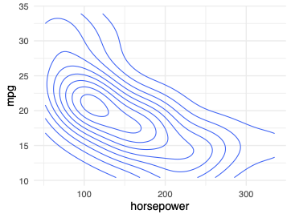
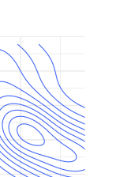
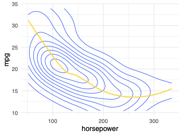
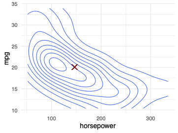

# 

## 

\maketitle

# Motivating Examples

## Motivating Examples
Given a random variable 
__X__
 and another random variable
  
__Y__
, you often want to make predictions about 
__Y__
 that
  are 
_as good as possible._
- Given some budget, what will an organization's head count be
    next year?
- Given a citizen's age and income, how likely are they to vote?
- Given a set of sounds picked up by a microphone, what are the
    chances that someone in the room has fallen down (Sound Flux,
    2019)?
- Given a set of voxels, does an image contain a malignant
    tumor?

::: {.notes}

- This is the goal of a 
- As you may have guessed, we're not just going to head
    straight to making predictions. We're going to built on top of
    things that you already know from the last two weeks, and we're
    going to derive new tools to use that we can 
:::

## Plan for the Week
Two sections: 
  
1. Conditional expectations
2. Best predictors and best linear predictors

::: {.notes}

- First, we'll practice working with covariance and
    correlation - these are the most foundational math tools that
    we'll need to work with joint distributions.
- Next, we'll study conditional expectation - this is
    an important way of summarizing the information in a joint
    distribution. We can ask, what is the shape of the data, provided
    that 
- Finally, we'll figure out how to make predictions
    for one random variable, given another - a very important task for
    data scientists.
:::

## Plan for the Week (cont.)
At the end of this week, you will be able to:
  
- Derive statements describing relationships among random variables
- Understand how to divide variance into a part that is explained and an error component that you have not explained
- Understand how a best linear predictor uses information
      from a set of random variables to help us predict the value of
      an outcome \note[item]{At the end of this week, you'll understand how variation
      in a set of random variables can be used to explain variation in
      another random variable.  This is at the very heart of models for
      linear regression.} \note[item]{Our goal throughout this part of the presentation is to
      work with the foundations of the math, rather than the specifics
      of \textit{one particular} integration. We'll do plenty of math in
      the course, but we're trying to target your effirts.} \note[item]{To do this, we're going to try rely on stand-in
      random variables -- $X \& Y$ -- that \textit{could} be any
      arbitrary function.} \note[item]{This lets us engage with the concepts -- which are
      challenging -- without sitting and working pencil-and-paper on
      cranking through the math.} \note[item]{There is a general principle here that we'd like you to
      start to learn -- it is exceedingly difficult to work at a
      conceptual level \textbf{and} a fingers-to-the keyboards level at
      the same time.} \note[item]{At times, we're going to illustrate these 
      points by coding. Now, a few words about this -- many of the
      theorems that we prove have sample analogues (this is an applied
      class -- and we're going to get to this in the next unit.) We may
      show you the sample version to help build intuition, but your
      main job in these weeks is to practice with random variables.
      Use the sample to build intuition but then go and make sure you
      understand the proof for random variables.}

# Conditional Expectation

# Introduction to Conditional Expectation

## Introduction to Conditional Expectation, Part I
To this point, we have characterized random variables with three
  concepts:
  
1. __The Expected Value__ , $\E[X]$
2. __The Variance__ , $\V[X]$
3. __The Covariance__ , $\cov[X,Y]$

  But, when there is dependence between two random variables 
$X$
 and
  
$Y$
, then if we know something about 
$X$
, we might be able to make a
  new contextualized statement about the 
_conditional
    distribution_
. 

::: {.notes}

- We've seen how to use expectation and var to summarize a
    distribution, but we've also seen how observing one variable lets
    us define a conditional distribution on another variable.  Now
    it's time to put those two concepts together.
- We've
    got the Frostee. We've got the fries. Let's do this.
:::

## Introduction to Conditional Expectation, Part II
We began the week with the questions:
  
- Given some budget, what will an organization's head count be
    next year?
- Given some attributes about a citizen, how likely are they to
    vote?
- Given a set of sounds picked up by a microphone, what are the
    chances that someone in the room has fallen down (Sound Flux,
    2019)?
- Given a set of voxels, does this image contain a malignant
    tumor?

## Introduction to Conditional Expectation, Part III
But, those were all conditional statements!  

  Rather than saying, ``On average, 78
\%
 of the electorate votes in
  any given election,'' we can instead say:

  
- ``Among people 29 or younger, 41 \% voted in the last
    presidential election''
- ``Among people who _have_ voted before, 90 \% will vote
    in any given election''

  This is our
  goal in data science! Use information to make more informed,
  
_better_
 statements.

::: {.notes}

- Conditional
    statements let us update general knowledge to make more specific,
    
- It is way lower in off-cycle elections -- about 30
- Because there is a probability distribution across these
    two mutually exclusive cases, we could actually figure out what
    the population prevalence of these two types are.
:::

# Conditional Expectation Operator

## Introduction to Conditional Expectation, Part I

- Recall expected values: \[
      \E[Y] = \int_{-\infty}^{\infty} y \cdot f_{Y} dy
    \]
- The expected value of $Y$ , $\E[Y]$ , is the integral of the
    product of \{ the value $y$ and the probability density function
    for that value \}
- Expectation is an operator that maps from $\R^{n} \to \R$

## Introduction to Conditional Expectation, Part II

- The conditional expectation operator of $Y$ given $X$ , $\E[Y|X]$ holds a similar form: \[
       \E[Y|X] = \int_{-\infty}^{\infty} y \cdot f_{Y|X}(y|x) dy, \forall X
       \in \text{Supp}[X]
     \]
- Recall also that expectation is an operator.
- So, too, is conditional expectation. \note[item]{\textbf{In plain language:} After you observe some
       value of $X$X, what is your best guess for $Y$? Where here,
       \textit{best} is the minimum MSE estimator.} \note[item]{\textbf{Running Example:} Suppose from South Hall,
       you (a) observe the temperature; (b) check the calendar; (c)
       check to see if it is sunny to make your best guess about the
       number of frisbees flying around on the quad.} \note[item]{\textbf{A tongue twister:} The conditional
       expectation is nothing more than the expectation of the
       conditional distribution. We're warming up for broadway!}

## Introduction to Conditional Expectation, Part III

::: {.notes}

- Draw a conditional distribution function
:::

# Conditional Expectation Demo

## Software Demo: Conditional Expectation
__Note: This is a lecture + software demo. We're just placing
     this here for organization.__

::: {.notes}

- In the current version of the course, in video
     
- We would like to also show this, with the Plotly demo
     stored in 
- In
     particular, take a sample, build the ``flat'' density
     functions. Build a slider that students can push-pull. This will
     give them a senes for what they are conditioning on, and will lay
     the groundwork for the kernel density section.
:::

# Learnosity: Conditional Expectation

## Conditional Expectation Example
The following table shows the joint probability distribution for
   discrete random variables 
$X$
 and 
$Y$
.
   
\begin{tabular}{c c || c | c | c}
       \multicolumn{5}{c }{X}

       & & 1 & 2 & 3 

       \hline
       &1 & 0.1 & 0.0 & 0.0

       Y &2 & 0.2 & 0.2 & 0.1 

       &3 & 0.1 & 0.2 & 0.1 
       
     \end{tabular}
1. Compute: $\E(Y|X=1)$
2. Compute: $\E(Y|X=2)$

# Reading: Conditional Expectation Operator

## Reading: Conditional Expectation Operator
Read page 67 through the first half of 69 (including Theorem 2.2.14)

# Properties of Conditional Operators

## Understanding Conditional Operators

  Conditional Expectation 
$\longrightarrow$
$\E[ \text{Conditional Distribution} ]$
\hspace{.48cm}
 Conditional Variance 
$\longrightarrow$
$\V[ \text{Conditional Distribution} ]$

::: {.notes}

- As we start to model relationships, some of our most important building blocks are what we call  conditional operators.  Two of the most important conditional operators are conditional E and conditional V.  <read>
- Do you see the pattern here?
- A conditional operator is an operator applied to a conditional distribution.  that's it!
- You take the equation for expectation, and then you plug in the conditional probability instead of the regular probability.  same for variance
- When you put it that way, you should recognize that pretty much all the properties we derived for regular expectation and regular variance also hold when we condition.  We pretty much only have to adjust the notation a bit.
- So we're not going to prove these results (the proofs are almost the same as before), but let's just mention some of the most important ones.
:::

## Formulas for Conditional Variance
$\V[Y|X=x] = \E \big[(Y- \E[Y|X=x])^2 \big| X=x \big]$
$\V[Y|X=x] = \E \big[ Y^2 | X=x \big] - \E \big[Y|X=x\big]^2$

::: {.notes}

- First, conditional E and conditional V are related just like their unconditional counterparts
- You can write conditional V as an conditional expectation of squared deviations from the conditional mean.
- There's also the more convenient formula, as a conditional expectation of the square, minus the square of the conditional expectation.
- Notice that these equations are the same as before, we're just adding the conditioning to every operator, which means we're putting in a conditional distribution everywhere.
:::

## Understanding Conditional Lotus

- Condition on $X=x$ .

::: {.notes}

- What about that famous rule that we called LOTUS?
- Remember what that was about.  if we have a random variable Y, and we pass it into a function h, that creates a new variable and we have a really nice formula for computing its expectation.
- Is there a conditional version of this?  Yes!  Let's add R.V. 
- If we condition on X, that's no problem, we just replace the distribution of Y with the conditional distribution, and plug it into LOTUS.
- Here's an extra little wrinkle though: the theorem you see in the book is a little more powerful than this.  It turns out that we can make h depend on both X and Y.  that sounds really complicated, but it actually doesnt' change much.
- When we condition on x, we treat X as a constant.  so h is essentially still just a function of Y.
:::

## 

::: {.callout-note title="Theorem: Conditional LOTUS"}

  Given discrete random variables $X$ and $Y$ with joint pmf $f$, and $h:\R^2 \rightarrow \R$,
$\E \big[h(X,Y) \big| X=x \big] = \sum_y h(x,y)f_{Y|X}(y|x),$
For all $x \in \text{Supp}[X].$
  Given continuous random variables $X$ and $Y$ with joint pdf $f$, 
  $\E \big[h(X,Y) \big| X=x \big] = \int_{x=-\infty}^\infty h(x,y)f_{Y|X}(y|x)dy,$
  for all $x \in \text{Supp}[X].$
:::

::: {.notes}

- And here's the full version of the conditional LOTUS. 
- The main thing to notice is that the equations look almost the same as before
- we now have the conditional distribution instead of the regular distribution.
- also, h can depend on y, but that doesn't change much because we've conditioned on y, so we can treat it as a constant.
:::

## 

::: {.callout-note title="Theorem: Linearity of Conditional Expectation"}

  Given random variables $X$ and $Y$ and $a,b \in \R$, then for all $x \in \text{Supp[X]}$,
    $\E \big[ aY + b \big| X=x  \big]  = a\E \big[ Y \big| X=x \big] + b$
Moreover, given $g,h:\R \rightarrow \R$, then for all $x \in \text{Supp[X]}$,
  $\E \big[ g(X)Y + h(X) \big| X=x  \big]  = g(x)\E \big[ Y \big| X=x \big] + h(x)$
:::

## Conditional Expectation Example
Simplify: 
$\E[ XY | X=x]$

# Demonstration of the Conditional Expectation Function

## Demonstration of the CEF
__Note: This is a Lecture and Software Demo, we're just
     placing it here for organization.__

::: {.notes}

- Show the Plots of
     Marin Headlands rendered by Plotly.
- Notice that when we're at any particular X value, we
     have a whole function for the distribution of Y. This is the
     conditional pdf.
- There is 
:::

# Reading: Conditional Expectation Function

## Reading: Conditional Expectation Function

- Read the second half of page 69, through page 71, stopping before the Law of Iterated Expectations. % \item \paul{switching to the function view seems like a big %   turn, %   maybe save that reading till we make the jump?}
- These pages are tough, so we're going to whiteboard
     theorems 2.2.11 and 2.2.12 on the other side of your reading.
- You can probably skip theorem 2.2.14 without great problem.
- Focus specific attention on definition 2.2.15.

::: {.notes}

- We're going to make acoupld of notes for you, so grab
     your book and a pen (if you write in your books)
- Pay particular attention to definition 2.2.15 -- this
     is the pivot from the operator to the function, which has a lot
     more information. The notation here can be unclear -- it isn't
     your fault.
:::

# Learnosity: Write a Conditional Expectation Function

# Introduction to the Law of Iterated Expectations

## Law of Iterated Expectations
Earlier, we worked with 
__theorem 1.1.13__
, 
_The law of
     total probability_
, which stated:
   
   

::: {.callout-note title="Theorem 1.1.13: the law of total probability"}

     If $\{A_{1}, A_{2}, A_{3}, \dots\}$ partition $\Sigma$,
     $B \in S$, and $P(A_{i}) > 0, \forall i$ then:
     \[
       P(B) = \sum_{i} P(B|A_{i})P(A_{i})
     \]
:::

- Useful because we can break the overall probability into
     smaller ``chunks'' whose probabilities might be easier to know.
- The Law of Iterated Expectations is a generalization and reapplication
     of this principle.

# Reading: Law of Iterated Expectations and Total Variance

## Reading: Law of Iterated Expectations
Read pages 72, 73, and the top of 74, stopping before theorem 2.2.19.
 

# Lightboard: Law of Iterated Expectations

## Law of Iterated Expectations

::: {.notes}

- Check out 4.14 law of iterated expectations.  It
      does this in the first half, then there are two examples.  I'm
      cringing now, because I inappropriately assumed a binary gender.
      But perhaps we can just keep the first part before the examples.
      and film a separate ipad video with just one or two
      examples?
- Why is this useful? Well, this says, if you can break
    down a statement into pieces, you can work them all back
    together. And, this is a continuous mapping version of the
    conditional probablity statement that we've seen earlier.
- Because we're interested in conditional expectation
    functions, we're going to use this as a tool quite a bit through
    the rest of the course.
:::

# Law of Total Variance

## Splitting Variance

::: {.callout-note title="Theorem 2.2.18: the law of total variance"}

     For random variables $X$ and $Y$:
     \[
       \V[Y] = \V\big[\E[Y|X]\big] + \E\big[\V[Y|X]\big]
     \]
:::

__Key question:__
 How much of the variance in 
$Y$
 can be
   explained by 
$X$
?
 

::: {.notes}

- Remember when we started a few weeks ago from
     relatively simple axiomatic statements? We've built 
- This is the last piece of tooling that we're going to
     build for this week. In the next sections we're going to apply
     this tooling against the BP and BLP.
- But, rather happily, this final piece of tooling itself
     has use -- splitting variance!
:::

## Splitting Variance: Example
$S$
 represents salary.

   
$O$
 represents occupation (1 = data scientist, 2 = data engineer, 3
   = data analyst).  

$\V[S] = 366$
.  How much of this is explained by occupation?
 

::: {.notes}

- The law of total variance will work
     for any random variables, but it's easiest to understand if we
     condition on a discrete random variable
:::

## Salary Conditioned on Occupation

::: {.notes}

- Here we see the conditional distributions of S
       for different occupations.  For each one, we can mark 
- If these were all equal, then learning occupation
       doesn't help you make a prediction about salary.
- The more the conditional expectation moves up and
       down - the more occupation gives us information about the
       salary
- For each conditional distribution,
       we can also mark 
- The bigger these conditional
       variances, the more uncertainty there is in salary even after
       we observe occupation.
:::

## Components of Variance
$\V[S]$
 is the sum of two components.
   
1. __Explained variance:__ $\V \big[ \E[S|O] \big] = 266$ - Measures how much information $O$ gives about $S$
- Can also be called systematic variance \note[item]{First we have $V\big[E[Y|X]\big]$.  This is the
       explained variance.  You can also call it the systematic
       variance or model variance. } \pause
2. __Unexplained variance: $E\big[V[S|O]\big]=100$__ - Measures how much extra variation is there in $S$ that we
       can't explain with $O$
- Can also be called error variance \note[item]{We may call this error variance, because we're really
       building a model for salary using occupation.  So if you tell
       me occupation, I use the model to give you an estimate for
       salary, but this is the uncertainty that's left over at the end
       - that's why we think of it as error.}

## Law of Total Variance Implications
Suppose that you can divide data into groups along (possibly) two
   dimensions.
   
1. A dimension that does not explain any variation in outcomes
2. A dimension that explains variation in outcomes

   As you're going to see in the next coding exercise, through this
   identity, if you can produce groups that have different means, you
   will necessarily produce a smaller 
$\E \big[ \V[Y|X] \big]$
.
 

# Learnosity: Variance Breakdown

## Learnosity: Variance Breakdown
__Note: This is a learnosity activity. We're just including
     it here for organization.__

::: {.notes}

- Here we will ask students to work the code about
     temperature and pollution that we've written.
:::

# Best Predictors

# Deviations From the CEF

## More Comments for Alex

::: {.notes}

- 
- 
      For the proof that CEF minimizes MSE, I think you should first point
      out that this 
:::

## Joint Density Function
For this section, we will work first with the same joint
   distribution function throughout.

   
\begin{align*} 
     X & \sim U(min = 0, max = 10) \\
     W & \sim N(mean = 0, sd = 1) \\
     Y &= 10 - 2\cdot X + W
   \end{align*}
 
   Where 
$X$
 and 
$W$
 are independent.
   

::: {.notes}

- In this segment of learning, we're going to talk about
    the Conditional Expectation Function as a quantity of interest.
- We'll begin by defining a quantity 
- This error will be presented
    here, and we'll prove several features about 
- Once again, the distinction between an operator and a
    function is going to be important to keep in mind.
- Notice that here we're providing you the ``diety-eye''
     view. We don't get issued this, and we don't know how to estimate
     these functional forms yet. That will be the focus of the next
     section.
:::

## Joint Density Function (cont.)

::: {.notes}

- I like to think about this in terms of a probability
     landscape -- this is a simple one that has a single most probable
     set of outcomes. In general, this is not the case.
- Callout to the workbook that makes this plot.
- Ask students to rotate the image so that they have made
     the plot and that the x axis ranges from 0 on the left, and 10 on
     the right; the y axis from -15 on the furthest to 15 on the
     nearest.
:::

## Deviations from the CEF

::: {.callout-note title="Deviations from the CEF"}

     Suppose that $\epsilon = Y - \E[Y|X]$ is the distance between my
     estimate within a grid and the actual value.  \note[item]{Notice
       that $Y$ is the actual continuous elevation that is modeled by
       the function of X and Y, but that $\E[Y|X]$ is the function that
       maps the CEF at the point $X=x$}- Inside each of the grids, how far, on average, will I be from
       the true elevation? $\E[\epsilon|X] = ?$
- Across the whole ridgeline, how far, on average, will I be
       from the true elevation? $\E[\epsilon] = \E[\E[\epsilon?|X]] =$ ?
- Within each of the grids, what features will shape how
       close you are, on average? $\V[\epsilon | X] = ?$
- Across the whole ridgeline, what features will shape how
       close you are, on average? $\V[\epsilon] = ?$

:::

# Reading: Deviations from the CEF

## Deviations from the CEF

- Begin by reading from where we left off previously on page 74
     to the middle of page 76, stopping when the discussion turns to
     linear restrictions.
- Try to work through, on your own, the proof of why the CEF is
     the best (minimum MSE) estimator of Y.
- In the proof of theorem 2.2.20, the authors add $\E[\epsilon | X]$ seemingly from nowhere. This is a legal move
     because in 2.2.19, you have derived that $\E[\epsilon | X] = 0$ .

# Best Predictors

## Predictors are Functions

::: {.callout-note title="Definition: Predictor"}

  Given random variables $X$ and $Y$, a predictor for $Y$ is a function, $g:\R \rightarrow \R$, such that $g(X)$ is regarded as a guess for $Y$.

:::

- Given a value $X=x$ , a predictor suggests a single value for $Y$ .
- Define error as $\epsilon = Y - g(X)$ .

::: {.notes}

- Remember that Y is a random variable, and even if we condition on X, it still have a conditional distribution.
- But we want to represent that distribution with a single number.
:::

## Predictors and Errors

::: {.notes}

- Let's see an example.  Here is a joint distribution, x is hp, y is mpg.
- This is actually an estimated distribution, but let's pretend it's the real one.
- A predictor for mpg is a function.  I'll draw one.
- what happens if we take a draw from this distribution?
- Nature reaches in and chooses a point.
- Here is the predicted Y, and this distance is the error.
- The predictor I drew is not a very good predictor.  what makes a good predictor?
- We want the error to be small, but how do we do that?
:::

## Choosing a Good Predictor

__Idea:__
 Minimize mean squared error, 
$\E[\epsilon^2]$
.

::: {.notes}

- remember when we had one random variable, we discovered that the mean was the value that minimized expected squared error.
- We can do the same thing here!
- By minimizing expected squared error, we'll be generalizing the mean, and we should end up with a function that stays close to the high probability areas.
:::

## Importance of the CEF

::: {.callout-note title="Theorem: The CEF Minimizes MSE"}

  Given random variables $X$ and $Y$, the CEF $\E[Y|X]$ has the smallest MSE out of all predictors of $Y$.
  
:::

::: {.notes}

- So what do we get if we minimize MSE?  The answer is exactly the CEF!
- If you care about MSE, and you want to generate predictions of 
- This is a really important result.  It tells us what the maximum possible performance is for any predictor.
- And it helps us to view the CEF from an optimization perspective.  That's a viewpoint that really important in both classical statistics and machine learning.
:::

# Lightboard: The CEF Minimizes MSE

## The CEF minimizes MSE

\hspace{-1.2cm}

::: {.notes}

- draw the CEF 
- Let's let 
- We want to show that any distance 
- write the error: 
- Look at the conditional expectation: 
- We know 
- We can use law of iterated expectations on MSE: 
:::

# Best Linear Predictors

## Complexity of the CEF

::: {.notes}

- Think about the CEF as a model for some random variable - mpg in this case.
- It's a good model in one sense - it minimizes MSE
- Bit the CEF can be quite complicated.  It takes an infinite number of numbers to specify the CEF.
- If you had all that information, how would you use it?
- Can you reason about every detail in this curve?
- Can you communicate what you see? Can you compare your results against another researcher's?
- The fact is, even if we could estimate the CEF (which takes a LOT of data), we're not well equipped to analyze it directly.
- So you actually don't find too many analyses that estimate the CEF.
:::

## Linearizing the Predictor

::: {.notes}

- This tells us that we need a simpler model.  The simplest possible model that captures a relationship: a line.
- This is what we call a linear predictor.
- There are some disadvantages to using a linear predictor.
- The joint distribution many not look especially linear.  We're covering up a lot of complexity.
- Except for very artificial situations, a linear predictor will have worse MSE than the CEF.
- But there are some major advantages.
- You only need a few numbers to write down a linear predictor - the slope is most important.
- The slope is easy to communicate, you can compare studies against each other.
- You have a single number that captures an overall relationship.
:::

## Choosing a Linear Predictor

::: {.callout-note title="Definition: The Best Linear Predictor (BLP)"}

  Given random variables $X$ and $Y$, the _best linear predictor (BLP)_ for $Y$ is the function $g:\R \rightarrow \R$, $g(X) = \alpha + \beta X$, with coefficients given by,
  
 $\text{argmin}_{\alpha, \beta} \E \Big[ \big( Y - (\alpha + \beta X) \big)^2 \Big]$
:::

::: {.notes}

- How do you choose a linear predictor?
- There are different strategies, so it depends on your goals
- But the most common idea is to continue our previous strategy, make MSE as small as possible.
- Read definition
:::

## Solving for the BLP

::: {.callout-note title="Theorem: The BLP Solution"}

  Given random variables $X$ and $Y$, the best linear predictor for $Y$ is given by $g(X) = \alpha + \beta X$, where,
  
  $\beta = \frac{\cov[X,Y]}{\V[X]}, \qquad \alpha = \E[Y] - \frac{\cov[X,Y]}{\V[X]} \E[X]$
:::

::: {.notes}

- Here's another reason to use the Best Linear Predictor.
- You can solve for the coefficients that minimize MSE, and they have a really elegant solution.
- Remember this form for the slope: it's a covariance over a variance.
:::

# Reading: The Best Linear Predictor

## Reading Assignment: Linear Approximation
Read to the middle of page 79, stopping before you get to example
   2.2.23. 

::: {.notes}

- This is why we have avoided paramterizing the
     random variables 
:::

# Moment Conditions

## Moment Conditions
The BLP is given by  
$\text{argmin}_{\alpha, \beta} \E \Big[ \big( Y - (\alpha + \beta X) \big)^2 \Big]$

## Moment Conditions - Solution
The BLP is given by  
$\text{argmin}_{\alpha, \beta} \E \Big[ \big( Y - (\alpha + \beta X) \big)^2 \Big]$
$0 = \frac{\partial \E[\epsilon^2]}{\partial \alpha} = \E \left[ \frac{\partial \epsilon^2}{\partial \alpha} \right] 
= \E \left[  2\epsilon \frac{\partial \epsilon}{\partial \alpha} \right] = -2 \E[\epsilon]$
$0 = \frac{\partial \E[\epsilon^2]}{\partial \beta}  = \E \left[ \frac{\partial \epsilon^2}{\partial \beta} \right] 
= \E \left[  2\epsilon \frac{\partial \epsilon}{\partial \beta} \right] = -2 \E[\epsilon X]$

Version 1:

1. $\E[\epsilon] = 0$
2. $\E[\epsilon X] = 0$

Version 2:

1. $\E[\epsilon] = 0$
2. $cov[\epsilon, X] = \E[\epsilon X] - \E[\epsilon] \E[X] = 0$

What about 
$\E[\epsilon | X]$
?

::: {.notes}

- If you put in different values of 
- How do you minimize a function?  you can use calculus, use your first order conditions.
- This next step is a little confusing.  it turns out that we can move the expectation outside of the derivative.  that's because the expecation is a sum or an intergral, so it passes through derivatives.
- What's happening here?  first, nature reaches in and chooses a data point, which defines an error.  then if you move 
- It turn out that not only does the BLP fulfill the moment conditions, it's the ONLY line that does.  I'm not going to show it, but you can check all the derivatives to see that the MSE has one minimum.
:::

# Lightboard: Understanding Moment Conditions

## Understanding Moment Conditions

1. $0 = \E[\epsilon]$
2. $0 = \cov[\epsilon, X]$

\hspace{-1cm}

::: {.notes}

- Here is a way to think about the moment conditions that I find useful
- Say you want to choose a linear predictor.  at first, you're considering every possible line through this plane.
- Now impose the first moment condition.  this tells us our line passes through this point.  but that's still many different lines.  how do we choose one?
- Let's draw one and see what happens.  For this line, when X is high, the error tends to be negative. when x is low, the error tends to be positive.  so the cov is negative.
- $cov[\epsilon,X] < 0 \implies$
- $cov[\epsilon,X] > 0 \implies$
:::

## Understanding Moment Conditions - Solution

1. $0 = \E[\epsilon] = \E \left[ Y - (\alpha + \beta X) \right] \implies \E[Y] = \alpha + \beta \E[X]$
2. $0 = \cov[\epsilon, X]$

\hspace{-1cm}

::: {.notes}

- Here is a way to think about the moment conditions that I find useful
- Say you want to choose a linear predictor.  at first, you're considering every possible line through this plane.
- Now impose the first moment condition.  this tells us our line passes through this point.  but that's still many different lines.  how do we choose one?
- Let's draw one and see what happens.  For this line, when X is high, the error tends to be negative. when x is low, the error tends to be positive.  so the cov is negative.
- $cov[\epsilon,X] < 0 \implies$
- $cov[\epsilon,X] > 0 \implies$
:::

# Lightboard: The BLP Solution

## The BLP Solution
The BLP is defined by the moment conditions:
  
1. $0 = \E[\epsilon]$
2. $0 = \E[\epsilon X]$

## The BLP Solution - Solution
The BLP is defined by the moment conditions:
  
1. $0 = \E[\epsilon] = \E \left[ Y - (\alpha + \beta X) \right] = \E[Y] - \alpha - \beta \E[X]$ . $\alpha =  \E[Y]  - \beta \E[X]$ .
2. $0 = \E[\epsilon X] = \E \left[ \big( Y - (\alpha + \beta X) \big) X \right]  = \E[XY] - \alpha \E[X] - \beta \E[X^2]$ $=  \E[XY] - \Big( \E[Y]  - \beta \E[X] \Big) \E[X] - \beta \E[X^2]$ $=  \E[XY] -  \E[X] \E[Y]  + \beta \E[X]^2 - \beta \E[X^2]$ $= \cov[X,Y] - \beta \V[X]$

$\beta = \frac{\cov[X,Y]}{\V[X]}$
$\alpha = \E[Y] - \frac{\cov[X,Y]}{\V[X]} \E[X]$

# Reading: Multivariate Generalizations

## Reading: Multivariate Generalizations
Read section 2.3, Multivariate Generalizations.

# Best Linear Predictors in Higher Dimensions

## Linear Predictors in Higher Dimensions

::: {.callout-note title="Definition: Linear Predictor"}

Given random variable $Y$, and random vector $\bs{X} = (1, X_1, X_2, X_3,...,X_k)$
     A _linear predictor_ for $Y$ is a function, $g:\R^k \rightarrow \R$ of the form,
     $g(x_0, x_1,x_2,...,x_k) = \beta_0 x_0 + \beta_1 x_1 + \beta_2 x_2 + ... + \beta_k x_k$
      such that $\hat Y = g(1, X_1, X_2,...,X_k)$ is regarded as a guess for $Y$.
      
  
:::

## Interpreting Model Coefficients

\begin{align*}
    \hat{Y} &=\beta_0 + \beta_1 X_1 + \beta_2 X_2 + ... + \beta_k X_k\\
    \frac{\partial \hat{Y}}{\partial X_i} &= \beta_i, \quad \ \  \Delta \hat{Y} = \beta_{i} \cdot \Delta X_{i}
  \end{align*}

::: {.callout-note title="\textbf{Ceteris Paribus:}  All else equal"}

- If $X_{i}$ changes by $\Delta X_{i}$ , the prediction $\hat{Y}$ changes by $\beta_{i} \cdot \Delta X_{i}$ , _if the other $X$'s are held constant_ .

:::

::: {.notes}

- How do we interpret the betas in a linear predictor?
- This actually applies to any linear predictor, not just the best one.
- To get an idea, try taking the partial derivative of the
    predicted outcome, with respect to some 
- This means that you can think of 
:::

## Interpreting Model Coefficients - Example
Does this model say peacocks with longer tails fly slower?  

  
\[
    \widehat{\text{air\_speed}} = 4.3 - 1.2 \cdot \text{tail\_length} + 0.8
    \cdot \text{muscle\_mass}
  \]

\scalebox{.5}{Photo by Thimindu Goonatillake CC BY-SA
    2.0}

::: {.notes}

- Here's a predictor that we developed to describe the flying
    speed of male peacocks.
- Notice the coefficient on the tail length variable: 
- Does this suggest that peacocks with longer tails are
    slower flyers?
- The answer is no - we have to remember ceteris paribus
- The correct interpretation is that peacocks with1 unit
    longer tails, but the same muscle mass, are predicted to fly 1.2
    units slower.  But what about peacocks with longer tails as a
    whole?  We just don't know.  For example, peacocks with
    longer tails might also have more muscle mass.  Maybe they fly
    faster.
:::

## Best Linear Predictors in Higher Dimensions

::: {.callout-note title="Definition: Best Linear Predictor"}

Given random variable $Y$, and random vector $\bs{X} = (1, X_1, X_2, X_3,...,X_k)$
     The _best linear predictor_ for $Y$ is the function, $g:\R^{k+1} \rightarrow \R$,
     $g(x_0 ,x_1,x_2,...,x_k) = \beta_0 x_0 + \beta_1 x_1 + \beta_2 x_2 + ... + \beta_k x_k$, with coefficients given by,
      $\text{argmin}_{\beta_0,...,\beta_k} \E \Big[ \big( Y - (\beta_0 + \beta_1 X_1 + ... + \beta_k X_k) \big)^2 \Big]$
:::

## Moment Conditions in Higher Dimensions
Apply first-order conditions:
  
 
$0 = \frac{\partial \E[\epsilon^2]}{\partial \beta_0} = \E \left[ \frac{\partial \epsilon^2}{\partial \beta_0} \right] 
= \E \left[  2\epsilon \frac{\partial \epsilon}{\partial \beta_0} \right] = -2 \E[\epsilon]$

For 
$j>0$
, 
$0 = \frac{\partial \E[\epsilon^2]}{\partial \beta_j}  = \E \left[ \frac{\partial \epsilon^2}{\partial \beta_j} \right] 
= \E \left[  2\epsilon \frac{\partial \epsilon}{\partial \beta_j} \right] = -2 \E[\epsilon X_j]$

Version 1:

1. $\E[\epsilon] = 0$
2. $\E[\epsilon X_j] = 0$

Version 2:

1. $\E[\epsilon] = 0$
2. $cov[\epsilon, X_j] = 0$

## The BLP Solution in Higher Dimensions
$\bs{\beta} = \E \big[(\bs X^T \bs X)^{-1} \big] \E \big[ \bs X^TY\big]$

::: {.notes}

- Finally, i just want to mention that there is a closed form solution to the BLP, even in higher dimensions.
- This solution requires some matrix algebra, so we won't get into it now.
- We'll come back later and talk about ordinary least squares regression, which is a technique for estimating the BLP, using a sample of data.
-   At that point, we'll spend more time explaining the matrix operations.
- For now, just remember that the BLP is a way to summarize the relationship among variables, and it's the target of interest for a lot of research.
:::

## Looking Ahead

- The Best Linear Predictor is also called the Population Regression Function.
- Linear Regression: An algorithm for selecting a linear predictor given a sample of data.
- Ordinary Least Squares Regression: An algorithm for estimating the best linear predictor. \note[item]{It's hard to overemphasize how important the BLP is. <read>} \note[item]{This means that the BLP is really the core object of interest for a HUGE amount of research.} \note[item]{So don't forget this -we'll have a lot more to say about it.}

