# 

# Motivating Example

## Roasting Coffee: Introduction

::: {.notes}

- This is the set shot
- Coffee is one of life's innumerable joys. It is also the
    best of them.
- There are flavors, complexity, bitterness, sweetness --
    and caffiene.
- I've been roasting coffee at home, for several years,
    I'll take you on a little tour. Don't worry, there's a reason.
:::

## Roasting Coffee: Field Trip

::: {.notes}

- Introduce (a) green coffee (and its range of size and
    dryness); (b) the roaster; (c) the temperature scope; (d) the
    young gun; and (e) the tryer.
- Introduce the tryer,then show trying before drop.
- Within each of these ``trys'' I've got a sample that has
    been jumbled up for 10 minutes. I've drawn about 30 beans, each
    from the same distribution.
- Ask students: In casual terms, would you say that the
    beans that I pull out are ``random''?
- I sure would!
- But, for our statistics to work, we need something that
    is different, and more specific than ``random'' -- we will need
    independent and identically distributed.
- The jumbling of these beans means that each bean's draw
    is independent of each other bean in the barrel.
- 
- 
- 
- 
:::

# Statistics, Parameters, and Estimators

# Introduction to Properties of Estimators

## Estimating Characteristics of Populations

- Data scientists are not given the joint density distribution. \note[item]{We're never given the joint pdf. It doesn't come in
      the instructions to being a data scientist.}
- One of our principle tasks is to produce _estimates_ about the _universe_ given only the limited information
    that we get from a sample of data. \note[item]{Because we have
      built these statements from axioms, we're able to know, that
      \textit{if these sets of assumptions are actually true} then we
      can produce an estimate that has known properties.}

## Estimating Characteristics of Populations (cont.)

::: {.callout-note title="Parameters, Statistics, and Estimators"}

- A __paramater__ , $\theta$ , is some summary of the joint
      distribution.
- A __statistic__ is some function that maps data from $\R^{n} \to \R$ .
- An __estimator__ , $\hat{\theta}$ , is some statistic of the
      data that we use to produce a guess for $\theta$ .

:::

::: {.notes}

- 
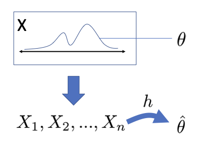

- We can't observe the joint distribution directly, so
      we try to make guesses about it.
- An estimator could be any function of the statistic.
      Here, we'll pass the data through function h and get estimator
      
:::

## $\overline{X}$ is an Estimator
We refer to statistics that are ``good'' guesses for a population parameter as
  
__estimators__
. 
  
- $\theta = \E[X]$ is a parameter.
- $T_{(n)} = \text{choose the 30}^{th} \text{ percentile}$ is a statistic
- $\hat \theta = \overline{X}$ is an estimator for $\theta$ .

## Introducing Estimators
In this section, you will learn about the properties that make
  estimators good guesses for a population parameter.
  

::: {.callout-note title="Properties of estimators"}

- __Consistency:__ As sample size grows, does the estimator
    converge in probability to the true value?
- __Bias__ and __unbiasedness__ : Is the estimator systematically too low or too
      high?
- __Efficiency:__ Does an estimator have relatively _large or small_ sampling variance, standard error, and
    MSE?

:::

::: {.notes}

- __Consistency__
- __Bias__
- __Efficiency__
:::

# Reading: Core Estimation Theory

## Reading: Core Estimation Theory
__Note: This is a READING CALL, just placing it here
    for organization.__

  Read pages 102–105, stopping at 3.2.3, Variance Estimators.

# Desirable Properties of Estimators

## Desirable Properties of Estimators
Throughout, we refer to 
$\theta$
 as a population 
_feature_

  or 
_parameter_
.
  
- $\theta$ has a fixed, true value, but this value is not
    directly observable. \note[item]{Examples of $\theta$: sentiment in a user population;
      donations to senate campaigns; mean age of MIDS instructors}
- Without ground truth, how can we know if our estimator is
    doing its job?

::: {.notes}

- Test-driven development, engineering,
    analogy -- software teams imagine every scenario possible, write
    a testing suite -- and conduct tests before releasing. That's
    how they know it ``works''. Because we don't know 
- Reasoning and evaluating these properties is one of the
    reasons that we have invested in probablity theory!
:::

## Desirable Properties of Estimators: Unbiasedness

::: {.callout-note title="Bias of an estimator"}

\note[item]{The bias of an estimator is the difference between the
      truth, and what you estimate. In this way, the term
      \textit{bias} has the same meaning as our plain-language
      meaning.}\note[item]{However, we cannot use it
      \textit{unthinkingly}. People say in plain language, ``They got
      biased treatment,'' and, ``It was a biased process.'' I suspect
      what they mean to say, ``They got prejudiced treatment.''}\note[item]{Notice also that in order to evaluate whether an
      estimate is biaesd, we \textit{need} a concept of what the true
      value is.} 
    The bias of an estimator is the expected difference between the
    _true_ population value and the estimator.
    - The _bias_ of $\hat{\theta}$ is $\E[\hat{\theta}] -
      \theta$ .
- If $\E[\hat{\theta}] = \theta$ , then there is no bias, and
      the estimator is _unbiased_ .

:::

## Desirable Properties of Estimators: Unbiasedness (cont.)
If 
$\hat{\theta}$
 is unbiased, does that mean that, for any sample
  taken, the estimate produced by 
$\hat{\theta} = \theta$
?
  
- $\hat{\theta}$ as an _estimator_ is a random variable.
- The value that it takes on given a sample is the _estimate_ .

::: {.notes}

- Draw an unbiased estimator!
- As a RV, 
- The 
- Draw a biased estimator!
- 
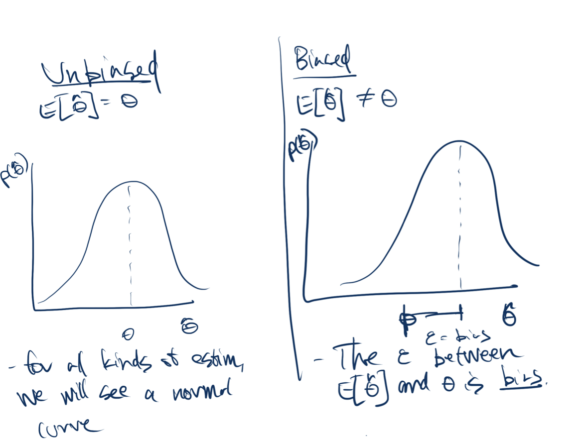

:::

## Desirable Properties of Estimators: Unbiasedness
    (cont.)

## Desirable Properties of Estimators: Efficiency

::: {.callout-note title="Mean Squared Error of an Estimator"}

- The MSE of an estimator $\hat{\theta}$ is \[
        E[(\hat{\theta} - \theta)^{2}] = V[\hat{\theta}] +
        (E[\hat{\theta}] - \theta)^{2}
      \]

:::

::: {.notes}

- Suppose you are taking temperature, and have two
    methods: (1) back of hand; (2) under-tongue. Which would you
    prefer?
- 
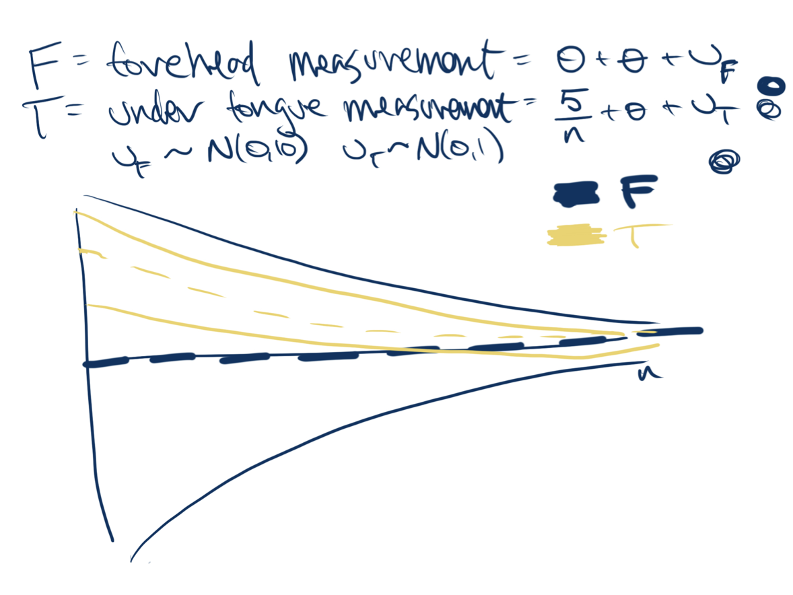

:::

## Desirable Properties of Estimators: Efficiency

## Desirable Properties of Estimators: Consistency

::: {.callout-note title="Consistency"}

    An estimator $\hat{\theta}$ is consistent for $\theta$ if
    $\hat{\theta} \overset{p}{\to} \theta$.
    \note[item]{If an estimator isn't consistent, then many times we
      would say it isn't worth using.}
:::

::: {.notes}

- 
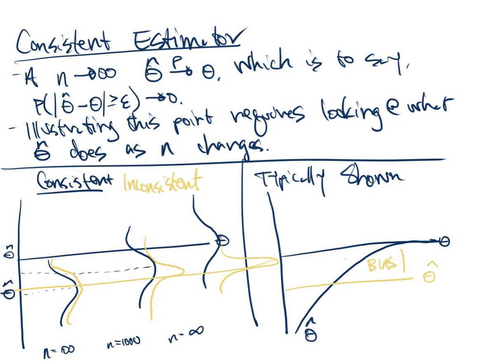

:::

## Desirable Properties of Estimators: Consistency

# Applying Properties of Estimators

## Evaluating Estimators
Which do you prefer? 
  

::: {.notes}

- Draw two estimators: (1) sine in n -- wavvy; (2)
    typically converging
- 
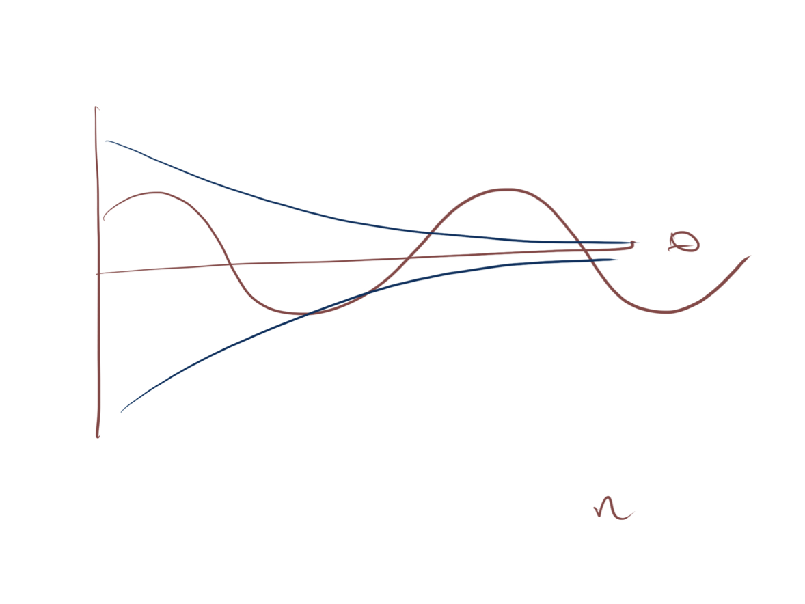

:::

## Evaluating Estimators (cont.)

::: {.notes}

- Draw two estimators
- Make both be consistent, one that is relatively more
    efficient.
- 
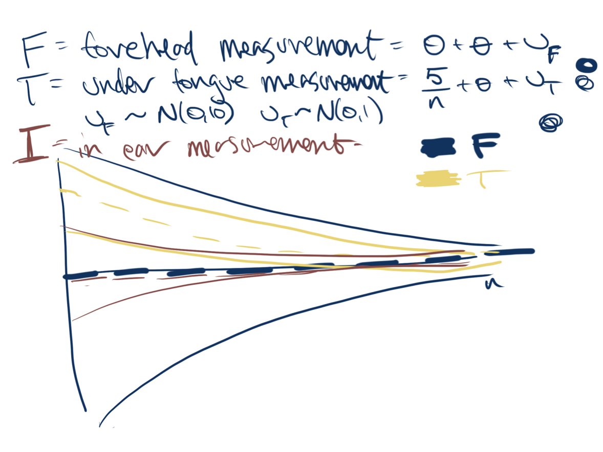

:::

## Desirable Properties of Estimators: Review

- An _inconsistent_ estimator is of little use.
- A _more efficient_ is estimator is preferable to a _less efficient_ estimator, all else equal.
- An _unbiased_ estimator is preferable to a _biased_ estimator, all else equal.

::: {.notes}

- For inconsistent estimators, perhaps there is some level
    of 
- More efficient estimators are preferrable, all else
    equal. But, in a business context there 
:::

# Random Sampling

# Reading: Independent and Identically Distributed

## Reading: Independent and Identically Distributed

- Read Section 3.0 and 3.1 in _Foundations of Agnostic
      Statistics_ (pages 91–96 in our copy of the book.) - Work to place the formal math definition into plan
        understanding. We will discuss this when you come back.
- Notice how $\mu$ and $\sigma^{2}$ are concepts that are
        immediately familiar, but they now represent population
        parameters.

::: {.notes}

- The mathematical formalism in 
- _Definition 3.1.2 -- the Finite Population Mass
      Function shows how we could move from talking about actual
      people to random variables (but keep in mind that we will almost
      always assume an "infinite superpopulation".) _
- Notice how 
:::

# Independent and Identically Distributed

## Independent and Identically Distributed

::: {.callout-note title="Definition: independent and identically distributed (IID)"}

- Undertake some process an arbitrary number of times—call
      it _sampling_ —to create a value from a phenomenon.
- If each instance of sampling draws from the same probability
      distribution, then we say the collection of values are __identically distributed__ .
- If none of the instances of sampling provide information
      about other instances of sampling, then we say the collection of
      values are __independent__ .
\note[item]{Talk through the definitions first.}
:::

## Independent and Identically Distributed (cont.)

::: {.notes}

- 
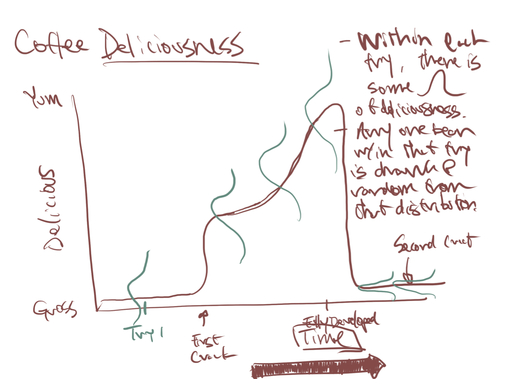

- Each of the sets of 
- Problem 1: We have a finite sample in this roaster --
    there are 10,243 beans in it. Paul counted! Ha! After we draw and
    look at one, there are only 10,242 left to draw, and we've changed
  the distribution of the beans by taking one out. So, technically, we
  have a dependent sampling process.
- But, subsequent ``trys'' are not independent. When I
    know how roasted each bean in try (3) is, I know that each bean in
    try (4) is going to be more roasted.
- Problem 2: The beans only get 
- Problem 3: Suppose you get one 
- Problem 4: What if all the big beans ``float'' to the
    top and so get less heat? Then we would have a non-independent
    distribution!
- Problem here is that I don't think you can
      define a model where a very roasted bean in try 1 gives you
      information that beans in try 2 are likely to be more roasted,
      but not that the next bean in try 1 is likely to be more
      roasted.  Any way I think of it, either both pairs are
      independent or not independent.
:::

## Making Assumptions

- What is a statistical assumption?
- When are they important?
- When can I violate them?
- What do I do if they are violated?

::: {.notes}

- Up until this point, all of our work has been
    axiomatic.
- We began with a principle, we looked at rules, and we
    observed what fell out.
- Now we're stepping into the fun, but clumsy world that
    forces us to put these alabaster axioms to work.
:::

## Making Predictions

\pause
- When data are independent and identically distributed (IID), it is possible to learn desirable things from
    a sample: - Accurate characterizations of the probability distribution
      function and values
- Reliable characterizations of certainty and
        uncertainty
- We can learn about unseen _population parameters_ from a sample and then use our domain knowledge to evaluate
      whether these population parameters apply to some circumstance.

::: {.notes}

- As data scientists, we might sometimes posess the entire
    universe of data and want to characterize it -- ``What is the
    sentiment of all the employees in 
- Much more frequently we're interested in something else
    -- making a statement about a population from limited data.
- What sets statistics apart is that it attempmts to
    characterize how certain we are about these predictions.
- Without IID, we might be incorrectly confident --
    leading to unforseen events. Or, we might learn someting about a
    population that isn't informative of our target.
:::

## What Is a Population?

::: {.callout-note title="U.S. Senator fundraising"}

    There are 100 U.S. Senators.
    - One could reason about a finite population with 100
        elements. \note[item]{Then, we \textit{know} the whole population, and
        there is nothing to estimate.}
- Or, one could assume a continuous distribution for
        fundraising. \note[item]{Each senator is a draw from this distribution.} \note[item]{If we are interested in fundraising \textit{in
            general} this lets us say things about the \textit{next
            set of senators}, not only the 100 who happen to be there
          now.} \note[item]{We know the idea of this joint distribution of an
          infinite number of senators is strange, but (a) look at how
          it broadens the questions we can answer; and (b) this is how
          statisticians reason about the world.}

:::

::: {.notes}

- When we model data as draws from a random variable 
- $X$
:::

# Learnosity: Is This IID?

## Is This IID? 
__Note: This is a learnosity activity, just placing it here
    for organization.__

  For each of these, would you say that this sample is distributed
  IID? What do you understand about the process that brings you to
  your conclusion? 
  
- Coffee - __Goal:__ Understand how roasted a batch of coffee is.
- __Sampling process:__ Dip into a drum to pull a set of 30 beans.
- Conduct a draft - __Goal:__ Randomly select people for military service.
- __Sampling process:__ Draw balls from an urn with a day
      of the year. Everybody born on that day goes to war.
- Produce training data for machine vision - __Goal:__ Gather images of normal and abnormal cellular
      structures to train neural net to recognize cancerous cellular structures.
- __Sampling process:__ Randomly select 10 patients (with
      consent!) from the general outpatient population (unlikely to
      have the cancer), and randomly select 10 patients (with
      consent!) from the oncology department (that are likely to have
      the cancer).

## Is This IID? (cont.)

- Teach a computer to _really_ read - __Goal:__ Teach a computer to understand theme and plot
      (the work of School of Information professor David Bamman).
- __Sampling process:__ Feed a neural network each word
      (in each sentence [ in each paragraph (in each chapter) ] ) of the English
      language literary canon.
- Any others? - __Goal:__
- __Sampling process:__

# Reading: Sample Statistics

## Reading: Sample Statistics

- Read pages 96–98.
- Stop before theorem 3.2.5.

# Sample Statistics

## Sample Statistics
Sample statistics are:
  
- Functions that are applied to samples of random variables \note[item]{Why do we say that $X_{1}, X_{2}, \cdots, X_{3}$ are
      all random variables and not just realizations of a random
      variable?} \note[item]{Make clear that sample statistics are
      \textbf{any} function of a random variable. Some are more useful
      than others, but they are just any mapping from
      $\mathbb{R}^{N} \rightarrow \mathbb{R}$ space} \note[item]{There
      are some \textit{classics} that we'll cover right now -- sample
      average, variance and standard error -- but also ranks, splines,
      factor loadings, space embeddings}
- _Themselves_ random variables

::: {.notes}

- At this point, we don't have any guarantee about what
      the sample statistics will look like under repeated sampling. If
      you've taken a stats course before, though, you'll recognize
      that we're building towards  sampling distribution of these statistics.
:::

# Conduct Sampling

## Conduct Sampling
__Note: This is a learnosity activity, just placing it here
    for organization.__

  The goal is that this will solidify the understanding that students
  have from the reading and will move us forward into a conversation
  about expected value and the sample variance of the sample average.
  
  
- Students will be provided with data and starter code that
    produces a population.
- From this population, they will have sliders they can
    pull that will increase or decrease the number of samples that
    they take, the number of draws per sample, and the underlying
    population variation.

# The Sample Mean as an Estimator

## The Sample Mean

::: {.callout-note title="Definition: Sample Mean"}

    For IID random variables, $X_1,..X_n$, the _sample mean_ is
    \[
      \overline{X} = \frac{1}{n}\sum_{i = 1}^{n}X_{i}
      \]
:::

- The sample mean is an _estimator_ for $\E[X]$ .

::: {.notes}

- Let's dive into out first example of an estimator: the sample mean.
- I'm sure you've taken thousands of means in your life, but you might not have thought of the sample mean as an estimator.
- First, what kind of object is this?  It's a statistic.  It's a function of a sample, which is made up of random variables, so it is a random variable.  This is really our statistical model that describes how a sample mean you write down in your analysis gets there.
- As statisticians, we're not really interested in the sample mean for its own sake.  We're interested in the population mean.  We're using the sample mean, because it's an estimator for the population mean.
:::

## The Sample Mean is an Estimator

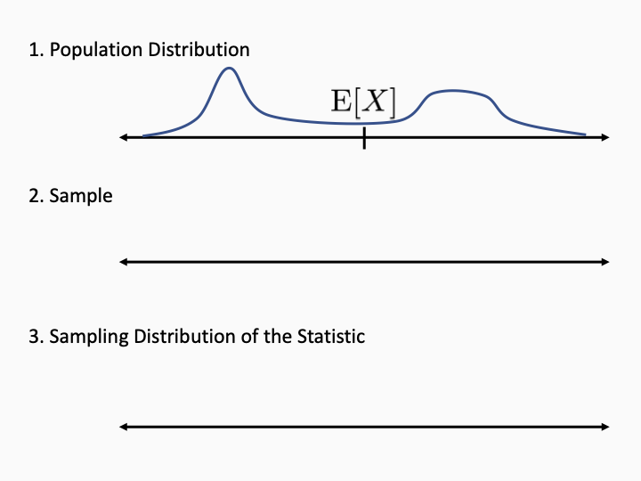

::: {.notes}

- Here's a picture to clarify how the model works.
- There are three important objects to keep in mind.
- First, we have the population distribution, we don't know what it is, but it's fixed, and it has a fixed population mean.
- What happens when we run the model?  nature reaches in and chooses datapoints.  I'll make a sample.
- From this sample, we compute the sample mean.  Does it equal the population mean?  of course not!  well, in some cases we could get lucky, but generally no.
- what kind of object is the sample mean? it's a random variable.  if you could rewind time, we'd get a different mean. 
- I'm not saying we can get two means, this is just a thought experiment.
- because the sample mean is a random variable, it has a sampling distribution.  I'll draw it here.
- There are two different distributions!  don't forget that, the population dist is not the same as the sampling distribution of the statistic.
:::

## Evaluating the Sample Mean as an Estimator
First Questions:
  
  
1. Is the sample mean biased?
2. How efficient is the sample mean?

::: {.notes}

- Once you start thinking about the sample mean as an estimator, the next step is to think about whether it's a good estimator. Are there any better estimators?
- What are the properties that we want our estimators to have?
- Let's start in this segment with these two. <read>
:::

## Unbiasedness of the Sample Mean

::: {.callout-note title="Theorem: The Sample Mean is Unbiased"}

    For IID random variables, $X_1,..X_n$, the sample mean $\overline{X}$ is an unbiased estimator for the population mean $\E[X]$.
    
:::

::: {.notes}

- $E[\overline{X}] =  E[\frac{1}{n}(X_1 + X_2 +...+X_n)  ]$
- $= \frac{1}{n}(E[X_1] + ... + E[X_n]) = E[X]$
:::

## Efficiency of the Sample Mean

::: {.callout-note title="Theorem: Sampling Variance of the Sample Mean"}

    For IID random variables, $X_1,..X_n$, with population variance, $\V[X]$, the variance of the sample mean is
     \[
        \V\big[\overline{X}\big] = \frac{\V[X]}{n}
      \]
:::

::: {.notes}

- $\V\big[\overline{X}\big]  = \V[ \frac{1}{n} (X_1 + X_2 +...+X_n)]$
- $= \frac{1}{n^2}( \V[X_1] + ... + \V[X_n]) = \frac{\V[X] }{n}$
- Is this a good variance?  It really depends on the population distribution.  Depending on what the population looks like, there could be more efficient estimators.  But at least the dependency on 
- Soon, we'll see that we can get a guarantee that the sample mean is actually close to the target.
:::

## Learnosity: Sampling Variance of the Sample Mean
__Note: This is a learnosity activity, just placing it here
    for organization.__
- If you increase the sample size, does the sampling variance of
    the sample mean increase, decrease, or stay the same?
- At what rate does this change? (Options include faster than
    the data, at the same rate at the data, slower than the data.) \note[item]{One is an increase, one a decrease, so not sure how to map
      $1/n$ to these options}
- If you increase the sample size, does the population variance, $\V[X]$ , change? (Hint: It is a population parameter.)

# Consistency and the Continuous Mapping Theorem

## Consistency

_"If you can't get it right as $n$ goes to infinity, you shouldn't be in this business."_
\begin{flushright}
\vspace{-.3cm} - Clive W.J. Granger
\end{flushright}

How can we formalize "right as 
$n$
 goes to infinity?"
  
- Estimators may converge at different rates.
- Deterministic guarantees are not possible.

::: {.notes}

- It's no exaggeration to say that consistency is the most important property that an estimator can have.
- So what exactly does it mean?
- A quote from the Nobel-prize winning economist Clive Granger.
- We want to be correct as the sample size gets bigger and bigger - how can we write that into a mathematical property?
- it's not obvious for at least two reasons.
- First, different estimators can converge at different rates.  it may take 
- Second, there's no deterministic guarantee.  There's no law of physics that prevents a coin from landing heads over and over forever.  all we can say is that the probability of that gets smaller and smaller as the number of flips increases.
:::

## Intuition for Convergence in Probability

- Let $T_{(1)}$ be the statistic with 1 datapoint.
- Let $T_{(2)}$ be the statistic with 2 datapoints.
- Let $T_{(3)}$ be the statistic with 3 datapoints.

\hspace{1.6cm}
\vdots

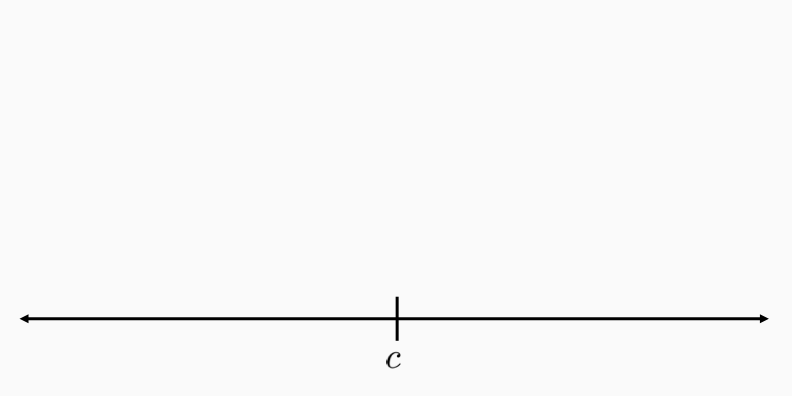

::: {.notes}

- Here's a stylize story to motivate the definition of consistency.
- Let's start with a sequence of random variables <read>
- Let 
- You tell me you want to converge on the target.  So I say, well give me some parameters, give me a window around the target that is acceptable.  also, 100
- I guarantee, that eventually in this sequence, there is a T that is in that window with 90
- Is the guarantee not strong enough? feel free to increase it:  let's say 99
- Is the window actually too wide? make it narrower!...
:::

## Convergence in Probability

::: {.callout-note title="Definition: Convergence in Probability"}

 
    Let $( T_{(1)}, T_{(2)}, T_{(3)},...)$ be a sequence of random variables and let $c\in \R$. $T_{(n)}$_converges in probability_ to $c$ if for all $\epsilon > 0$, 
    $\lim_{n \rightarrow \infty} P\Big[ T_{(n)} \in(c-\epsilon, c+\epsilon) \Big] = 1$
    We write this as $T_{(n)} \overset{p}{\rightarrow} c$.
      
:::

- An estimator $\hat \theta$ is _consistent_ for $\theta$ , if $\hat \theta \overset{p}{\rightarrow} \theta$ .

## Continuous Mapping Intuition

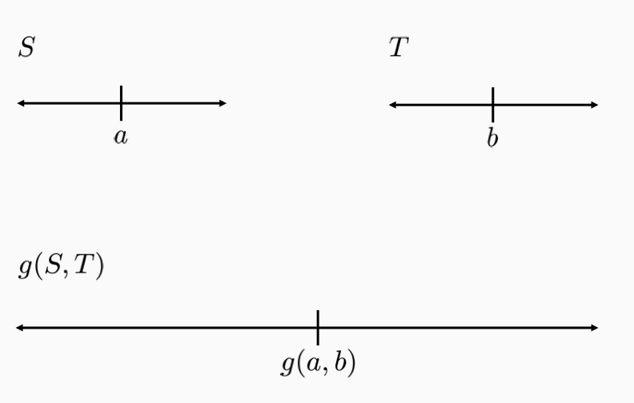

::: {.notes}

- Consistency is really important.  We're going to design a lot of estimators and we'll want to prove that they are consistent.
- There are different strategies you can use to prove that estimators are consistent.  The book likes to use a very powerful result about the plug in principle, but you have to know a lot more math to apply it rigorously.
- We prefer to use a famous theorem called the continuous mapping theorem.  It allows you to prove convergence in probability when you combine estimators together. 
- Here's a picture to show what we mean.  we have two estimators S and T that each converge to some target.  We have a function g that takes a,b to this point.  As long as g is consistent, it turns out that g(S,T) is also consistent.
:::

## 

::: {.callout-note title="The Continuous Mapping Theorem"}

 
    Let $( S_{(1)}, S_{(2)}, S_{(3)},...)$ and $( T_{(1)}, T_{(2)}, T_{(3)},...)$ be two sequences of random variables.  Let $g: \R^2 \rightarrow \R$ be a continuous function.  If $S_{(n)} \overset{p}{\rightarrow} a \in \R$ and $T_{(n)} \overset{p}{\rightarrow} b \in \R$, then $g(S_{(n)}, T_{(n)})  \overset{p}{\rightarrow} g(a,b)$
:::

::: {.notes}

- Given 
- Want 
- Equivalent to:  given probability 
- By cont. of 
- by convergence of S and T, 
- let 
-  This implies  
:::

# Reading: Weak Law of Large Numbers

## Reading: Weak Law of Large Numbers 
Read page 100, beginning at theorem 3.2.8, through the end of page
  102. 

# Weak Law of Large Numbers

## The Weak Law of Large Numbers

::: {.callout-note title="Theorem: The Weak Law of Large Numbers"}

  Let $(X_1,X_2,X_3,...)$ be a sequence of i.i.d. random variables with finite variance.  Let $\overline{X}_{(n)} = \frac{1}{n} \sum_{i=1}^n X_i$.  Then
  $\overline{X}_{(n)} \overset{p}{\rightarrow} \E[X]$
:::

- __Equivalently:__ The sample mean is _consistent_ for the population mean.

::: {.notes}

- We have all the pieces in place to present one of the most classic results in statistics.
- The WLLN states that as sample size increases, the sample mean converges in probability to the population mean.
- Or much more simply, the sample mean is consistent.
:::

## Consequences of WLLN
__The sample mean is consistent.__
- The error converges in probability to zero.
- The sample mean is accurate, as long as we can make $n$ large enough.

__As a building block to study other estimators.__
- Combine WLLN with Continuous Mapping Theorem.

::: {.notes}

- What do we take away from the WLLN?
- First, we learned that the sample mean is great.  On top of being unbiased, we also have consistency.
- Whatever the variable is: wavelengths of cosmic rays, or how cranky people in Berkeley are.  You never know the true population mean, but if you crank up n enough, you'll can be accurate to any level.
- Now, honestly, you already knew the sample mean was great.  you don't need more reasons to use the mean.  And we can write down more precise statements about the convergence of the sample mean.  So why is the WLLN so important?
- But is a second reason WLLN is important.  it is a building block we can use to study other estimators.
:::

## Applying the WLLN

__Objective:__
 Estimate the cdf 
$F$
 at a point 
$x$
.
  

__Idea:__
 Use empirical cdf
  
  

::: {.notes}

- F(x) = P(X < x)
- $T_{(n)}(x) = \frac{1}{n}\sum I(X_i \leq x)$
- $T(x) \overset{p}{\rightarrow}\E[ I(X \leq x) ] = P(X \leq x) = F(x)$
- So we can consistently estimate the CDF at any point.
- There are stronger convergence results for the cdf, so we don't use this version too much
- But this is an example of how WLLN can help us with other estimators.  we'll use it again in the future.
:::

# Proof of the Weak Law of Large Numbers

## Proof of the Weak Law of Large Numbers
Given random variable 
$X$
 and 
$\epsilon > 0$
.

## Proof of the Weak Law of Large Numbers
Given random variable 
$X$
 and 
$\epsilon > 0$
.
  
  Let 
$D = | \bar X - \E[X] |$
$\V[\bar X] = \E[D^2] = \V[X]/n$
$\V[\bar X] = \E[D^2] = \E[D^2 | D < \epsilon] P(D < \epsilon) + \E[D^2 | D \geq \epsilon]P(D \geq \epsilon)$
$\geq 0 + \epsilon^2 P(D \geq \epsilon)$
$P(D \geq \epsilon) \leq \frac{\V[X]}{ \epsilon^2 n} \overset{p}{\rightarrow} 0$

::: {.notes}

- The key to this proof is we have to get from a small variance to a statement about deviations.
- Why can't we be outside this window?  Let's draw the probability distribution.
- The point is that if there's some probability outside the window, that represents deviations that are large, and that has the effect of keeping variance up. that can't happen.
:::

# Simulating the WLLN

## 
__Note: This is a learnosity activity, we're just including it
    here for organization.__

  Students will work through the notebook called 
\texttt{WLLN.Rmd.}

# Reading: Estimating Population Variance

## Reading: Estimating Population Variance

- Read pages 105–108, stopping before the beginning of the
    next section.
- You are going to use _the plug-in principle_ , which is
    a general approach for designing estimators in a sample. \note[item]{Write down what we want for the population, use a
      sample to estimate it, check the characteristics of the
      estimator using math.}

::: {.notes}

- __Note: This is a READING CALL, just placing it here
      for organization.__
:::

# Estimating Population Variance

## Why Estimate Variance?

- How much coffee do students drink on average?
- How much does coffee intake differ from student to student?

::: {.notes}

- So far, we've talked about estimating the population mean.
- The mean is really important, but there are other quantities that we might want to estimate.
- Let's consider the variance - usually the second-most important feature you can learn.
- If you estimate mean coffee intake, that's is helpful, but just one number, nothing about the shape of the distribution.
- IF you also know variance, you start to have at least some information about shape.  That can really improve your understanding.
:::

## Applying the Plug-In Principle
Population Variance: 
$\V[X] = \E[X^{2}] - \E[X]^2$

::: {.callout-note title="The Plug-In Variance Estimator"}

  Given a sample $\bs X = (X_1,X_2,...,X_n)$, the _plug-in variance estimator_ is,
    \begin{align*}
\tilde{\V}(\bs X) &= \overline{X^{2}} - \overline{X}^{2}
    \end{align*}
:::

::: {.notes}

- How do we come up with an estimator for variance?
- We use what we call the plug-in principle.  All that means is that we just replace population quantities with sample analogues.
- In this case, we can write the variance as the difference of two expectations.
- We just replace each expectation with a sample mean.
:::

## Consistency of the Plug-In Estimator

::: {.callout-note title="Theorem: Consistency of the Plug-In Variance Estimator"}

  Let $(X_1,X_2,X_3,...)$ be a sequence of i.i.d. random variables with finite variance $\V[X]$.  Then $\tilde{\V}(\bs X)=\overline{X^{2}} - \overline{X}^{2}$ is consistent for $\V[X]$.
  
:::

::: {.notes}

- Proof: 
- $\overline{X^2}\overset{p}{\rightarrow}\E[X^2]$
- Let 
- $g(\overline{X^2}, \overline{X}) = \tilde{\V}(\bs X)$
- CMT 
:::

## Bias of the Plug-In Variance Estimator
Let 
$(X_1,X_2,X_3,...)$
 be a sequence of i.i.d. random variables with finite variance 
$\V[X]$
.  Then
  
$\E[\tilde{\V}(\bs X)] = \frac{n-1}{n} \V[X]$

::: {.notes}

- What about bias?  Unfortunately, the plug-in estimator is biased.  That's pretty common, the plug-in principle often gives us consistent estimators, but doesn't help with bias.
- You can compute the expectation of the estimator, and you can see that it's almost what you want.
- There's just an extra factor of 
- If you think about it, if we knew the true population mean, we could measure deviations from it to get an unbiased estimator.  But we have the sample mean, and the sample mean gets pulled towards where the most data is, pushing the estimate down.
:::

## A Better Variance Estimator

::: {.callout-note title="The Unbiased Variance Estimator"}

  Given a sample $\bs X = (X_1,X_2,...,X_n)$, the _unbiased sample variance estimator_ is,
    \begin{align*}
\hat{\V}(\bs X) &= \frac{n}{n-1} \Big( \overline{X^{2}} - \overline{X}^{2} \Big)
    \end{align*}
:::

::: {.notes}

- So the plug-in estimator is biased, but we know exactly what the bias is so we can fix it.
- We just adjust it by adding a correction factor.  It's called a degrees of freedom correction.
- This makes the estimator unbiased, and it's still consistent, because this fraction goes to 1.
- This estimator has really good properties, and it's the standard formula you should remember. 
:::

# Standard Errors

## 
standout

 Point Estimate 
$\Leftrightarrow$
 Uncertainty

::: {.notes}

- We've been talking about ways to generate a point estimate for a parameter.
- But the point estimate is really only half the story.
- That's because the point estimate is not the same as the true parameter.
- If all you have is the point estimate, and no other way to judge how far off it might be, it may not be very valuable at all.
- If you're just messing around with data for fun, you may not care, but when the stakes get high, you realize you really need a way to capture that uncertainty.
:::

## Importance of Uncertainty

__Estimate:__
 Our candidate has 52
\%
 support.

## Importance of Uncertainty

__Estimate:__
  The maximum dose of the medication is 26mg.

## Importance of Uncertainty

__Estimate:__
  The angle of the tower is 90 degrees.

## The Sampling Distribution of the Statistic

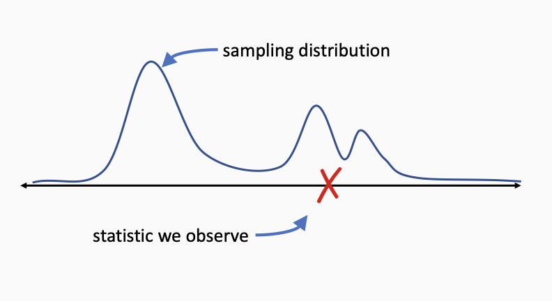

\pause
__Standard Error:__
(Estimated) standard deviation of the sampling distribution

::: {.notes}

- Remember that a statistic IS a random variable
- You get a single number.  But the model says that there are other values that are possible.
- There is an entire probability distribution over possible values.
- If we could see this distribution, we could understand how representative our one value is.
- We could gauge how different it might be from the true parameter.
- We can't see the sampling distribution, but if i.i.d. holds, we can still learn things about it.
- A good first question: how spread out is it? standard error = standard deviation of the sampling dist.
- You can think of the standard error as estimating, if you could run your study over and over, how far apart the values would be on average.  that's an important indicator of uncertainty.
:::

## Reporting standard errors

1. The mean number of mushrooms per pizza was 13.2 (SE  3.6).
2. The time for mice to navigate the maze was 35 $\pm 2$ seconds.
3. \begin{tabular}{c | c}
Vitamin W & Vitamin X \\
\hline
2.3 & 3.4 \\
(0.3) & (0.9)
\end{tabular}

::: {.notes}

- Really, whenever you report a statistic, you always want to include standard errors.
- unless you have another method of expressing uncertainty.
- There are a couple of ways to include them...
:::

# Standard Errors, The Sample Variance, and Standard
  Deviation

## Many Measures of Dispersion

:::: {.columns}

::: {.column width="49%"}

::: {.callout-note title="Sample Variance"}

:::
::: {.callout-note title="Sample Standard Deviation"}

:::
:::

::: {.column width="49%"}

::: {.callout-note title="Sampling Variance of the Sample Mean"}

:::
::: {.callout-note title="Standard Error of the Sample Mean"}

:::
:::

::::

::: {.notes}

- It can seem like we're just making a salad with all
    these concepts!
- I mean, I am a Berkeley vegetarian, but even I don't like
    variance salads.
- The 
- The 
- The 
- Finally, the 
:::

# Motivating The Central Limit Theorem

## Capturing Uncertainty
Need tools to capture how far off our estimate may be.

- Standard Error: the (estimated) standard deviation of the sampling distribution of the estimator.
- But a standard error is just one number...

::: {.notes}

- We've talked about how important uncertainty is.
- A point estimate by itself isn't all that useful.  we need a way to capture how far off it might be
- One answer to that is the standard error, which is an estimate for the standard deviation of the sampling distribution of a statistic.
- But the standard error doesn't capture everything about the sampling distribution.
- It's just one number.  it can give you a general idea, but can't help you make precise statements about what parameter values are plausible.
:::

## Uncertainty Example

- Hidden fact: Population mean = 0
- Idea: Market if estimate is 2 standard errors above 0.

::: {.notes}

- Here's an example.  You want to understand whether vitamin W improves performance on a statistics test.
- You don't know this, but vitamin W doesn't do anything
- You estimate the performance, and it's positive, great!
- But you know that there's uncertainty.  So you're not conviced the effect is really positive
- You decide on this rule: if the estimate is at least 2 standard errors away from zero, you'll take the vitamin to market.
- That's actually not a terrible rule of thumb.  This is a very very simplified version of a hypothesis test , but I think there's enough detail to make this point.
:::

## The Importance of Shape

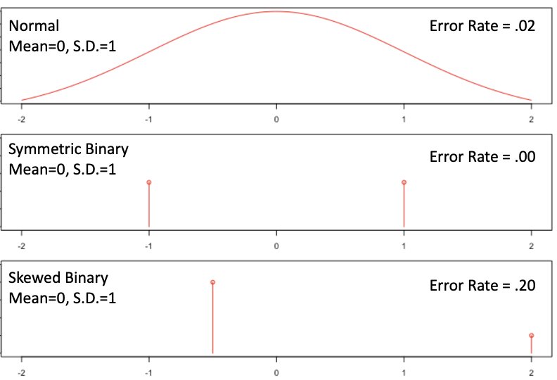

::: {.notes}

- Here are three possible sampling distributions for the statistic.  All 3 of them have a mean of 0 and a standard error of 1.
- So if you get an estimate of 2, you will take vitamin W to market.  and that's a mistake because the true effect is zero.
- The question is, how likely are you to make a mistake in each case?
- So the shape really matters when we want to express uncertainty more precisely.  That seems like a problem, because there are so many possible shapes out there.
:::

## The Central Limit Theorem

::: {.callout-note title="Central limit theorem (CLT): idea"}

    For a __very broad__ class of population distributions, the sampling distribution of the mean becomes approximately normal as the sample size grows large.
  
:::

::: {.notes}

- It turns out that a very famous theorem can help us.  It's called the CLT.
- The CLT says that, yes, there are a lot of possible distributions out there.  If you have a small sample size, the variety is a big problem
- But as the sample size grows large, the sampling distribution of the sample mean becomes more and more normal.
- This is great because it's going to unlock a lot of important tools, including confidence interval and hypothesis tests.
- Because of that, this is often viewed as the most important theorem in all of classical statistics
:::

# Reading: The Central Limit Theorem

## Reading: The Central Limit Theorem
__Note: This is a reading call, we're just placing it here for
    organization.__

  Read pages 108 and 109 of section 3.2.4. There's no 
_need_
 to
  read through the demonstration of Slutsky's theorem, but you can if
  you would like.
  
- Rather than proving the CLT, we are going to ask you to work
    through a short demonstration against data that we hope will
    convince you of the CLT's effectiveness.
- The book is terse in its presentation of when and how the CLT
    applies. We will fill that out when we come back together.

# Apply the Central Limit Theorem

## Apply the Central Limit Theorem
__Note: This is a learnosity activity, just placing it here
    for organization.__

# Central Limit Theorem

## Reminder of Context

- The WLLN tells us what happens to the sample mean as $n
    \to \infty$ : $\overline{X} \overset{p}{\to} \E[X]$
- We also know that, as $n \to \infty$ , we can generate an
    increasingly good estimate for $\V[X]$ because $\overline{X^{2}} -
    \overline{X}^{2} \overset{p}{\to} \V[X]$
- For more precise statements about uncertainty, we need the sampling distribution of the statistic.

::: {.notes}

- We were really glad when we saw the result of the WLLN.
- From weak assumptions, we can put together an estimator
    
- What if we want to know more information about this
    estimator?
:::

## Convergence in Distribution

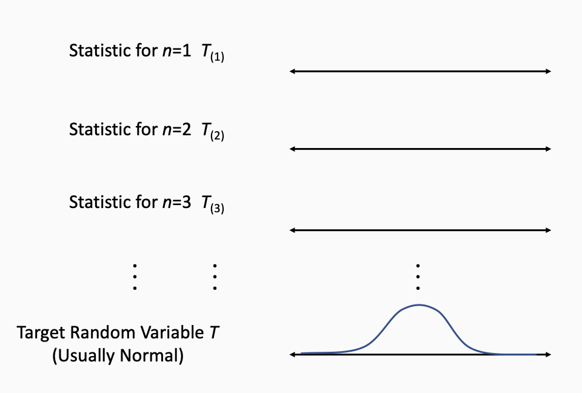

::: {.notes}

- Let's build out the idea of 
- Suppse you have a sequence of random variables, for now,
    it will be a set of sample means.
- First, suppose that you take a sample of size 1, and
    return the average. What will you see?
- Then, suppose that you take a sample of size 2, and
    return the average. What will you see?  Will this larger sample
    have a larger or a smaller sampling variance of the mean? (This
    is the WLLN claim).
- The idea of convergence in distribution, is
    that as you go along the sequence of distributions, the shape
    
- Convergence in distribution is much stronger than just a
    single point converging like we had for the
    WLLN. 
- The whole distribution not just a central tendency for
    example, converges to 
    the mean.
:::

## Convergence in Distribution

::: {.callout-note title="Definition: Convergence in distribution"}

  Let $(T_{(1)}, T_{(2)}, T_{(3)}, ...)$ be a sequence of random variables, with cdfs  $(F_{(1)}, F_{(2)}, F_{(3)}, ...)$, and let $T$ be a random variable with cdf $F$.  Then $T_{(n)}$_converges in distribution_ to $T$ if, for all $t\in \R$ at which $F$ is continuous,
  $\lim_{n \rightarrow \infty} F_{(n)}(t) = F(t).$
  We denote this as $T_{(n)} \overset{d}{\rightarrow} T.$
:::

::: {.notes}

- Here's the statement, and the thing to notice is that the actual statement of convergence is in terms of the CDFs
- You might hope it was about pdfs, but that's not possible.  for example, if you have a discrete population, you can never have a continuous statistics
- Also, every random variable in the world has a cdf, so that makes this more universal.
:::

## The need to Standardize

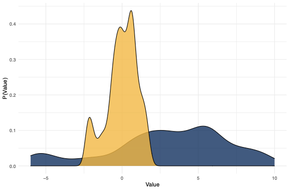

::: {.notes}

- We want to say that the distribution of the sample mean converges in distribution to the normal, but there's one more wrinkle.
- Remember that as n increases, the distribution gets thinner and thinner.
- The variance decreases as 1/n
- So we can't just look at the raw distribution, which approaches a spike.  We have to stretch it back out so that the width is a constant.
:::

## Standardizing the Sample Mean

::: {.callout-note title="Definition: Standardized sample mean"}

 
    For IID random variables $(X_1,X_2,...,X_n)$ 
    with finite $\E[x] = \mu$ and finite $\V[X] = \sigma^2$,
    then __the standardized sample mean__ is:
    $Z = \frac{\left(\overline{X} - \E\big[\overline{X}\big]
      \right)}{\sigma\big[\overline{X}\big]} =
    \frac{\sqrt{n}\big(\overline{X} - \mu\big)}{\sigma}.$
:::

- The standardized sample mean always has mean 0 and standard deviation 1.

::: {.notes}

- Recall, 
:::

## The Central Limit Theorem

::: {.callout-note title="The Central Limit Theorem"}

    Let $(X_1,X_2,X_3,...)$ be a sequence of i.i.d. random variables with finite mean $\E[X] = \mu$ and finite variance $\V[X] = \sigma^2$,
    $Z =    \frac{\sqrt{n}\big(\overline{X} - \mu\big)}{\sigma} \overset{d}{\to} N(0,1)$% $$% which is the equivalent to% $$% \sqrt{n}(\overline{X} - \mu) \overset{d}{\to} N(0, \sigma^{2})% $$
:::

::: {.notes}

- With all that out of the way, we can finally state the CLT
- To summarize: As long as n is large enough,
    then the mean, 
- It doesn't matter what the population distribution looks like.
- This means that we can run hypothesis tests and make precise statements about uncertainty.
:::

## Generality of the CLT
The CLT applies to:
    
- Continuous Random Variables
- Discrete Random Variables
- Symmetric Random Variables
- Asymmetric Random Variables

 Only Requirements:
 
- Data points are IID.
- Population has finite variance.

Versions of the CLT exist for many other statistics.

## What Sample Size is Enough?
The CLT works in the limit as
    
$n\to \infty$
.  What can we say for a finite 
$n < \infty$
?
    
- Rule of Thumb: $n=30$ for CLT to "kick in."
- Reality: Convergence depends on how non-normal population is. - A normal population requires $n=1$ .
- Highly skewed distributions may require $n=100$ , $n=1000$ , or more.

::: {.notes}

- When you were working with a normal underlying
      distribution, how quickly with a sample average move
      
- If two distributions have the same 
- There's a general rule of thumb that for 
:::

# Learnosity: When Does the CLT Apply?

## Where and When Does the CLT Apply? Part III
__Which of these random variables has an approximately normal distribution because of the CLT?__
- $X=$ hours spent by one individual on a 203 homework
    assignment
- $X=$ average hours spent by randomly assigned study groups of
    size 4 on the same 203 homework
- $X=$ number of barks by a dog named Rex for a one-hour
    period at night

## Where and When Does the CLT Apply? Part III
__Which of these random variables has an approximately normal distribution because of the CLT?__
- $X=$ total number of barks by a neighborhood of dogs
    for a one-hour period at night
- $X=$ age of a randomly selected MIDS student
- $X=$ average of sample of 10 randomly selected
    MIDS students
- $X=$ VADER sentiment of a sample of 100 SMS
    messages

# The Plug-In Principle

## The Plug-In Principle

- Want mean of population $\rightarrow$ Mean of sample.
- Want variance of population $\rightarrow$ Variance of sample.
- Want $f(E[X], V[X])$ ? $\rightarrow$ $f(\bar X, \hat V(X))$

   See the Pattern?

::: {.notes}

- I want to discuss this idea of the Plug-In principle
- The book uses it a lot, but it also glosses over the details
- Now you've seen a few estimators, and you may start to notice a pattern...
- If you want a function of the population variance, you can plug the sample variance into the function
- So statisticians started to notice, hey, if we just plug in these sample analogues, we seem to get good estimators.
- Is this just an accident?  Or is there something deeper going on?  Can we use this to find estimators for more parameters?
:::

## The Plug-In Principle

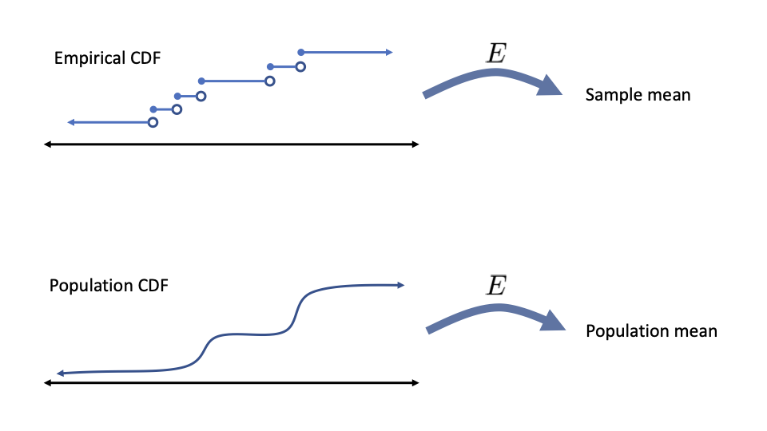

::: {.notes}

- It turns out, yes, there is something going on
- At the bottom, we have a population, represented as a CDF.  We apply expectation to it, to get the population mean
- Now at the top, we have our sample of data, represented by the empirical CDF.  Well, if you take the empirical distribution and apply expectation to it, you get the sample mean.
- What's key here, is that these expectations are exactly the same operator!  You really need to take measure theory to prove this, but hopefully that seems believable
- Now, what happens when 
- We know the empirical CDF converges in distribution on the population CDF.
- We need the expectation operator to be continuous, and that's not easy to define here.  but if it's smooth enough, as the empirical cdf approaches the true cdf, it makes sense that the sample mean approaches the population mean in probability. 
- This works a lot of the time.  For a really large class of operators, if you plug in the empirical cdf for the true one, you get a consistent estimator.
- But that's not all.  these estimators are consistent, and they are also asymptotically normal
- That's harder to demonstrate, but here's a hint.  if you look at a point on the CDF function, you can write it as a sample mean - you add a 1 for every point to the left, an 0 for every point to the right.  So the distribution of this point approaches the normal.  So you can maybe believe that if the deviations are small enough, when you pass them through the expectation, you get another normal sampling distribution.
- So that's the plug-in principle.  It's pretty important, because it's also the basis for bootstrap theory.  It does take some advanced math to check that it actually applies to your estimator.  So we won't prove things with it in this class, but it's good to know that it exists, and we will use it to come up with ideas for estimators.
:::

# Reading Assignment

## Reading Assignment
__Only if you're interested,__
 read section 3.3 - 3.3.1 to learn more about the Plug-In Principle. 

# Asymptotic Theory

## 
__Across a range of applications, small samples are problems.__
- If we've got a _lot_ of data, though, we can rely on
    weaker requirements
- Asymptotic properties of estimators ask the question, __What happens when we have a lot of data?__
- In general, as $n\to \infty$ , does $\hat{\theta}$ converge in distribution or
  probability to something that is useful or desirable? \note[item]{\paul{Love the intro!}} \note[item]{\paul{Is it possible to give some taste of what useful or desirable means, or does that take too long?  I know it would have to be vague.   We don't really expect to find perfectly normal distributions in the real world.  We can't just assume that hair length or income is normal and fit a normal curve to data, nobody would believe our models.  With asymptotics, we know that our statistics follow simple distributions we know how to analyze.  }}

::: {.notes}

- Tie the problems back to the small-sample bias of the
    Plug-In Sampling Variance
:::

## Reading: Asymptotics
__Note: This is a READING CALL. We're placing it here for
    organization.__
- The interested student can read pages 111-114.
- But, we might recommend skipping it if you're constrained.
- The take home is that there is an asymptotic statement of: - Being Normally Distributed
- SE, MSE and Efficiency
- Sampling Variance and Sampling Standard Error

## Reading: The Plug-In Principle

- $F(x)$ is the cumulative distribution function, the _CDF_
- $f(x)$ is the probability distribution function, the _PDF_
- $\hat{F}(x) \not= F(x)$ and $\hat{f}(x) \not= F(x)$ \note[item]{When showing the estimated distributions, note that
       they're not the same as the true distributions.}
- As $n\to \infty$ we hope that $\hat{F}(x)
       \overset{d}{\to}F(x)$ and $\hat{f}(x)\overset{d}{\to}f(x)$ . \note[item]{This is an important reminder to read the math
         aloud, converting the notation to its language equivalent.} \note[item]{When you asked earlier, ``But where do these
        functions come from?'' the answer is, we estimate them! Here!
        They come from here!}

::: {.notes}

- We're not going to lie to you... this is a challenging
    section to read.
- A couple of notes are in order.
:::

## The Plug-In Principle

::: {.callout-note title="Expectation and Variance Functionals"}

    You _know_ what the processes for calculating an expectation
    and variance are.
    \begin{align*}
      E[X] &= T_{E}(F) = \int x \cdot dF(x) \\
      V[E] &= T_{V}(F) = \int (x - E[X])^{2} \cdot dF(x)
    \end{align*}
:::

  These are the 
_statistical functionals_
 for expectation and
  variance.
  

::: {.notes}

- You might be annoyed that we're dealing with 
- 
:::

## The Plug-In Principle (cont.)

::: {.callout-note title="Plug-In Estimators"}

 
    For i.i.d. random variables $X_{1}, X_{2}, \dots, X_{n}$, with a
    common CDF $F$, the plug in estimator for $\theta = T(F)$ is just
    $\hat{\theta} = T(\hat{F})$.
    \begin{align*}
      \hat{E}(X) &= T_{E}(\hat{F}) \\
                 & = \sum x \cdot \hat{f}(x) \\
                 & = \sum x \cdot \frac{I(X_{i} = x)}{n} \\
                 &= \frac{1}{n} \sum x \\ 
                 &= \overline{X} \\ 
    \end{align*}
:::

## Example of the Plug-In Principle

::: {.callout-note title="Example with Discrete Data"}

    Suppose you there is some discrete process that places values into the
    random variable $X$.
    \note[item]{(You can't see equation process!)}
:::: {.columns}

::: {.column width="35%"}

- $F_{X}(1) = 1/3$
- $F_{X}(2) = 1/6$
:::

::: {.column width="35%"}

- $F_{X}(3) = 0$
- $F_{X}(4) = 1/2$
:::

::::

    But, you do get to produce i.i.d. random draws from the
    process. Of 1000 draws: \\\begin{tabular}{llll}
      \textbf{1} & \textbf{2} & \textbf{3} & \textbf{4} 

      \hline
      331 & 156 & 0 & 513 

    \end{tabular}
:::

## Example of the Plug-In Principle, cont'd

::: {.callout-note title="Example with Discrete Data"}

$\hat{E}(\bs X) = T_{E}(\hat{F})$
:::

::: {.notes}

- 
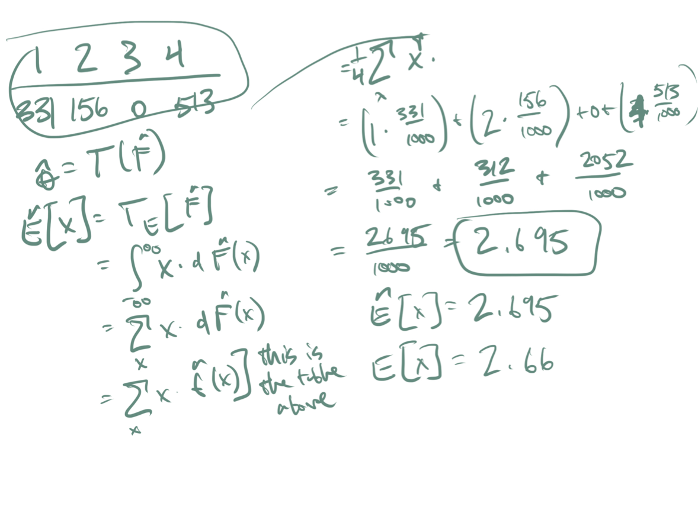

:::

## Reading: Kernel Methods Esttimate the PDF
Read pages 121 - 124.   

## Kernel Methods, Part I

::: {.callout-note title="Kernel Density Estimator of PDF"}

- Cannot _directly_ observe the joint PDF.
- For discrete RV, approximations come through frequency
      tables.
- For continuous RV, approximations come through kernel
      density estimates:
\[
      \hat{f}_{K}(x) = \frac{1}{n} \sum_{i=1}^{n}K_{b}(x - X_{i}),
    \forall x \in \R\]
:::

## Kernel Methods, Part II 

- Kernel methods are smoothing methods
- The _kernel_ is some weighting function

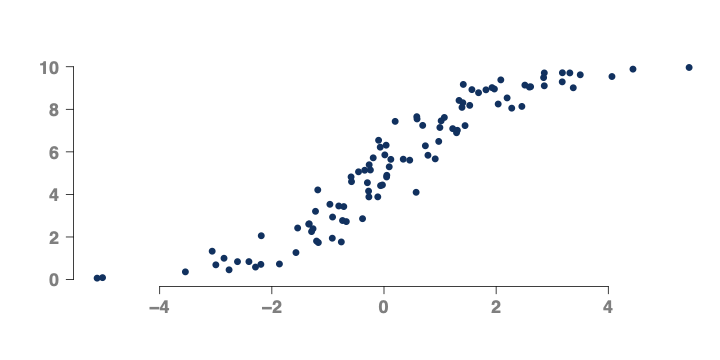

::: {.notes}

- 
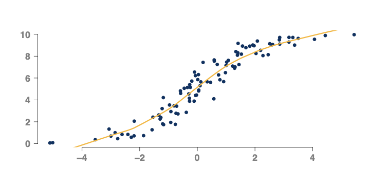

:::

## Kernel Methods, part III
As smoothing function, these permit plug in estimates that are
  directly analogous to the estimating functionals of the CDF.
  

::: {.callout-note title="Kernel Plug-In Estimator"}

    The _Kernel plug-in estimator_ of $\theta = T(F)$
    is \[\hat{\theta}_{k} = T\big(\hat{F}_{K}\big),\] where,
    $\hat{F}_{K} = \int_{-\infty}^{x} \hat{f}(u)du$. 
  
:::

::: {.notes}

- 
:::

## Kernel Methods, part IV

::: {.callout-note title="Kernel Plug-In Estimator for Expected Value"}

      We know the functional for the expected value has a specific
      ``shape'' \[\E[Y] = \int y\cdot df(y).\] So, the feasible kernel method is
    \[\hat{\E}_{k}(\bs Y) = \int_{-\infty}^{\infty} y \cdot d\hat{f}_{K}(y)\]
:::

## Kernel Methods, part V

- $\E[Y]$ and $\E[Y|X]$ are lowest MSE estimates of $Y$ \note[item]{But, $E[Y]$ and $E[Y|X]$ both require diety-level
      knowledge of the pdf or joint pdf.}

\begin{align*}
    \hat{\E}_{K}(\bs Y) &= \int y\hat{f}(y) \\ 
    \hat{\E}_{K}(\bs Y|X=x]) &= \int y \hat{f}_{Y|X}(y|x) \\
  \end{align*}
- If you can produce i.i.d. samples from $f_{Y|X}$ , you can
    produce estimates, $\hat{f}_{K}(y|x)$ that get ever closer to the
    true value

::: {.notes}

- The next sections in the course combine these facts with
    the CLT distributional shapes so that we can make 
:::

## Apply Kernel Methods
__Note: This is a LEARNOSITY activity. We're just placing it
    here for organization.__

