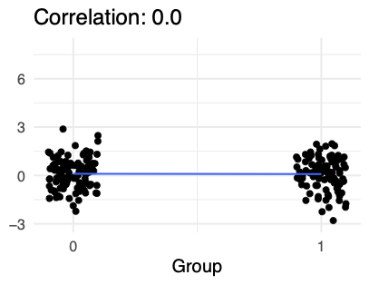
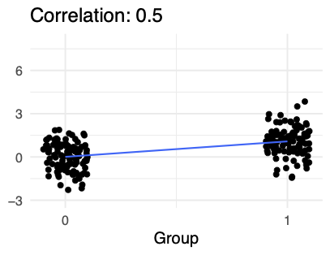
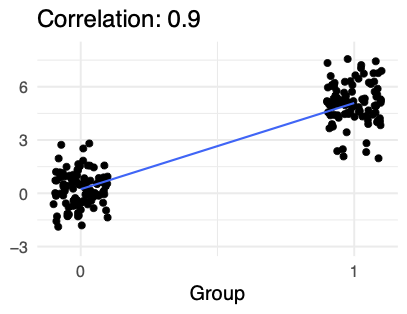
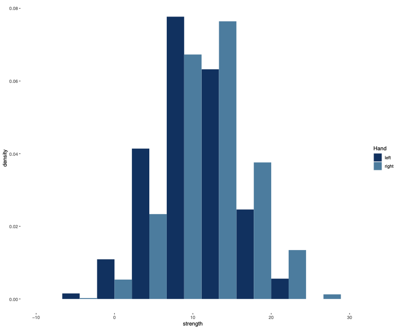
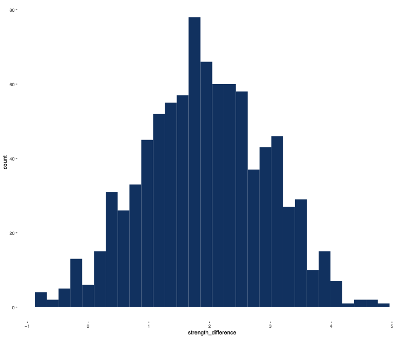
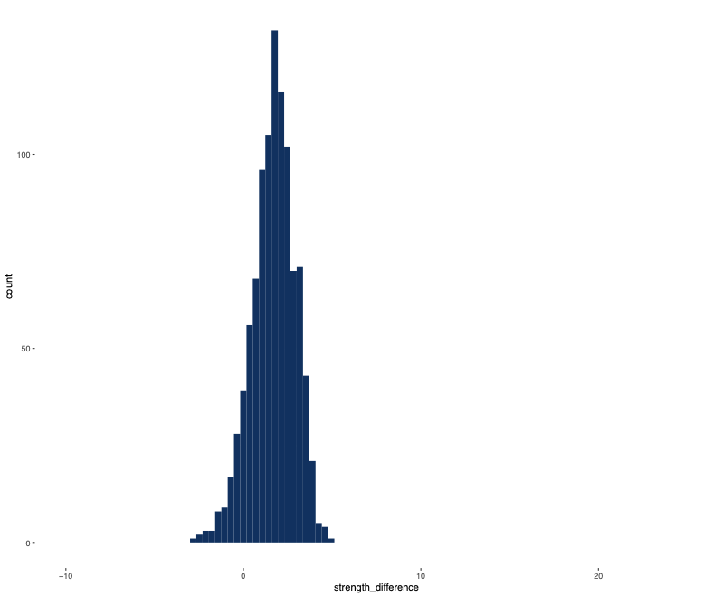

# 

# Introducing the Two-Sample t-Test

## Motivating the Two-Sample t-Test

\begin{exampleblock}{An Important Data Science Question}
    Is group A different from group B?
  \end{exampleblock}

  Examples:
  
- Are customers who get a birthday gift less likely to leave than those who don't?
- Do patients who take Vitamin W get over the flu faster than patients who don't?
- Do democracies or autocracies start more wars?

::: {.notes}

- The two-sample t-test is one of the most common procedures in inferential statistics. What is it for? As a data scientist you will often face a question about two groups - group A and group B. Someone will ask you if one is greater or less than than the other.
- Questions like this are everywhere. In business, you have A-B testing.
- In medicine, you may want to test a group of patients taking a vitamin against a control group
- In political science, you may want to test whether democracies or autocracies start more wars.
- What do these questions have in common? They all have two groups, and in all cases we're measuring the outcome on a metric scale. So it makes sense to ask about the expectation of each population - are the expectations different?
:::

## Example Scenario

\begin{exampleblock}{From the Journal of Empirical Fashion}
  \begin{tabular}{c | c | c}
  & New Yorkers & San Franciscans \\
  \hline
black outfits &  12.1 & 13.3  \\
sample size & 50 & 50
 \end{tabular}
 \end{exampleblock}

 Is this evidence that San Franciscans have more black outfits than New Yorkers 
_in expectation_
? 

::: {.notes}

- Here's a specific example, with data.
- write on slide: 13.3-12.1 = 1.2 outfits
- Is this a big difference? is it just noise?
- To be more precise, is this evidence that SF'ans have more black outfits than NYers in expectation?
- To analyze this question, we need a model...
:::

## Two-Sample Model Framework

\begin{exampleblock}{Basic Model Setup} 
    Suppose $(X_1,..,X_{n_1})$ are i.i.d. with mean $\mu_X$.    
    
    Suppose $(Y_1,..,Y_{n_2})$ are i.i.d. with mean $\mu_Y$. 
       \end{exampleblock}
\begin{exampleblock}{Null Hypothesis}
    $H_{0}: \mu_{X} = \mu_{Y}$ (The two population means are equal)
  \end{exampleblock}
\begin{exampleblock}{Alternative hypotheses}
    $H_{1}: \mu_{X} \neq \mu_{Y}$ (best choice in most cases)\\
    $H_{2}: \mu_{X} > \mu_{Y}$ \\
    $H_{3}: \mu_{X} < \mu_{Y}$ 
  \end{exampleblock}

::: {.notes}

- A model is a representation of the world built of RVs. for a two-sample t-test, the model begins like this.
- Let 
- Let's assume that the X's are iid with mean 
- We'll need more assumptions, but this is a start.
- The null is that our two means are the same.
- Our usual alternative is that the means are different.
- It is also possible to run a one-sided test in special circumstances. alt is one mean is greater than other.
- Given this model, how plausible is the null hypothesis?
:::

## Comparing Population Means

::: {.notes}

- One important piece of information is how much does the number of black outfits vary in the population.
- Here's a picture with three different distributions for our sample averages.
- The top distribution has very high standard deviation. You can see that it doesn't seem unusual to get two sample averages that are 1.2 outfits apart.
- The middle distribution has medium deviation. Now it starts to look a little more surprising that our two sample averages were 1.2 apart.
- The bottom distribution has low standard deviation. Now it seems quite unlikely to get two sample averages 1.2 apart. The data seems inconsistent with this hypothesis.
:::

## Comparing Population Means

\begin{exampleblock}{Two-Sample t-Test}
  
 $$t = \frac{\overline X - \overline Y}{\text{Estimate of Standard Deviation}}$$
 
    Assess whether two populations have the same expectation \textbf{while accounting for variability}
  \end{exampleblock}

::: {.notes}

- Putting these ideas together, we can make a statistic by taking the difference in sample averages, and dividing by an estimate of standard deviation - that's exactly the idea behind the two- sample t-test
:::

# The Two-Sample z-Test

## Two-Sample \textit{z}-Test

\begin{exampleblock}{Assumptions} 
    Suppose $(X_1,..,X_{n_X})$ are i.i.d. with mean $\mu_X$.    
    
    Suppose $(Y_1,..,Y_{n_Y})$ are i.i.d. with mean $\mu_Y$. 
    
    Assume $X \sim N(\mu_X, \sigma_X)$.  $Y \sim N(\mu_Y, \sigma_Y)$.  We know $\sigma_X$, $\sigma_Y$.
      \end{exampleblock}

\begin{flushright} \includegraphics[height=.5\textheight, width = .5\textwidth]{figures/normal.pdf}
\end{flushright}

::: {.notes}

- Before we tackle the two-sample t-test, let's begin with the simpler 2 samp. z test. unrealistic, but build intuition.
- Same assumptions as before, but add assump. of equal var 
- How do we create a test statistic?
- What is the distribution of 
- $V[\overline{X} - \overline{Y}] = V[\overline{X}] + V[\overline{Y}] = \sigma_X^2/n_X +  \sigma_Y^2/n_Y$
- $\overline{X} - \overline{Y}\sim N(0, \sqrt{\frac{\sigma_X^2}{n_X}+\frac{\sigma_Y^2}{n_Y}})$
- 
      We can standardize by dividing. 
- Here's the standard normal. 
We can plot our statistic on this curve, to get a p-value or see if it's in a rejection region.
:::

## 

\begin{exampleblock}{From the Journal of Empirical Fashion}
  \begin{tabular}{c | c | c}
  & New Yorkers & San Franciscans \\
  \hline
black outfits &  12.1 & 13.3  \\
sample size & 50 & 50
 \end{tabular}
 \end{exampleblock}

   Let 
$X_1,...,X_{50}$
 rep. New Yorkers. Assume iid, mean 
$\mu_X$
.

      Let 
$Y_1,...,Y_{50}$
 rep. San Franciscans. Assume iid, mean 
$\mu_Y$
.

      Assume 
$\sigma_X = \sigma_Y = 2.$

::: {.notes}

- Here's an example with actual data.
- $z = \frac{\overline{X} - \overline{Y}}{ \sqrt{\frac{\sigma_X^2}{n_X}+\frac{\sigma_Y^2}{n_T}}} = \frac{12.1 - 13.3}{\sqrt{\frac{4}{50}+\frac{4}{50}}} = \frac{-1.2}{ \sqrt{\frac{4}{25}}}  = -3.0$
- $z<-1.96$
- We can also compute p-value 2*pnorm(-3) = .0027
:::

## General Procedure for Testing
Three steps:
  
1. Specify model, null hypothesis, rejection criterion
2. Calculate statistic
3. Plot statistic on the null distribution to get the $p$ value.

::: {.notes}

- From this example, I hope you see that the two-sample z-test is not all that different from the one-sample tests we did earlier.
- No matter what the test is, there's a general pattern that you follow...
:::

# The Two-Sample t-Test

## Types of Two-Sample t-Tests

1. Student's t-Test
2. Welch's t-Test

::: {.notes}

- There are actually two versions of the two-sample t test you should be aware of.
- Student's t-test is the original t-test. it's simpler, but requires strong assumptions
- Welch's t-test is more general, and this is really the modern t-test.
:::

## The Two-Sample z-Test
$z = \frac{\overline{X} - \overline{Y}}{ \sqrt{\frac{\sigma_X^2}{n_X}+\frac{\sigma_Y^2}{n_Y}}}$
- Problem : we don't know $\sigma_X$ or $\sigma_Y$

::: {.notes}

- To explain these tests, let's remember our equation for the z test
- The big problem with this test is we're using the standard deviations 
- We're going to have to estimate these in some way.
:::

## Student's t-Test

- Estimate a single "pooled" standard deviation, $s$ .
- Substitute $s$ for both $s_X$ and $s_Y$ . $t =  \frac{\overline{X} - \overline{Y}}{\sqrt{\frac{s^2}{n_X}+\frac{s^2}{n_Y}}}$

\begin{exampleblock}{Theorem}
if $\sigma_X = \sigma_Y$, $t$ has a T distribution with $n_X + n_Y -2$ degrees of freedom.
  \end{exampleblock}

::: {.notes}

- Here's what Student did..
- Student's idea is to create a single estimate for standard deviation - let's call it 
- I'm not including the equation for 
- You plug 
- Why would you do this? Well, it turns out that Student got a really clean, elegant result
- Theorem: this statistic follows a t dist. with 
:::

## 

\begin{exampleblock}{degrees of freedom \textit{(df)}}
    Number of independent pieces of information that vary given estimated parameters
  \end{exampleblock}
- __One sample t-test__ - Model has one parameter (the mean)
- Given the sample mean, and $n-1$ observations, can compute the last one.
- _df_ = $n - 1$
- __Student's two-sample t-test__ - Model has two parameters ( $\mu_X$ and $\mu_Y$ )
- Given the sample means, $n_X -1$ observations for $X$ and $n_Y - 1$ observations for Y, can compute the rest
- _df_ = $n_{X} + n_{Y} -2$

::: {.notes}

- Why is there a -2 in degrees of freedom?
- There's a pattern. Think of degrees of freedom in this way. (read def)
- For the one-sample test, our model had one parameter - the mean. it's the mean we wanted to test.
- If I gave you the sample mean, and n-1 rows of data, you could compute the last row.
- There's no more information in the last row of data. it's already locked in.
- so df is n minus 1 for the estimated parameter.
- For the two-sample test, we now have a model with two parameters...
:::

## Student's t-Test Summary

- Tests if mean of $X$ equals mean of $Y$ .
- Uses a pooled estimate for standard deviation.
- __Major disadvantage:__ Only valid if $\sigma_X = \sigma_Y$ .

::: {.notes}

- Let's take a moment to summarize Student's t-Test.
- We use the t-Test to see if 
- Student used a pooled estimate for standard deviation.
- But there's one problematic assumption: the test is only valid if 
:::

## Welch's t-Test

- Compute two sample standard deviations: $s_X$ and $s_Y$ .
- Substitute $s_X$ for $\sigma_X$ and $s_Y$ for $\sigma_Y$ .

$t =  \frac{\overline{X} - \overline{Y}}{\sqrt{\frac{s_X^2}{n_X}+\frac{s_Y^2}{n_Y}}}$
\begin{exampleblock}{Theorem}
$t$ has \textit{approximately} a T distribution. The degrees of freedom are given by

$$v = \frac{\left( s_X^2/n_X +  s_Y^2/n_Y\right)^2}{\frac{\left(s_X^2/n_X\right)^2}{n_X-1} + \frac{\left(s_Y^2/n_Y\right)^2}{n_Y-1}}$$
  \end{exampleblock}

::: {.notes}

- Let's move on to Welch's test.
- Unlike Student, Welch computed two different sample standard deviations.
- Then substitute in
- Unfortunately, this method just isn't as clean mathematically. 
- You do get a similar theorem, but (1) the distribution is only approximately t. and (2) there's this complicated equation for degrees of freedom. the degrees of freedom you get are usually not an integer.
:::

## Choosing a Two-Sample t-Test
Some authors recommend a two step process:
  
1. Use Levine's test for equal variances ( $H_0: \sigma_X = \sigma_Y$ )
2. If non-significant, proceed with Student's t-Test

 Our advice: always use Welch's t-Test

- Power is almost as high as for Student's test
- We never know for sure if variances are equal
- This is the default in most statistical software

::: {.notes}

- Why is this our advice? 3 reasons
- First, the only reason you'd ever want more assumptions is to get more power. It's true that Student's test is more powerful - but studies have shown that the difference is too small to worry about
- Second, you never know if the variances are equal - you can use a test, but a test is just a test - it's not proof. and the result really depends on the sample size. for small samples in particular, it's really hard to know.
- Finally, this is the default setting in most software. not really a reason, but it is convenient.
:::

## Welch's Two-Sample t-Test Assumptions

- __Metric Scale:__ $X_1, X_2,..X_{n_X}$ and $Y_1, Y_2,...,Y_{n_Y}$ are random variables measured on a metric scale.
- __Independence:__ $X$ 's are iid, $Y$ 's are iid, and $X$ 's and $Y$ 's are mutually independent.
- __Normality:__ The distribution of the $X$ 's is normal and the distribution of the $Y$ 's is normal - The CLT guarantees normality for large samples
- Main concern is strong skewness with a small sample

::: {.notes}

- Let's summarize the assumptions in a more user-friendly form.
:::

# Practical Significance of the T-Test

## Practical Significance for the T-Test
After using a t-test to assess statistical significance, it is
  important to assess practical significance. 

\begin{quote}
    Your main goal is to explain to your audience
    why they should or should not care about the effect.
  \end{quote}
__Three common effect size measures:__
1. Difference in means
2. Cohen's d
3. Correlation r

## Difference in Means

::: {.callout-note title="Difference in means"}

\[
      \overline{X}_{A} - \overline{X}_{B}
    \]
:::

- Answers the question `` _How different are these
        groups?''_
- Often makes great headlines
      and is a good choice if units are familiar
- But lacks context in its calculation
- People who eat chocolate live 1.5 years longer than those who
    do not each chocolate

## Cohen's d

::: {.callout-note title="Cohen's d"}

\small_Cohen's d_ is a measure of difference of means
    standardized by the variance in the data.
    \[
      \frac{ \overline{X}_{A} - \overline{X}_{B} }{s}
    \]
    Where $s$ is a pooled standard deviation:
    $\sqrt \frac{(n_1-1)s_1^2 + (n_2-1)s_2^2}{n_1+n_2}$
:::

- Answers the question `` _How many standard
      deviations apart are the groups?_ ''
- The difference in sarcasm score between frequentists and
    Bayesians is $d = 0.54$ standard deviations.

## Correlation

:::: {.columns}

::: {.column width="50%"}

::: {.callout-note title="Biserial Correlation"}

_Correlation_ answers the question ``How strong is the
        relationship between group identity and the outcome?''
        \[
          \rho = \frac{\cov(X, Y)}{\sigma_{X}\sigma_{Y}}
        \]
:::
:::

::: {.column width="50%"}

:::

::::

::: {.notes}

- Notice the similarity in the form between Cohen's d and
    correlation -- Cohen's d divides by the pooled standard deviation;
    correlation divides by the product of two group standard
    deviations.
:::

## Correlation

:::: {.columns}

::: {.column width="50%"}

::: {.callout-note title="Biserial Correlation"}

_Correlation_ answers the question ``How strong
      is the relationship between group identity and the outcome?''
      \[
        \rho = \frac{\cov(X, Y)}{\sigma_{X}\sigma_{Y}}
      \]
:::
:::

::: {.column width="50%"}

:::

::::

## Correlation

:::: {.columns}

::: {.column width="50%"}

::: {.callout-note title="Biserial Correlation"}

_Correlation_ answers the question ``How strong
    is the relationship between group identity and the outcome?''
    \[
      \rho = \frac{\cov(X, Y)}{\sigma_{X}\sigma_{Y}}
    \]
:::
:::

::: {.column width="50%"}

:::

::::

## Practical Significance is about Context

- How strong is the same relationship between _different_ groups?
- How strong is a _different_ relationship between the
    same group?
- What is the underlying dispersion in the data?
- What is a meaningful anchor or reference point that you can
    use for context?

# The Paired t-Test

## Paired t-Test

\begin{exampleblock}{Climbing grip}
    Suppose you randomly sample 30 Berkeley students.  For each
    student $i$, you measure right-hand strength ($R_i$) and left-hand
    strength ($L_i$).

    \begin{itemize}
    \item You conduct a t-test with $H_0: \E[R] = \E[L]$
    \item \textbf{Problem}: Grip strength varies a lot
      person-to-person, $\Rightarrow$  t-test has low power.
    \end{itemize}
  \end{exampleblock}

## Paired t-test

## Paired t-Test

- __Idea:__ For any _particular_ subject $i$ , the difference
    between right-hand strength and left-hand stregth, $R_i - L_i$ ,
    will usually be small.
- Within-person variation is small.

## Paired t-Test

## Paired t-Test

## Paired t-Test

::: {.callout-note title="Paired t-test"}

    A _paired t-test_, sometimes called a _dependent
      t-test_, builds an explicit dependency between data.
    Instead, perform a one-sample t-test with $H_0: \E[ R_{i}- L_{i}] = 0$.
  
:::

- This dependency must actually exist
- Cannot simply change the test

## Unpaired vs. Paired t-Test

:::: {.columns}

::: {.column width="49%"}

__Unpaired__- $t = \frac{\overline{A} - \overline{B}}{\sigma_{A\&B}}$
:::

::: {.column width="49%"}

__Paired__- $t = \frac{\overline{A} - \overline{B}}{\sigma_{(A - B)}}$
:::

::::

## Paired t-Test Assumptions

- $A$ and $B$ have a metric scale with the same units.
- There is a natural pairing between observations for $A$ and for $B$ . - pre-test and post-test for same individual
- response to two types of stimulus for same mouse
- responses for a pair of spouses
- Each pair $(A_i, B_i)$ is drawn i.i.d.
- The distribution of $A-B$ is sufficiently normal given the sample size.

# Introduction to Non-parametric Tests

## Non-parametric Tests

- $t$ -test is parametric, like all the tests we've seen so far - Assumes the population comes from a parametric family of distributions
- Typically the normal curves
- It is not always possible to meet this assumption

## Non-parametric Tests (cont.)
__Large sample__
- No Problem
- central limit theorem tells us that the sampling distribution of the mean will be approximately normal, so $t$ -tests are valid
- Parametric tests are generally valid for large samples

## Non-parametric Tests (cont.)
__Small sample__
- $t$ -test is fairly robust to deviations from normality, but you should look at your distribution and see how non-normal it is
- Suppose you have a small sample and you suspect you have a major deviation from normality
- You might be able to transform the variable to make it more normal, but that can alter the meaning and make results harder to interpret

\begin{exampleblock}{An alternative is to use a \textit{non-parametric} test}
    
  \end{exampleblock}

## Non-parametric Test Details

- Non-parametric tests can be also called __distribution- free tests__ - Still involve assumptions, but they are less restrictive than those of parametric tests
- Many tests work on principle of ranking data - List the scores from lowest to highest -- each score gets a rank, so higher scores have higher ranks
- Only consider ranks instead of looking at the metric value of the variable
- Use the order of variables to construct statistics that we can use to test hypotheses

## Non-parametric Test Details (cont.)

:::: {.columns}

::: {.column width="50%"}

__Advantages__- Population distribution doesn't have to be normal
- Easier to justify a rank-based test
:::

::: {.column width="50%"}

__Disadvantages__- We throw out metric information
- Rule of thumb: if you throw away information, you lose statistical pwoer
:::

::::

## Rank-Based Tests for Ordinal Variables

- Rank-based tests are especially useful when we have an ordinal variable - eg. a Likert variable such as "how do you feel about a presidential campaign?"
- Neutral, support, strongly support, etc.
- It is hard to argue that the difference between neutral and support is the same as the difference between support and strongly support

## Love Tester Example

  Do you trust that the difference between harmless and mild is the same as the difference between burning and passionate?
    

## Rank-Based Tests for Ordinal Variables (cont.)
If you run a 
$t$
-test in these cases, you impose a linear structure on your variable, treating it as metric
  
- This method may or may not be reasonable
- If you use a rank-based test that is okay--you are asking whether one group tends to rank below or above another
- The ranks are still meaningful

## Conclusion

- There are some situations in which you should consider non-parametric tests
- Coye is going to tell you more about the specifics

# Wilcoxon Rank-sum Test for Independent Groups

## Parametric and Non-parametric Tests for Comparing Only Two Groups

\begin{tabular}{p{0.3\linewidth}||p{0.3\linewidth}|p{0.3\linewidth}}
      \textbf{Type of Design} & \textbf{Parametric Tests} & \textbf{Non-parametric Tests}  

      \hline \hline
      \textit{Two independent samples}  & Independent samples $t$ test & Wilcoxon rank-sum test (Mann-Whitney test) 

      \hline
      \textit{Two dependent Samples } & Dependent samples $t$ test & Wilcoxon signed-rank test
    \end{tabular}

## Comparing Two Independent Conditions: Wilcoxon Rank-Sum Test

- Data are ranked from lowest to highest across groups
- This provides __potential rank__ scores
- If the same score occurs more than once then all scores of the same value receive the average of the potential ranks for those scores

\scalebox{0.4}{  
      \begin{tabular}{c|cccc}
        ID & Group & Score & Potential Rank & Final Rank 
 \hline
        1  & A     & 10    & 1              & 1   
 
        2  & A     & 11    & 2              & 2.5 
 
        3  & B     & 11    & 3              & 2.5 
 
        4  & B     & 12    & 4              & 4   
 
        5  & A     & 20    & 5              & 6   

        6  & B     & 20    & 6              & 6   

        7  & B     & 20    & 7              & 6   

        8  & A     & 33    & 8              & 8   

      \end{tabular}
    }
- This gives us the __final rank__ scores

## Comparing Two Independent Conditions: Wilcoxon Rank-Sum Test

\begin{tabular}{c|cccc}
      ID & Group & Score & Potential Rank & Final Rank 
 \hline
      1  & A     & 10    & 1              & 1   
 
      2  & A     & 11    & 2              & 2.5 
 
      3  & B     & 11    & 3              & 2.5 
 
      4  & B     & 12    & 4              & 4   
 
      5  & A     & 20    & 5              & 6   
 
      6  & B     & 20    & 6              & 6   
 
      7  & B     & 20    & 7              & 6   
 
      8  & A     & 33    & 8              & 8   

    \end{tabular}

## Calculating the Wilcoxon Rand-Sum Test

- After assigning final ranks, add up all the final ranks for each of the two groups
- Subtract the mean rank for a group of the same size as our groups - Otherwise, larger groups would always have larger values
- For example, the mean group for a group of four = 1 + 2 + 3 + 4 = 10
- Our final calculation in therefore: - $W$ = sum of ranks - mean rank

## Calculating the Wilcoxon Rank-Sum Test (cont.)

\scalebox{0.75}{  
      \begin{tabular}{c|cccc}
        ID & Group & Score & Potential Rank & Final Rank 
 \hline
        1  & A     & 10    & 1              & 1   

        2  & A     & 11    & 2              & 2.5 
 
        3  & B     & 11    & 3              & 2.5 
 
        4  & B     & 12    & 4              & 4   
 
        5  & A     & 20    & 5              & 6   

        6  & B     & 20    & 6              & 6   

        7  & B     & 20    & 7              & 6   

        8  & A     & 33    & 8              & 8   

      \end{tabular}
    }
- Group A: W = sum of ranks (17.5) - mean rank (10) = 7.5

## Interpretation of the Wilcoxon Rank-Sum Test

\begin{exampleblock}{Default is a two-sided test, like a \textit{t} test}
    \textbf{Null hypothesis:} There is no difference in ranks
    \textbf{Alternative hypothesis:} There is a difference in ranks
  \end{exampleblock}
- You can also do a one-directional test if you hypothesize that one particular group will have higher ranks than the other
- Always two values for $W$ (one for each group)
- Lowest score for $W$ is typically used as the test statistic

## Interpretation of the Wilcoxon Rank-Sum Test (cont.)

- For small sample sizes ( $N<40$ ), R calculates the $p$ value with the Monte Carlo methods - ie. simulated data are used to estimate the statistic
- For larger samples, R calculates the $p$ value with a normal approximation method - Assumes that the sampling distribution of the $W$ statistic is normal, not the data
- Normal approximation method helpful because it calculates a z statistic in the process of calculating the $p$ value

## Effect Size for the Wilcoxon Rank-Sum Test

\begin{exampleblock}{Effect Size Correlation}
    $$r = \frac{Z}{ \sqrt{N} }$$
    Divide the z statistic by the square root of the total sample size
  \end{exampleblock}
\begin{tabular}{c|c}
    r    & Effect Size  
 \hline
    0.10 & Small 

    0.30 & Medium 

    0.50 & Large 
  \end{tabular}

