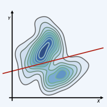
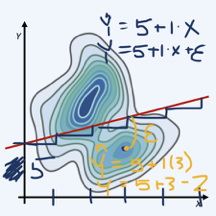
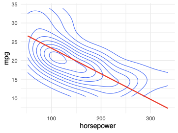
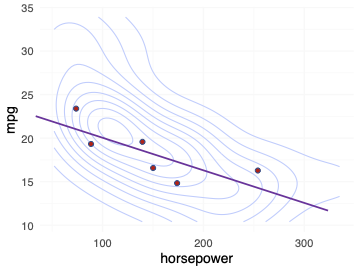

# 

## 

::: {.notes}

- If you open any academic paper that uses data today - there's a quite good chance that you'll find a linear regression inside. If you don't find a regression, you might find a technique that's based on linear regression.  Even the most cutting edge machine learning techniques - most still contain elements of linear regression.
:::

## 

## 

## The Regression Algorithm

__Idea: Draw a line given a sample of data__

::: {.notes}

-  So regression is absolutely foundational to modern data science.
- And, in one sense it's easy.
- The basic idea is quite simple
- The algorithm is quite simple - I can show you how to calculate the line in a few minutes.  But just drawing a line isn't statistics - anyone can draw a line, but a line is just a line.
- After you draw a line, there are two questions you need to ask...
:::

## 
standout

What does this line 
_mean_
?

Under what assumptions?

::: {.notes}

- What's interesting is that even though everyone agrees on how to compute a regression line, people have different answers to these questions.
- There's a statistical perspective, a structural perspective, a machine learning perspective...
- Which do you need to learn?  All of them.  As a data scientist, you'll need to converse with many types of people...
- But you have to start somewhere.  We have a very strong opinion about this - we're going to teach you what we think is the most fundamental perspective on regression.
:::

## The Mechanics of OLS Regression

- The OLS algorithm
- Statistical assumptions
- Statistical guarantees

::: {.notes}

- You can think of this unit as covering the mechanics of linear regression.  The algorithm itself, statistical assumptions, and statistical guarantees.  This is a foundation, and later on, we'll move on to applications.  let's get started.
:::

# Unit Plan

## Goals of This Week
At the end of this week, you will: 
  
1. Understand that regression is the plug-in estimator
    of the best linear predictor (BLP).
2. Understand overall model fit and use an F-test to assess
    whether a candidate model is performing better than a baseline
    model.
3. Understand how to appropriately interpret regression
    coefficients, including measures of certainty and uncertainty, and
    use Wald tests to assess whether coefficients are different from zero.
4. Lay a foundation for careful interpretation.

::: {.notes}

- When we discuss fitting, we're going to reason from the
    closed-form solutions. But, we will also nod to how we might
    produce estimates through a brute-force, numeric optimization
    route.
:::

# Reading: The Golem of Prague

## Reading: The Golem of Prague
__This is a placeholder for a reading call. We're just placing
    it here for organization.__
- Read Sections 1.0 and 1.1 of _Statistical Rethinking_ ,
    which we have provided a copy of in PDF form from the publisher.
- _Statistical Rethinking_ is a great book and reference
    that you should consider later in your data science and statistics
    path.

# Regression, a Statistical Golem

## Regression, a Statistical Golem

- Regression—like all models—is a tool.
- We put tools to use toward a data scientific purpose; however,
    tools are only tools.
- Use of a straight-edge, scale, and T-square doesn't make
    one an architect any more than use of \{ \texttt{insert language} \} or \{ \texttt{insert technique} \} makes one a data scientist.

::: {.notes}

- A major point in 201, and again here in 203 is that we
    cannot, under any circumstance -- whether question formation,
    ethics, data viz, model architecture -- be unthinking as data
    scientists. Because our models 
- In the case of regression, it is 
- The tasks that we pursue require 
- But, combined with how we 
:::

## The Machinery of OLS Regression

- OLS regression is a plug-in estimator for the best linear
    predictor (BLP).
- The BLP is the lowest mean squared error (MSE) estimator, out of all linear functions.

::: {.notes}

- 
- On the one hand, there is little special about
    regression.
- It is a simple formula, with a closed form solution that
    is both easy to fit (because of squared loss). It just so happens
    that minimizing MSE happens to be desirable in many cases.
- But this is quite literally the beginning and end of
    what it does. If we wanted to minimize quadratic squared error; or
    absolute deviations, we would derive another estimator.
- What if we wanted to make a model that was usefully
    understandable by a stakeholder for descriptive purposes? What if
    we wanted to identify a causal effect? There is no guarantee that
    minimizing MSE will accomplish these goals. We as scientists have
    to carefully define the question and task that we are
    undertaking.
:::

## Applications of OLS Regression
__Regression is fantastically versatile__
- Under some circumstances, regression has explainable
      internal weights (coefficients) that are of interest.
- Under other circumstances, regression identifies causal
      effects.
- Under many circumstances, regression is the _de facto_ baseline estimator.

::: {.notes}

- But, on the other hand...
:::

# Elements of a Linear Model

## Elements in a Linear Model

::: {.callout-note title="Linear model A.K.A. linear predictor"}

    A __linear model__ is a representation of a random variable
    ($Y$) as a linear function of other random variables
    $\bs X = (X_1,X_2,...,X_k)$.
  
:::

\begin{tabular}{l|l}
      \multicolumn{1}{c}{$Y$} & \multicolumn{1}{c}{$X_1, X_2,...,X_k$} \\
      \hline
      Target & Features\\
      Outcome & Predictors\\
      Dependent variable & Independent variables\\
      Output & Inputs \\
      Response & Controls\\
      Left-hand side (LHS) & Right-hand side (RHS)\\
      \multicolumn{1}{c}{$\vdots$} & \multicolumn{1}{c}{$\vdots$} \\
    \end{tabular}

::: {.notes}

- Before we dive into OLS regression, let's discuss linear
    models more broadly.
- By a linear model, we mean that
    we have one random variable 
- These variables go by many different names.
- In ML, Y is usually the target, X's are features
- In classical stats, dependent and independent variables,
    or sometimes RHS and LHS are more popular
- Those are ok, but we don't like that
    dependent variable sounds like a causal effect.  As we'll discuss,
    we can't just assume that a linear model represents any kind of
    causal relationship.  For that reason, we'll try to stick with the
    more prediction-focused terms, like target and features 
:::

## The Linear Model Formula

::: {.callout-note title="The linear model formula"}

\begin{align*}
      \hat{Y} &= g(X_1,X_2,...,X_k)\\
              &=\beta_0 + \beta_1 X_1 + \beta_2 X_2 + ... + \beta_k X_k
    \end{align*}
:::

::: {.notes}

- Here's what the linear model looks like
- We may write g of the X's to emphasize that this is a function
- The number that comes out of the function is called a prediction
- Since we're putting random variables into the function,
    the output is also a random variable
- We'll label the prediction 
- $\beta_{k}$
- Depending on the type of linear model building that
    you're doing, either 
:::

## A Linear Model Example

::: {.callout-note title="Brunch in Berkeley"}

\[
      \widehat{\text{Avocados}} = 2 + 1 \cdot \text{Lemons} + 2 \cdot
      \text{Loaves\_Bread}
    \]
:::

# Review: Outcome, Prediction, and Error

## Review: Outcome, Prediction, and Error

::: {.notes}

- Here's a picture of a joint distribution, with just one X and Y.
- And here's a line representing a linear model.
- Is this a good model?  Doesn't look great to my eyes,
    but that's actually intentional.  We haven't said anything about
    what makes a good model yet!
- If I imagine drawing a point 
- 

:::

# Concept Check: Making Predictions with a Linear Model

## Concept Check: Making Predictions with a Linear Model

- Students will be given a model and (x,y) and compute prediction and error.

# Metric Inputs

## Interpreting Model Weights (Coefficients)

\[
    \hat{Y} =\beta_0 + \beta_1 X_1 + \beta_2 X_2 + ... + \beta_k X_k
  \]

::: {.callout-note title="Interpretation of coefficients"}

- If $X_{i}$ changes by $\Delta X_{i}$ units, the predicted value
      of the target, $\hat{Y}$ changes by $\beta_{i} \cdot \Delta X_{i}$ units.
- If $X_{i}$ and $X_{j}$ change by $\Delta X_{i}$ and $\Delta
      X_{j}$ respectively, then the predicted value of the target, $\hat{Y}$ changes by $(\beta_{i} \Delta X_{i}) + (\beta_{j} \Delta X_{j})$ .
__Ceteris paribus:__ all else equal
  
:::

::: {.notes}

- How do we interpret the betas in a linear model?
- A linear model is a 
- To get an idea, try taking the partial derivative of the
    predicted outcome, with respect to some 
- This means that you can think of 
:::

## Interpreting Model Coefficients: Example
Does this model say peacocks with longer tails fly slower?  

  
\[
    \text{air\_speed} = 4.3 - 1.2 \cdot \text{tail\_length} + 0.8
    \cdot \text{muscle\_mass}
  \]

\scalebox{.5}{Photo by Thimindu Goonatillake CC BY-SA
    2.0}

::: {.notes}

- Here's a model that we developed to describe the flying
    speed of male peacocks.
- Notice the coefficient on the tail length variable: 
- Does this mean that peacocks with longer tails are
    slower flyers?
- The answer is no - we have to remember ceteris paribus
- The correct interpretation is that peacocks with1 unit
    longer tails, but the same muscle mass, are predicted to fly 1.2
    units slower.  But what about peacocks with longer tails as a
    whole?  We just don't know.  You can imagine that peacocks with
    longer tails also tend to have more muscle mass.  Maybe they fly
    faster.
:::

# Categorical Inputs

## Categorial Inputs, Part I
What if, rather than 
_numeric_
 inputs, we had 
_categorical_
 inputs?
  
- Information that says it belongs to one category or another, but doesn't provide a value to that category?
- __Reminder__ : There are four ``levels'' of information -- (1) Categorical; (2) Ordinal; (3) Interval; (4) Ratio

## Categorical Inputs, Part II
How is this represented in a model?
  
- The model aims only to distinguish one category from another, and so switches from stacked _labels_ to _one-hot encoded_ , or _dummy_ variables.
- Practically, in this model, one of the labels is identified as the _baseline_ , _default_ , or _omitted_ category
- Indicators for _alternate_ levels mark changes from the baseline to the alternate level.

## Categorical Inputs, Part II

# Learnosity: Interpreting Model Weights

## 
__This is a placeholder for a Learnosity activity.__
- have to change this, so it's about interpretation, not prediction
- In this activity, students will be given a fitted model that
    conforms with the data that they have for the peacock
- They will make predictions _first_ from the data,
    and then
- Second, from newly created data to see how the predictions
    change

# Part 2: Selecting a Linear Model with OLS

# OLS is Regression for Estimating the BLP

## Fitting Linear Models
__Linear regression:__
 an algorithm for fitting a linear model
  given a sample of data
  
- Ordinary least squares (OLS) regression
- Quantile regression
- Regularized regression - Lasso
- Ridge regression

::: {.notes}

- Where do linear models come from?  Up till now, we've
    just made up numbers.
- But what we really want to do is choose the model
    using data.
- There are a lot of different algorithms that you can use to choose a linear model.  We've listed a few famous ones here, but there are many options.
- If you start with a different objective, you will design a different algorith..
- Out of these, the most foundational type of regression
    is OLS, so what is it designed to do?
:::

## Understanding OLS

::: {.callout-note title="Ordinary least squares (OLS) regression"}

- The most well-known type of linear regression
- A foundation for many other types of regression
- Key goal: estimating the best linear predictor (BLP)

:::

::: {.notes}

- In this unit, our main topic is a type of regression called OLS
- A key goal is estimating the BLP.  Let's review what the BLP is and why it's so great.
:::

## The BLP Minimizes Expected Squared Error

## The Best Linear Predictor

::: {.callout-note title="The BLP (population regression function)"}

    The best linear predictor is defined by the function 
    \[g(\mathbf{X}) = \beta_{0} + \beta_{1}X_{1} + \beta_{2} X_{2} +
      \dots + \beta_{k}X_{k}\] 
    where $\boldsymbol{\beta} = (\beta_0, \beta_1,...,\beta_k)$ are
    chosen to minimize the expected squared error.
    
    \[
      \min_{(b_{0}, \dots, b_{k})}
      \E\big[ (Y - (b_0  + b_1 X_1 + ... +b_k X_k))^2\big]
    \]
:::

::: {.notes}

- If we are working with a best linear predictor, then we
    know we have a function that must take the following form: 
- Remember the formula for the BLP in the single variable
    case; it is a more complex now -- complex enough that we can't
    work through the statement, but it is just a bit more than 
:::

## Great Things About the BLP
The best linear predictor...
  
- minimizes MSE out of all linear models.
- captures an infinitely complex distribution in a few parameters.
- can be estimated with much less data compared to a probability density.
- is easy to reason about.
- is easy to communicate to others, helping knowledge advance.
- has a closed form solution that is relatively easy to work with.

## Applying the Plug-In Principle

::: {.notes}

- We can't see the joint distribution, so we can't analyze the true error
- But we do have this data, so can use a plug-in estimate
- Instead of an expectation, we'll look at the distance to each data point and take an average
- These distances are called residuals
:::

## OLS Regression Is the BLP Plug-In Estimator

::: {.callout-note title="Plug-in strategy"}

    The OLS regression line is given by
    \[
      \hat{g}(\mathbf{X}) = \hat{\beta}_{0} + \hat{\beta}_{1}X_{1} + \hat{\beta}_{2}X_{2} +
      \dots + \hat{\beta}_{k}X_{k} 
    \]
    where $\boldsymbol{\hat \beta} = (\hat \beta_0,\hat \beta_1,...,\hat \beta_k)$ are given by
      \[
      \min_{(b_{0}, \dots, b_{k})} \frac{1}{n}  \sum_{i=1}^n \big(Y_i
      - (b_0 + b_1 X_{[1]i} + ... + b_k X_{[k]i}) \big)^2.     
    \]
:::

::: {.notes}

- The general plug-in principle says that we write down
    the sample analogue for the population quantity that we're
    interested in. Lets do just that.
- Basically, we had an expectation in the formula
    before, but now we replace that by taking an average over the n
    datapoints.
- Instead of minimizing squared error, we are now
    minimizing squared residuals
- The hope is that by doing this, we'll get a good
    estimator.  But we still have to prove it.  we'll do that soon.
:::

## An Analogy with the Mean

\renewcommand{\arraystretch}{1.5}
\begin{tabular}{p{5cm} | p{5cm}}
  Given only Y & Given Y and X \\
  \hline
  $\E[Y]$ minimizes MSE out of all numbers. & the BLP minimizes MSE out of all linear models. \\ 
  We can't compute $\E[Y]$ without knowing the distribution. & We can't compute the BLP without knowing the distribution. \\
  $\bar X$ is the plug-in estimator for $\E[Y]$. & OLS is the plug-in estimator for the BLP.
  \end{tabular}

## Coming Up Soon...
We still have to:
  
- solve the minimization problem
- show that OLS is _consistent_ for the BLP

::: {.notes}

- Here's what we have to do.
- First, we have to get the equation into a more useful form.  We want to minimize the sum squared residuals.  we have to actually solve that minimization problem and write down the solution.
- Second, we have to show that it really has good statistical properties
- Once we do all that, we'll have a great justification for the OLS algorithm.  it is a consistent estimator for the model that minimizes MSE.
:::

# Learnosity: You Minimize It!

## Learnosity: You Minimize It!
__Note: This is a Learnosity Activity. We're just placing it
    here for organization.__

  This is the activity that is currently coded
\texttt{regression\_fit\_2d\_exercise/}
.
  
__Note that we would
    like to expand this to ask students to work through several
    examples in a row. Presently we have a single example made;
    expanding this to a broader set is relatively easy. In the
    expanded set, we should ensure that we have some complexity in the
    data—e.g., a sine curve.__

# Reading: OLS Regression Estimates the BLP

## Reading: Linear Regression is a Plug-in Estimator for the BLP
__Note: this is a reading call, we're just placing it here for
    organization.__

  Read pages 143–147 of 
_Foundations of Agnostic Statistics._

# Choosing Assumptions for OLS Regression

## When Does OLS "Work"?
The OLS regression line is
  
\[
    \hat{g}(\mathbf{X}) = \hat{\beta}_{0} + \hat{\beta}_{1}X_{1} + \hat{\beta}_{2}X_{2} +
    \dots + \hat{\beta}_{k}X_{k}
  \]

  where 
$\boldsymbol{\hat{\beta}}$
 are chosen to minimize
  squared residuals.
  
\pause

 Different assumptions 

$\Downarrow$

Different statistical guarantees

  

::: {.notes}

- You've already seen one definition of OLS regression.
- OLS is just an algorithm.  No matter what the situation
    is, you can always run it and get some numbers out.  (It is a Golem!)
- So you might want to know, ``What assumptions are needed
    for OLS regression to work?'' It's not so easy - there are different sets of assumptions out there.
- Depending on which assumptions you choose, you get different guarrantees.
- We're going to teach you two main sets of assumptions.
:::

## 
standout
\normalsize
- __More data__ $\implies$ less restrictive assumptions
- __More data__ $\implies$ easier to assess assumptions

::: {.notes}

- First, a very general point: the more data you have, the better off you are.
- More data helps in two major ways.
- First, we don't need as many assumptions with more data.
    That's because of asymptotics - statistics behave in predictable
    ways when 
- Second, having more data helps you to assess your
    assumptions.  It's hard to defend an assumption of normality when
    you have 5 data points.  if you have 100, you have an argument.
:::

## OLS in a Large Sample

::: {.callout-note title="The large-sample model (not an official name)"}

    Just two assumptions:
    - I.I.D.
- Unique BLP exists

:::

__Asymptotic behavior as $n\to\infty$ provides considerable
    guarantees.__

::: {.notes}

- With a lot of data, 
- All we need is that the data is distributed i.i.d., and
    that there is a unique solution to the BLP.
- If there isn't a unique solution, then we just can't
    solve for it!
- When you package these two assumptions together, we'll call them the large-sample model.
- That's not an official name, so don't use it outside of this class.  But it will help us to give it a name.
:::

## OLS in a Small Sample

::: {.callout-note title="The classical linear model"}

- A parametric model—fully specifies $f_{Y|X}$
- Traditional starting point for regression
- Even with extensive transformations, may be hard to justify assumptions

:::

__Guarantees come from strict assumptions.__

::: {.notes}

- We want to draw your attention to the fact that we're
    presenting the large-sample (asymptotic) version of regression
    this week. In the future, we will talk about the smaller sample
    variant known as the 
- Whereas we get 
:::

## OLS in Very Small Samples
Special difficulties when 
$n < \sim15$
- No help from asymptotics
- Not enough data to assess CLM

::: {.callout-note title="Randomization inference"}

- A framework for testing (restrictive) null hypotheses

:::

::: {.notes}

- I want to say a few words about very small samples.
- very small isn't a technical phrase, but think 
- First, should you 
- The problems really compound in this range.
- First, you get no help from asymptotics, which means that
  you need to meet the CLM exactly.
- Second, you don't have enough data to assess the CLM.
  even if things look ok, how can you convince someone when you only
  have 10 datapoints?
- One suggestion: if you need to work with very small data,
   especially from experiments, you should read up on a field called
   randomization inference.  It can give you a principled way to test
   hypotheses (at least special types of hypotheses) without any
   distributional assumptions.
:::

## Rules of Thumb for OLS Assumptions

::: {.callout-note title="Rules of thumb"}

  In general, you might reason about data and regression models in the
  following way.

  \begin{tabular}{l|l}
      \textbf{Sample size} & \textbf{Required assumptions} \\
      \hline
      $100 \leq n$ & Large-sample linear model\\
      $15 \leq n < 100$ & Classical linear model\\
      $5 \leq n < 15$ & Randomization inference\\
    \end{tabular}
:::

::: {.notes}

- These are our 3 main frameworks. I want to put down
    some numbers to help you choose a framework.
- These are ONLY rules of thumb. 
- First, you can consider the large-sample model if
    
- It depends on how extreme the violations of the CLM are.
    In particular, if the error distribution has a really large skew,
    you may need 
- from 15 to 60, we're recommending the CLM as your framework.
- below 15, the CLM is no longer very credible.  you can
    report your coefficients, and possibly use randomization inference
    to get p-values.
- Out of these models, we're going to start with the large sample model. and we're going to spend the most time on the large-sample model.  That's because we expect a data scientist to spend more time with with large samples, but we will come back and talk about the CLM later in the course.
:::

# The Bivariate OLS Solution

## 
Existing Content (in distinct format) 
 
 9.5 Deriving the Bivariate OLS Estimators
 

# Consistency of Bivariate OLS Under the Large-Sample Model

## 
__Continuous mapping theorem:__
 Let 
$(S^{(1)},
S^{(2)},S^{(3)},...)$
 and 
$(T^{(1)}, T^{(2)},T^{(3)},...)$
 be
sequences of random variables.  Let 
$g: \R^2 \rightarrow \R$
 be a
function that is continuous at 
$(a,b)  
\in \R^2$
.  If 
$S^{(n)} \overset{p}{\to}  a$
 and 
$T^{(n)} \overset{p}{\to}  b$
, then 
$g(S^{(n)} ,T^{(n)})  \overset{p}{\to}
g(a,b)$

Assumptions: 1) I.I.D.  2) Unique BLP exists (
$\V(X) > 0$
)

::: {.notes}

- In the last lightboard we derived that 
- Here, we'll prove that these estimates are consistent
  estimates in the large sample case.
:::

## 
__Continuous mapping theorem:__
 Let 
$(S^{(1)},
S^{(2)},S^{(3)},...)$
 and 
$(T^{(1)}, T^{(2)},T^{(3)},...)$
 be
sequences of random variables.  Let 
$g: \R^2 \rightarrow \R$
 be a
function that is continuous at 
$(a,b)  
\in \R^2$
.  If 
$S^{(n)} \overset{p}{\to}  a$
 and 
$T^{(n)} \overset{p}{\to}  b$
, then 
$g(S^{(n)} ,T^{(n)})  \overset{p}{\to}
g(a,b)$

Assumptions: 1) I.I.D.  2) Unique BLP exists (
$\V(X) > 0$
)

\begin{align*}
  \quad x^{(n)} &= (x_1,x_2,...,x_n) \quad y^{(n)} = (y_1,y_2,...,y_n)\\
  S^{(n)} &= \widehat{\cov}(x^{(n)}, y^{(n)  }) \quad T^{(n)} = \widehat{\V}(x^{(n)})\\
  \hat \beta^{(n)}_1 &=  S^{(n)} / T^{(n)}\\
  S^{(n)} &   \overset{p}{\to} \cov[X,Y], \qquad 
            T^{(n)}    \overset{p}{\to} \V[X]\\
  g(c,d) &= c/d\text{ is continuous where } d \neq 0 \\
  \hat \beta^{(n)}_1 &= g(  S^{(n)}, T^{(n)})
                       \overset{p}{\to}  
                       g(  \cov[X,Y], \V[X,Y] ) = \beta_1 
\end{align*}

::: {.notes}

- In the last lightboard we derived that 
- Here, we'll prove that these estimates are consistent
  estimates in the large sample case.
:::

# The Matrix Formulation of a Linear Model

## The Matrix Formulation of a Linear Model

- Insert content from previous version of course: 10.7 Matrix
    Form of the Linear Model
- This content leads into the next lightboard of the
    derivation of the OLS normal equations

# Reading: The Matrix Solution For OLS Regression

## Reading: The Matrix Solution For OLS Regression
Read section 4.1.3, which is on pages 147 - 151.

# The Multiple OLS Solution

## The Multiple OLS Solution

- Pull in the lightboard called _Matrix Derivation of
        the OLS Estimator_ .
- In the next iteration of the course, pull in a geometric
      derivation of the OLS coefficients.

# Sample Moment Conditions

## Review: Population Moment Conditions
__Population:__
  Let 
$\epsilon$
 represent error from the BLP.

Version 1: 
$\E[\epsilon]=0, \E[X_j \epsilon] = 0$
  for all 
$j$
.  

Version 2: 
$\E[\epsilon]=0, \cov[X_j,\epsilon]=0$
 for all 
$j$
. 

## Sample Moment Conditions
__Sample:__
 Let 
$\bs e = \left[ \begin{matrix} e_1 \\ \vdots \\ e_n \end{matrix} \right]$
 represent OLS residuals.

## Sample Moment Conditions
__Sample:__
 Let 
$\bs e = \left[ \begin{matrix} e_1 \\ \vdots \\ e_n \end{matrix} \right]$
 represent OLS residuals.

$\X^T \bs Y = \X^T \X \bs \beta$
, 
$\qquad 0 = \X^T ( \bs Y - \X \bs \beta) = \X^T \bs e$
$\left[ \begin{matrix} 1 & 1 & \hdots & 1 \\
X_{[1]1} & X_{[1]2} & \hdots & X_{[1]n} \\
\vdots & \vdots & \ddots & \vdots \\
X_{[k]1} & X_{[k]2} & \hdots & X_{[k]n} \\
\end{matrix} \right]. \left[ \begin{matrix} e_1 \\ e_2 \\ \vdots \\ e_n \end{matrix} \right]$
$\sum e_i = 0$
, 
$\sum X_{[j]i} e_i = 0$
. or 
$\widehat{\cov}(\bs X_{[j]}, \bs e) = 0$

# Consistency of Multiple OLS

## Consistency of Multiple OLS
Assumptions: 1) I.I.D.  2) Unique BLP exists

  
$\text{In population: } \boldsymbol{  \beta } = \E[ X^TX]^{-1} \E[X^TY]$

::: {.notes}

- To apply the continuous mapping theorem, we need to know that 
:::

## Consistency of Multiple OLS
Assumptions: 1) I.I.D.  2) Unique BLP exists
  
\begin{align*}
    \text{In population: } \boldsymbol{  \beta } &= \E[ X^TX]^{-1} \E[X^TY]
  \end{align*}
\begin{align*}
    \boldsymbol{ \hat \beta }^{(n)} &= (\frac{1}{n}  \X^{(n)T} \X^{(n)})^{-1} \frac{1}{n}  \X^{(n)T} \boldsymbol{Y^{(n)}} \\
    \frac{1}{n}  \X^{(n)T} \boldsymbol{Y^{(n)}}  &=
                                     \frac{1}{n}   \left[
                                          \begin{array}{cccc}
                                            \vertbar & \vertbar &        & \vertbar \\
                                            x_{1}    & x_{2}    & \ldots & x_{n}    \\
                                            \vertbar & \vertbar &        & \vertbar 
                                          \end{array}
                                       \right]
                                       \left[
                                         \begin{array}{c}
                                           y_1 \\
                                           y_2  \\
                                           \vdots \\
                                           y_n
                                         \end{array}
                                           \right]
    =\frac{1}{n}  \sum_{i=1}^n x_i^T y_i \\
  \frac{1}{n}   \X^T\X &= \frac{1}{n} 
             \left[
             \begin{array}{cccc}
               \vertbar & \vertbar &        & \vertbar \\
               x_{1}    & x_{2}    & \ldots & x_{n}    \\
               \vertbar & \vertbar &        & \vertbar 
             \end{array}
                                              \right]
                                              \left[
                                              \begin{array}{ccc}
                                                \horzbar & x_{1} & \horzbar \\
                                                \horzbar & x_{2} & \horzbar \\
                                                         & \vdots    &          \\
                                                \horzbar & x_{n} & \horzbar
                                              \end{array}
                                                                   \right]
                                                                   = \frac{1}{n}  \sum_{i=1}^n x_i^T x_i
  \end{align*}

::: {.notes}

- Is this useful, or should we just do the bivariate case?  it's a lot of content for one lightboard and I think it's too hard to actually prove continuity for the CMT
- 
- Can write 
- First, here's a useful way to write our vector of coefficients.  as the true parameter plus a random error term.
- Next, we have to open up these matrices and think about what's inside.  Let the rows of 
- To apply the continuous mapping theorem, we need to know that 
:::

## Consistency of OLS

\begin{align*} 
    \text{WLLN} &\implies \frac{1}{n} \sum_{i=1}^n x_i^T x_i  \overset{p}{\to} \E[X^TX]  \qquad  
                  \frac{1}{n} \sum x_i^T y_i  \overset{p}{\to} \E[X^T Y]  \\
    \text{CMT} &\implies \boldsymbol{ \hat \beta } = \beta + (\frac{1}{n} \sum_{i=1}^n x_i^T x_i) ^{-1} (\frac{1}{n}  \X^T \epsilon)
                 \overset{p}{\to} \beta + 0 = \beta \\
  \end{align*}

# Unique Variation and Regression Anatomy

## How Can We Understand a Specific $\hat \beta_i$?

\[
    \boldsymbol{\hat \beta}= (\X^T\X)^{-1}\X^T\boldsymbol Y
  \]

::: {.notes}

- We've written before that OLS is a 
- Another, very interesting consequence of the
      underlying geometry of OLS regression is that each of the
      coefficients are fitted only on the 
- Agrist and Pichke (2009) term this the
      
- You've seen the matrix solution for ols regression, so you can now go and compute ols coefficients.
- But what if you want to understand a specific
    coefficient? what makes it go up and down?  You could invert the
    matrix, but that's really complicated
- You might wonder, can you write down a formula for a
    single coefficient, that will help you understand what's going
    on.
- It turns out, yes.  There is a helpful formula, which we
    call the regression anatomy formula.
:::

## Partialling Out
$\hat Y = \hat \beta_0 + \hat \beta_1 X_1 + \hat \beta_2 X_2 + ... + \hat \beta_k X_k$

  Step 1: Regress 
$X_1$
 on other 
$X$
s
  
$\hat X_1 = \hat \delta_0 + \hat \delta_2 X_2 + ... + \hat \delta_k X_k + r_1$

  Step 2: Regress 
$Y$
 on the residuals from Step 1
  
  
$\hat Y = \hat \gamma_0 + \hat \beta_1 r_1$

 Regression anatomy: 
$\hat \beta_1 = \frac{\widehat{ \cov} ( \boldsymbol{Y}, \boldsymbol{r_1})}{\widehat{\V}(\boldsymbol{r_1})}$

::: {.notes}

- Let's say we're interested in computing 
- It turns out that we can compute it in stages:
- First, regress 
- We have some residuals from that regression, 
- Next, we take those residuals and regress Y on them.
- It turns out that we get the same 
- This is a powerful idea.  ols works on unique variation in each X, variation that is collinear with the other variables doesn't contribute, you may as well subtract it out.  As we'll see later, the more unique variation we have in X, the more precision we'll have.
:::

# Deriving the Regression Anatomy Formula

## Deriving the Regression Anatomy Formula
Use content from old course:

10.5 Regression Anatomy

# Segment for Consideration: Applying the Regression Anatomy Formula

## Applying the Regression Anatomy Formula
Consider using the old concept check:  10.6 Applying the Regression Anatomy Formula

## Interpreting Model Coefficients: Warnings
$\widehat{Wage} = \beta_0 + \beta_1 Age + \beta_2 Birth\_Year$

What does it mean to hold 
_Age_
 constant while increasing 
_Birth\_Year_
?
 

::: {.notes}

- Ceteris paribus hints at some of the care we need when putting variables into a linear model.
- Here's a model for wage, with two variables, Age and Birth Year, how do you interpret 
- You can fit a model like this (many do), but is it telling you something about the joint distribution?
- 
:::

# Evaluating the Large-Sample Linear Model

## The Large-Sample Linear Model

- I.I.D. data
- A unique BLP exists

::: {.notes}

- The great thing about regression with large samples, is that you don't need a lot of assumptions.
- A lot of books heavily stress the CLM, and people get the impression that regression takes a lot of assumptions 
- Actually, if you're seeing this for the first time, you might be really surprised that we are doing everything with just two assumptions, which we are calling the large sample linear model.
- But we do need these two assumptions, so it's important that we stop to assess them.
- We can't just blindly assume they're true.  we have to look at the situation we're modeling and ask, are they plausible?  or are they realistic.
:::

## What Does I.I.D. Mean?

Imagine selecting each new datapoint...

- from the same distribution
- with no memory of any past datapoints

::: {.notes}

- This is a model, and we have to look at the real world and see how much it resembles this model
:::

## Common Violations of Independence

- Clustering - Geographic areas
- School cohorts
- Families
- Strategic Interaction - Competition among sellers
- Imitation of species
- Autocorrelation - One time period may affect the next   __How can observing one unit provide information about some other unit?__ \note[item]{In general, the question is how can observing one unit give information about some other unit.} \note[item]{For some of these violations, you can devise a statistical test.  But there's no test can can detect an arbitrary network of dependencies.  To assess this assumption you really need to use your background knowledge.}

::: {.notes}

- It helps to know some common violations so that you can watch out for them 
:::

## A Unique BLP Exists
A BLP exists:

- $\cov[X_i,X_j]$ and $\cov[X_i,Y]$ are finite (no heavy tails)

The BLP is unique:

- No perfect collinearity
- $\E[X^TX]$ is invertible \note[item]{What does this mean? Each X has to have some unique variation.} \note[item]{That makes sense because we know ols works on unique variation.  If we combine this assumption with the previous one, we can prove that a unique BLP exists.}

\hspace{.5cm}
$\implies$
 No 
$X_i$
 can be written as a linear combination of the other 
$X$
's.
  

::: {.notes}

- What does it mean for the BLP to exist? we need all the covariances in the solution to be finite.  that basically means that the random variables can't have tails that are too heavy.
- This is usually true.  actually, some textbooks don't even mention this assumption.
- I think it's good to mention it, because researchers do believe that some variables have heavy tails: wealth is one example. air emissions. financial returns...
:::

## Perfect Collinearity Example 1
$\widehat{Price} =  .5\ Donuts + 0.0\ Dozens$

 or
  
$\widehat{Price} =  0.0\ Donuts + 6.0\ Dozens$

::: {.notes}

- Here's an example to help understand why we need this assumption
- You regress the price on both number of donuts and number of dozens of donuts.
- it's 50 cents per donut, so you can write the price as 50 cents times number of donuts
- But you can also write it as 6 dollars times number of dozens.
- Both are equivalent for predicting the price - this problem doesn't affect prediction.
- But you can't estimate coefficients, because they aren't uniquely defined.
:::

## Perfect Collinearity Example 2
$\widehat{Voters} =  200\ Positive\_Ads + 100\ Negative\_Ads + 0\ Total\_Ads$

 or
  
$\widehat{Voters} =  100\ Positive\_Ads + 0\ Negative\_Ads + 100\ Total\_Ads$

::: {.notes}

- Here's another example, to show you that multicollinearity isn't always about pairs of variables, it might be more variables
- Here you have a regression with number of positive ads, number of negative ads, and the total number of ads.
- Once again, you can find multiple ways to write the same model. 
:::

# Goodness of Fit

## 
__Goodness of fit:__
 How well does a model fit the data?

  
- $R^2$
- Adjusted $R^2$
- Akaike information criterion (AIC)
- Bayesian information criterion (BIC)

::: {.notes}

- We've seen how to compute regression coefficients, and you know a little about interpreting them.
- But we sometimes you also want to step back and assess the model as a whole.
- One question you might ask is this: How well does a model fit the data?
- I know that's a fuzzy question, but it seems important.  Is there a really close match between model and data or are they far apart?
- Can we come up with a single number to capture that idea?
- There are a number of statistics for that purpose, and we can call them measures of fit. 
- The most famous one is 
:::

## Breaking Down Variance
__ Total variance = explained variance + residual variance __

::: {.notes}

- $R^2$
- This may remind you of the law of total variance, but it's a different decomposition,  this only works for OLS
- $\hat V[Y] = \hat V[\hat Y + \hat\epsilon] = \hat V[\hat Y] + \hat V [\hat\epsilon] + 2 \widehat{cov}[\hat Y, \hat \epsilon]$
- $\widehat{cov}[\hat Y, \hat \epsilon] =  \widehat{cov}[\beta_0 + \beta_1 X_1 + ...+\beta_k X_k, \hat \epsilon] =0$
- One technical note: these are regular sample variances - so the denominator is n-1 everywhere.  I'm saying that because when people say "residual variance" it usually includes a correction for the number of coefficients.  If you do that, you get something called adjusted R squared.  I want to talk about regular R squared so no corrections.
:::

## Defining $R^2$
$R^2 = 1- \frac{\hat \V(\bs{\hat \epsilon}) }{ \hat \V (\bs{Y} )  } = 1 - \frac{\text{residual variance}}{\text{total variance}}$
$\text{For OLS: } R^2 =  \frac{\text{explained variance}}{\text{total variance}}$

_ How much of the variation in the outcome does the model explain?_

::: {.notes}

- Now that you understand these components of variance, here's the definition of 
- $R^2$
- You can think about variance as information.  The independent variables are giving you some information about the outcome.  If you could predict the outcome perfectly, 
:::

## R is Correlation

\Large
$R^2 = \frac{\hat \V( \bs{ \hat Y}) }{ \hat \V ( \bs Y )  }$

::: {.notes}

- Here's another way to look at 
- I can rewrite the numerator:
     
- $R^2 = \frac{\hat V(\hat Y) \hat V(\hat Y) }{ \hat V ( Y )  \hat V(\hat Y) } 
      = \frac{\widehat{cov}(\hat Y, Y)^2}{ \hat V ( Y )  \hat V(\hat Y)}  = \widehat{corr}(\hat Y, Y) ^2$
- So we learned that 
:::

## Understanding Sums of Squares
Total sum of squares: TSS 
$= \sum_{i=1}^n (y_i - \bar y)^2$

 Explained sum of squares: ESS 
$= \sum_{i=1}^n (\hat y_i - \bar y)^2$

 Residual sum of squares: RSS 
$= \sum_{i=1}^n (\hat \epsilon_i)^2$
$\text{For OLS:  TSS} = \text{ESS} + \text{RSS}$
$R^2 =1 - \frac{\text{RSS}}{\text{TSS}}$

::: {.notes}

- I want to warn you that when you read about R-squared, the formula is usually different.
- Instead of variances, most people learn about these things called sums of squares
:::

## Things to Remember About $R^2$

- Adding variables always makes $R^2$ go up. \note[item]{First, adding variables makes $R^2$ go up.  this is because OLS is essentially an $R^2$ maximizing machine.  you give it more variables and it can't do any worse.}
- With many variables, consider alternatives. - Adjusted $R^2$ % \item Akaike Information Criterion (AIC) % \item Bayesian Information Criterion (BIC) \note[item]{If you have a lot of variables, you might want to consider
  alternatives.  These are measures of fit that penalize extra
  variables.}
- $R^2$ is not a measure of practical significance. - For example, regress hospital admissions on being shot
- A low $R^2$ is a negative, but assess it in context. \note[item]{For example, if you are trying to model the purchasing
  decision that someone makes, there are \textit{all} kinds of things
  that affect that choice. Having a low R2 on a behavioral outcome is
  pretty common.} \note[item]{This is a general test -- if you're including a lot of new
  model features, you would expect R2 to increase -- but this could
  just happen as a result of chance!} \note[item]{The real concern is one of \textit{overfitting} where your
  model is fitting to ``noise'' in the data, rather than to systematic
  patterns.} \note[item]{If we were to just keep increasing the number of terms --
  building a bigger and bigger Golem -- we could perfectly fit the
  data.} \note[item]{But, what would we do with a new datapoint that comes in?}

# Measuring Uncertainty in Regression Estimates

# Introduction to Measuring Uncertainty

## Introduction

- You've run your regression, and produced your BLP estimate.
- How much _could_ the coefficients that you are reporting change if you had drawn a different sample?

## Example: Becomming a Man

- __Becomming a Man__ is a randomized controlled trial that recruited 7,500 male youth in Chicago. \href{https://www.nber.org/system/files/working_papers/w21178/w21178.pdf}{[link]}
- The program, among many other efforts, taught to think about circumstances before engaging.
- Youth randomized to receive this treatment were: - 28-35 \% less likely to be arrested for any reason
- 45-50 \% less likely to be arrested for violent crimes.
- 12-19 \% more likely to graduate high-school

::: {.notes}

- With a sample of this size, with randomly assigned programming to participants, there is little chance that the estimated coefficients would change with a different sample.
:::

## Example: Predicting School Achievement

- Gellman, Hill and Vehtari
      (2020)  write about 343 Portuguese high-school students drawn
      from across the country.
- Predict final-year math grade (as a percentage) and use a large number of predictors: - __Demographic Features__ : family size, health, parent's education
- __Past Education Features__ : past-class failures, educational support, paid classes
- __Educational Cost Features__ :  home-to-school travel time, home internet access
- __Social Features__ : going out with friends, weekday and weekend alcohol consumption

## Describing Uncertainty as ``Resolution''

- Measured data is a point-in-time, limited view of a complex reality.
- With limited data, we can only make out ``fuzzy'' patterns
- With more data, we can see more detail
- With different data, we can see different details

## Describing Uncertainty as ``Resolution''

## Describing Uncertainty as ``Resolution''

# Review: Review: Statistics, Distributions, and Uncertainty

# Reading: Robust Standard Errors

## Reading: Robust Standard Errors
Read section 4.2 Inference, stopping at the bottom of page 153.

# Robust Standard Errors

## Robust Standard Errors, Part I

- Regression coefficients are random variables
- As such, they have sampling variance, just as any other realized random variable
- Recall you've used the sampling variance of the sample mean, $\hat{V}[\overline{X}]$ , and the related concept, the standard error of the sample mean, $\hat{\sigma}[\overline{X}] = \sqrt{\hat{V}[\overline{X}]}$ .
- Here, we introduce the equivalent concept in OLS regression: $\hat{\sigma}[\hat{\beta}_{k}] = \sqrt{\hat{V}[\hat{\beta}_{k}]}$

## Robust Standard Errors, Part II

- On the bottom of page 152, the authors seem to, from nowhere, divine the statement

\[
    \left( E[X^{T}X]\right)^{-1} E[\epsilon^{2}X^{T}X] \left( E[X^{T}X]\right)^{-1}
  \]
- Let's slow that down just a little bit.

## Robust Standard Errors, Part III

## Robust Standard Errors, Part IV

- What information is contained in: $X^{T}X$ ?

## Robust Standard Errors, Part V

- How do changes in data _shape_ increase or decrease the standard errors of regression coefficients?

# Hypothesis Tests

# Testing Improvement in a Model

## Testing Improvements in a Model: The F-Test

# Testing Individual Coefficients

## Hypothesis Tests for OLS
_Are the relationships we see in our regression true of the
    population, or just consequences of sampling variation?_

  Most common tests:
  
- Testing single coefficients - Usually $H_0: \beta_i = 0$ \note[item]{First, we often test single coefficients.  We are usually
  interested in whether there is really a relationship between a var
  and the outcome.  So we set $H_0: \beta=0$.} \note[item]{We hope to reject the null, which gives us evidence that
  there is a relationship. Lets us tell an interesting story} \note[item]{But remember, if you only report positive results, that's
  called publication bias.  It can contribute to false discoveries and
  makes it harder to correct false discoveries.  so for this class,
  negative results are just as interesting as positive results} \note[item]{The other common type of test is of multiple
  coefficients. For now, let's look at single coefficients.}
- Testing multiple coefficients - Usually $H_0: \beta_i = \beta_j = ... = 0$

## Asymptotic Normality of OLS

::: {.callout-note title="Theorem"}

  When the data points are I.I.D. from a distribution with unique
  BLP. $\sqrt{n}(\boldsymbol{\hat \beta} - \boldsymbol{\beta})$
  converges in distribution to a multivariate normal distribution. 
  
:::

:::: {.columns}

::: {.column width="70%"}

- Each $\beta_i$ is asymptotically normal.
- Linear combinations (e.g., $\beta_i - \beta_j$ ) are asymptotically normal.
:::

::: {.column width="30%"}

:::

::::

::: {.notes}

- Think of this as the CLT for ols coefficients.  You can
    derive it from the CLT.
- Remember that we know how to consistently estimate the
    variance of each coefficient (and covariances), so asymptotically
    we know the exact distribution better and better.
:::

## Testing a Single OLS Coefficient

::: {.callout-note title="Large-sample testing procedure"}

  Let $s_i$ be the robust standard error estimate for $\beta_i$.  Then, under $H_0: \beta_i = \mu_0$,
$z = \frac{\hat \beta_i - \mu_0}{s_i}$
is asymptotically distributed $N(0,1)$.  
:::

- Computed automatically in statistical software

## The t-Test for OLS Coefficients
In practice, we call the statistic 
$t$
 and test against a
  
$T$
-distribution. 
  
- Asymptotically, the $Z$ and $T$ distributions are equal.
- Under the classical linear model assumptions, the $T$ distribution is _exact_ for small samples.

## Practical Significance in OLS
_Is the relationship between $X_i$ and $Y$ of a magnitude we should care about?_

  Two common effect size measures:
  
- $\hat \beta_i$
- Coefficient after standardizing $X_i$ or $Y$

::: {.notes}

- As we've told you, when you conduct a test, it's not
    enough to report on statistical significance.  it's very important
    to assess the practical significance of your result.  How do you
    do that in ols?
- Really there are two common effect size measures that you can focus on.
- First, the coefficient itself!  betas are effect size
    measures.
- That's great when the units are understandable
- If the units are confusing, you can still use the
    coefficients, but you will want to standardize your X or Y
    variable first.
:::

## Practical Significance Example 1
$\widehat{Price} = 82,213 + 25,134 \ Bedrooms + 8 \ Gnomes$
_"Garden gnomes have a statistically significant relationship
  with house price ($t=2.1$, $p = .03$)."_
\pause
_"The predicted price only changes by \$8 per garden gnome, a
  negligible amount compared to the total house price.  For
  comparison, the model predicts that it would take over 3,000 gnomes
  to match the effect of a single bedroom."_

## Practical Significance Example 2
$\widehat{Agility} = 132 + 3.4 \ Sleep\_Hours$
_"We found evidence that more sleep is related to a higher
    agility score ($t=3.8$, $p < .001$)."_
_"Each extra hour of sleep is associated with an extra 3.4 points."_

::: {.notes}

- What's wrong with this discussion?
- The problem is we have no idea what 3.4 agility points
    means.
- In this case, a good idea is to first standardize the
    agility score.
:::

## Practical Significance Example 2 (cont.)
Let 
$S\_Agility = \frac{Agility -
    \overline{Agility}}{\sqrt{\widehat{var}(Agility)}}$
$\widehat{S\_Agility} = -1.21 + 0.92 \  Sleep\_Hours$
_"Each extra hour of sleep is predicted to increase agility
    by 0.92 standard deviations."_

::: {.notes}

- We standardize by subtracting the mean and then dividing
    by the standard deviation.
- Now the coefficient can be interpreted in terms of
    standard deviations. Let's read..
- Of course you should try to add more context: is this a
    study for firefighters, for a wellness magazine?  Remember that
    the larger goal is to communicate whether the effect is something
    that we should care about.
:::

# Testing Multiple Coefficients

## Testing Multiple Coefficients

\input{./images/crime.tex}

::: {.notes}

- Here's an example regression table, We're predicting the
    crime rate.
-  This is somewhat old data, but it's for a set of
    counties in North Carolina, in 1987
- For our predictors, we have the density, and then a set
    of wage variables.
- Only the density is statistically significant.  is the
    relationship with wages really that small?
- Well there's a potential problem here.  These variables
    are closely related.  there is a lot of multicollinearity, so the
    standard errors are high.  That might be the reason they are non
    significant.
:::

## Testing Joint Significance

\begin{align*}
\text{Full model: } Crime = \widehat{\beta_0} & + \hat \beta_1 Density + \hat \beta_2 Fed\_Wage \\
  &+ \hat \beta_3 Ser\_Wage + \hat \beta_4 Man\_Wage + \hat \epsilon_f
   \end{align*}
\begin{align*}
\text{Restricted model: }Crime  = \hat \beta_0 & + \hat \beta_1 Density + \hat \epsilon_r
   \end{align*}
$H_0: \beta_2 = \beta_3 = \beta_4 = 0$

Idea: if 
$H_0$
 is true, the full model should not be much better
at explaining the outcome

## 
__ Total variance = explained variance + error variance __
$f = \frac{df_f}{df_r - df_f} \frac{\V[\epsilon_r]- \V[\epsilon_f]}{\V[\epsilon_f]}$

::: {.notes}

- Let me remind you that we can break down the variance in
  the outcome like this.  the smaller the error variance, the more the
  model explains
- If the null hypothesis is true, we expect the two models
  to have similar error variance.
- We make a test statistic by taking a fraction...  again if
  the null is true, the numerator should be small
- There is a degrees of freedom adjustment, it's just a
  constant, so not as important now
- It turns out that this statistics has exactly an
  F-distribution under the null, so we can use it to test.
- A big F statistic means that the full model is predicting
  the outcome much better using the extra variables.  so we're more
  likely to reject the null.
:::

## F-Test Results

\begin{tabular}{cccccc}
    & RSS & Df & Sum of Sq   &   F & Pr(>F) \\
    \hline
    Full   & 14526    &&&&                       \\
    Wages   & 14924 & -3  &  -397.57 & 0.7846 & 0.5057 \\
  \end{tabular}

::: {.notes}

- Here you can see the results
- This is a style called an Anova table.
- A lot of people assume Anova is a different technique -
    it's not.  an Anova is always based on a linear model.  But anova
    means that you'll report F-tests to explain what different factors
    are doing.
- In this case, you can see that our p-value is .51.  so
    not at all significant.  the problem was not multicollinearity, or
    not just multicollinearity.  We can see that these variables
    actually do very little to explain the crime rate.
:::

