# 

## 

\maketitle

# Questions of Description

## Questions of Description

    What is the shape of the relationship between a country's
    economic output and Internet access?

::: {.notes}

- Here are some questions that you might want to answer
    with a statistical analysis...
:::

## Questions of Description

 Image: Alarichall (CC SA 4.0)

    How big is the pay gap in the United States? 

::: {.notes}

- That is, what
      is the difference in pay between workers of different genders?
:::

## Questions of Description

     How does the pay gap depend on the age of the worker?

## 
standout

Description
  

::: {.notes}

- One thing these questions have in common: They are
    questions of description.
- They are also questions
    that can be addressed using linear regression.
- You've learned the mechanics of how linear regression
    works.  You know the nuts and bolts of interpreting coefficients and statistical guarantees.
- But how do you build a model, when the purpose is description.  that's a more strategic level of thinking
- There's an entire set of concerns that goes into building models for description, and that's going to be out topic in this unit.
:::

## Plan for the Week
Preamble
  
- Three modes of model building

  Three sections about descriptive modeling
  
1. Capturing nonlinear relationships
2. Measurement with controls
3. Modeling conditional effects

## Plan for the Week (cont.)
At the end of this week, you will be able to:
  
- Understand how three major modes of model building lead to
    very different models
- Balance design goals when creating a model for description
- Plan a set of model specifications for a regression table

# What Is Linear Model Building?

## What Is Linear?

\renewcommand{\arraystretch}{1.6}
\begin{tabular}{r|c}
    Model & Linear?\\
    \hline
    $ Y= \beta_0 + \beta_1 X_1 + \beta_2 X_2 + \epsilon$ &\\
    $Y = \beta_0 + \beta_1 X + \beta_2 X^2 + \epsilon$  & \\
    $\ln Y = \beta_0 + \beta_1 \ln X + \epsilon$ & \\
    $Y = \beta_0 X ^ {\beta_1} + \epsilon $ &\\
  \end{tabular}

::: {.notes}

- Before we talk about model building, let's review a
    basic definition.  What makes a linear model linear?
- Here's our classic linear model equation, you know this
    is linear, but why?
- You might answer, 
- Here's a model, where
    we've squared X.  If you think about it, this is the equation for
    a parabola, not a line.  But actually, you can run an ols
    regression on this, no problem, because 
- Another example, where we've
    taken logs of Y and X.  That's no longer the equation for a line,
    but we've just created new variables, and we can run an ols
    regression on them.
- That's not to say that
    everything in the world is linear.  Here's an example of an
    equation that's not allowed in OLS
- But I'm hinting at
    the fact that there's a lot more flexibility in the linear model
    than you might think at first.
:::

## What Is Linear Model Building?
How do you select from all the possible linear models?

  
- Which variables to include, which to exclude
- Whether and how to transform each variable
- Whether to create new variables
- Whether to multiply variables together

::: {.notes}

- Once you recognize that there are actually a lot of
    different models that count as linear, you might wonder: how do
    you choose one?
- Here are some more specific questions that you face as a
    data scientist
:::

## The Model-Building Process

:::: {.columns}

::: {.column width="50%"}

- Modeling goals
- Observations from data
- Background knowledge
- Background theory
:::

::: {.column width="50%"}

- Diagnostic plots
- Measures of fit
- Tests of model assumptions
:::

::::

::: {.notes}

- Here's a very very rough schematic, just to emphasize
    that model building is usually an iteratie prcess. You propose a
    model, then evaluate it, then make adjustments and propose a new
    model
- When you are proposing a model, here are some
    of the factors that will guide your decision
- And when
    you are evaluating
- In the following segments, we're going to dig into all
    of these components, and give you an idea of wha this process is
    like
:::

# Modes of Model Building

## An Important Question to Keep in Mind:
standout

  What are your goals?  

::: {.notes}

- If I can give you one piece of
    advice as you start model building, it's to keep this question in
    your mind: what are your goals?
- 
- Depending on what your modeling goals
    are, even if you have the same data, you may end up with very very
    different models.
- That's true of linear regression
    specifically.  A statistician, a political scientist, and a
    machine learning researcher can all use linear regression on the
    same data, but the models will look very differerent.  Those
    differences can be traced to the different goals that each of
    those people have.
:::

## Three Modes of Model Building

1. Predictive modeling: What value can we expect for data we
    haven't seen?
2. Descriptive modeling: How can we make sense of the patterns
    in data?
3. Explanatory modeling: How can we measure effects inside a
    causal theory?

::: {.notes}

- So there is a large variety in the way that people in
    different fields build models.
- At the same time, we
    can identify three major modes of model building that account for
    most of the variety we see: predictive, descriptive, and
    explanatory.  It's important that you understand the differences
    between them, and the goals that are common in each one.
:::

## Predictive Modeling
__Prediction:__
 making guesses for unknown values
  
- For new people, new pictures of cats, or other units
- For future time periods

  A key focus of machine learning and time series analysis

::: {.notes}

- Let's start with predictive modeling.  When we say
    prediction, we mean computing a guess for data we haven't seen.
- It could be new people.  Ex: you get data about a
    patient's symptoms and you want to predict if they have an immune
    disorder.
- It could also be future values.  Ex. given
    the last 3 years of data, how many waffle irons can we sell next
    december?
- When we think about predictive modeling, the field that
    immediately jumps to mind is machine learning, especially
    supervised machine learning.  But a lot of time series analysis is
    also very focused on prediction.
:::

## Key Goals of Predictive Modeling

1. Accurately predict values \note[item]{What are the goals of
      predictive modeling?  Number 1: accuracy - make predictions that
      are as close to ground truth as possible.} \note[item]{In a
      way, predictive modeling is the most well-defined mode of model
      building, because it usually has just this one goal.  The
      internals of the model don't matter as long as it predicts well.
      So you have a lot of flexibility when it comes to choosing the
      model, you can try a neural network, then switch to a random
      forest.  still, linear regression is still important here.} \note[item]{It is true that sometimes there is a second goal in
      predictive modeling, being interpretable. } \note[item]{This is
      especially true when a model makes decisions for humans, such as
      who gets a loan and who doesn't.  But those situations are less
      common - most of the time, interpretability doesn't matter very
      much.}
2. Be interpretable by humans (usually less important)

  Implications for linear regression
  
- Hundreds of variables, or more \note[item]{When we care
      about prediction, why not try every possible variable we can get
      our hands on?}
- Variable selection by algorithm \note[item]{Because we have so
      many variables, we'll need algorithms to select the ones that
      make it to the final model. } - False discovery: Out of many variables, some will look
      important by chance. \note[item]{In ML this is called
        overfitting.  There is a long list of specialized techniques
        to combat this.}
- Coefficients usually don't have meaning \note[item]{As a
      result of these features, individual coefficients usually don't
      have any meaning.  They may change completely in response to
      tiny perturbations in the data}

## Descriptive Modeling
__Description:__
 summarizing or representing data in a compact,
  human-understandable way
 
  
- Gain understanding by interpreting the model's internal
    structure
- Popular in statistics, but ``not commonly used for theory
    building
    and testing in other disciplines'' \\ \hspace{1cm} —Shmueli, Galit. _ To Explain or to Predict?_

::: {.notes}

- Descriptive modeling is really popular among
    statisticians, but not very popular outside of statistics.  Why?
    Associations are not Causations
:::

## Key Goals of Descriptive Modeling

1. Measure complex concepts \note[item]{We want to measure
      complex concepts, or especially relationships}
2. Capture features of the world \note[item]{We want to capture
      features of the world.  This overlaps with making accurate
      predictions, but it's not really the same goal.  we want to
      capture features that help us make sense of the world.}
3. Simplify phenomena to make them understandable
4. Highlight associations
5. Generate hypotheses

  Implications for linear regression
  
- Parsimonious models
- Use of logarithms and other transforms with clear
    interpretation
- Long build process relying on EDA

## Explanatory Modeling
__Explanation:__
 using data to test or estimate parameters in a
  causal theory
 
  
- Explanation lets us reason about actions
- Common mode in economics, political science, epidemiology,
    psychology, environmental science...
- Causal assumptions are required to make causal claims

::: {.notes}

- Why is this important?  Because we may want to learn
    something from a model and then DO something.  Maybe we want to
    set a policy to improve public health.  Maybe we want to change
    our prices to increase profits. 
- Business problems
    are also usually causal.  You want to know what will happen if the
    business changes its prices, or adopts a new policy.  You don't
    care if lower prices are associated with more profit, you want to
    know what will happen if you actually change the prices. 
- I want to point out something in our definition - the
    causal theory is there first, then we combine it with data.  It
    may not be a big Theory with a capital T.  However: You always
    need to start with some causal background information.  We'll come
    back to this point in our unit on explanatory modeling.
:::

## Key Goals of Explanatory Modeling

1. Measure a causal effect.
2. Evaluate a theory.
3. Predict the consequences of potential actions.

  Implications for linear regression
  
- Variable selection is guided by causal theory
- Models oriented to perform a specific measurement
- Key challenge is the operationalization gap between
    theoretical constructs and variables

## Three Modes of Model Building

1. Predictive modeling: What value can we expect for data we
    haven't seen?
2. Descriptive modeling: How can we make sense of the patterns
    in data?
3. Explanatory modeling: How can we measure effects inside a
    causal theory?

::: {.notes}

- So there you have the three major modes of model
    building.  We've seen that each of them has very different goals,
    which leads to quite different linear models.  Let me also point
    out that the divisions aren't always that clear.  In descriptive
    modeling, a key goal is capturing features of the joint
    distribution.  But of course, that can also help us to make sense
    of an explanatory model.  In fact, trying to capture features of
    the joint distribution can sometimes lead you to more accurate
    machine learning models for prediction.  
- But as you
    keep learning, it can really help to pay attention to which of the
    three main modeling modes you're working in..
:::

# Introduction to Descriptive Modeling

## How Would You Describe These Data?

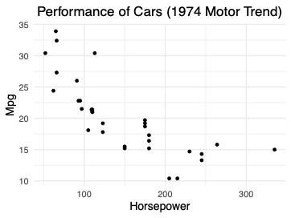

::: {.notes}

- If you had to describe this data over the phone, how
    would you do it?  Take 10 seconds, and try to say a few words
    about it right now.
- What words are you using?
    Slope? Decreasing? Maybe hyperbolic or exponential?
- If you used any of those words, really, what you're
    doing right now is descriptive model building
- You may
    be doing it very informally, or even subconsciously, but you're
    probably imagining a smooth curve passing through these points and
    describing that curve.
:::

## Introduction to Descriptive Modeling
__Description:__
 summarizing or representing data in a compact,
  human-understandable way
 
  

  Linear regression is a tool that can help us answer:

  
- What patterns exist in a dataset?
- What is the shape of a specific relationship?
- What is the size of a feature or effect? \note[item]{the
      sizes of different features are encoded in the coefficients!} \note[item]{Unlike a predictive model, in a descriptive model, we
      really care about our betas, they are measurements of the
      world.}

::: {.notes}

-  Let's review what Description means.
- There are many tools we can use for describing data.
    There's clustering algorithms, principle component analysis, and
    linear regression is also a description tool
:::

## What Does It Take to Build a Descriptive Model?
Skill, art, and a lot of iteration

  
- No causal theory to constrain model choice
- Often many ways to operationalize concepts
- Need to balance many competing goals
- Takes time to build intuition in many dimensions

::: {.notes}

- All together this can be a very creative form of model
    building.
- It's our main topic for today - I hope
    you're excited to dive in.
:::

# Logarithms

## A Question of Development
How does the economic productivity of a country relate to Internet
  access?
  
  Data taken from the World Bank
  
- GDP per capita
- Internet users per 100

## Is OLS Regression Appropriate?

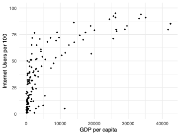

::: {.notes}

- Here's a graph of our data.
- You can see it
    has this very interesting pattern - a very nonlinear pattern.  Try
    taking your finger, and drawing a line to represent this data.
    Take a moment to think about this question: is it ok to run a
    linear regression?  here?
- 
- The short answer is that you
    can absolutely run an ols regression.  We know that OLS
    coefficients are consistent for the best linear predictor, as long
    as the best linear predictor exists and is unique.  (there is
    another assumption to worry about, which is iid.  Can you really
    believe that countries are independent from each other? I'm
    skeptical, but there are a lot of country-by-country studies out
    there, so let's note the problem as a limitation but keep going.)
:::

## Interpreting the Level-Level Model
$\widehat{users} = 2.4 + .0021\ GDP$
__Interpretation 1:__
 A country with an extra 
\$
1 of GDP per
  capita is predicted to have another .0021 Internet users per 100.
  
__Interpretation 2:__
 A country with an extra 
\$
1,000 of GDP
  per capita is predicted to have another 2.1 Internet users per 100.

::: {.notes}

- Here's are the results of fitting the ols regression
- Here's how we would interpret the coefficient...
- Both of these numbers are really small.  So we can
    improve this interpretation by choosing a bigger change...
:::

## Does OLS Regression Meet Our Goals?

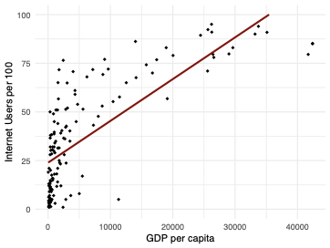

::: {.notes}

- Here's what the regression line looks like.  We know
    this is valid as far as ols assumptions.
- But does it meet our goals?  In particular, one of the
    main goals of descriptive modeling is capturing features of the
    world.
- There's a clear structure that is not reflected in our
    model.
- If you look in the middle section, you can
    see that the prediction is consistently too low.  At the extremes,
    the prediction is too high.
- There's one other small problem that's worth mentioning.
    it's only a minor problem, but notice that most of the data is
    clustered on the left side.  The slope of the line is mostly
    determined by these few points on the right side.  that's ok, but
    there's these points on the left potentially have important
    information that's not really making it into the model.
- For all these reasons, we need to consider a variable
    transformation.
:::

## Variable Transformation

::: {.callout-note title="\textbf{Variable transformation}"}

    Replace $X$ with $f(X)$ for some $f: \R \rightarrow \R$\note[item]{What function $f$ should you use?  Here are some of
      the most common choices.}- $\ln(X)$
- $\log_{10}(X)$
- Indicator functions
- $X^a$
- Polynomials(X)
\note[item]{Out of all of these, the logarithm is the probably the
      best choice for our data.  Let's see what it does.}
:::

::: {.notes}

- Transforming a variable, means that we're replacing some
    X with a function f(X)
:::

## Taking the Log of GDP

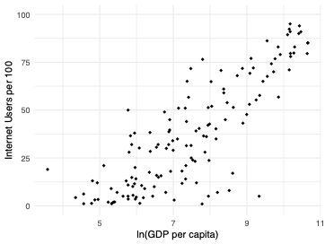

::: {.notes}

- Here's
    what the data looks like after you take a log of GDP per capita.
    Can you draw a line through it?  Much easier!
:::

## Taking the Log of GDP

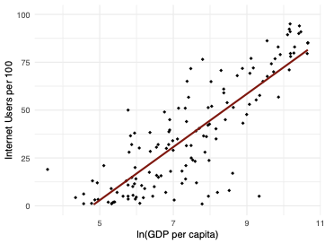

::: {.notes}

- And
    here is the new regression line, which matches the shape of this
    relationship.
:::

## Model: $\widehat{users} = \beta_0 + \beta_1 \ln GDP \quad\quad R^2 = .68$

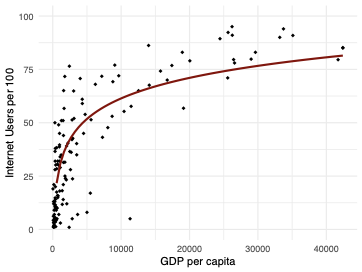

::: {.notes}

- There's another way to view this model.  Let's go back
    to the original x-axis, without the log
- If we do
    that, this is what our model looks like
- This is a
    logarithmic curve.  That makes sense.  Our model says that
    predicted internet users is a linear function of the log of GDP.
- Think about it this way, we took the log of X and
    revealed a straight line in the scatterplot.  That tells us that
    we have a logarithmic relationship.
:::

# Interpreting and Applying Logarithms

## Interpreting Logarithms
__Base 10 log__
$\widehat{users} = -66.5 + 32.0 \log_{10} GDP$

  Interpretation: adding a 0 to GDP associated with 32 more Internet
  users per 100
  
  
__Base $e$ log__
$\widehat{users} = -66.5 + 13.9 \ln GDP$

  Interpretation: multiplying GDP by a small 
$1+\alpha$
 associated with
  
$13.9 \alpha$
 more Internet users per 100

::: {.notes}

- There are actually two common choices for the logarithm,
    you can take a base 10 log, or a natural log
- A base 10 log is helpful when we want to think about a
    variable in powers of 10.  We're all used to powers of 10.
:::

## Interpreting Logarithms (cont.)
$\frac{\partial \widehat{users}}{\partial GDP} =
                                                    \frac{\partial}{\partial GDP}[ -66.5 + 13.9\ln GDP ]$

::: {.notes}

- $\frac{\partial}{\partial x}\ln x = 1/x$
- \begingroup
:::

## Model:
    $\widehat{users} = \beta_0 + \beta_1 \ln GDP \quad\quad R^2 = .68$
  

::: {.notes}

- Let's see what that rule of thumb looks like on the
    graph. Let's choose some point on the curve, GDP = 10,000.
- I'm going to draw the tangent line at that point - it's
    a good approximation for small changes in GDP.
- I know the slope of the tangent is 13.9/GDP
- Let's say that I increase GDP by some proportion,
    
- What's the change in Y?  I multiple the change in
    X by the slope and I get 
- If alpha is small, then the tangent line is close to the
    curve, so this is a good approximation.
- For example, if we increase GDP by 1
- But if you think about really big changes: 30
:::

## Other Uses of Logarithms
Log-linear form: 
$\ln Y = \beta_0 + \beta_1 X$
- Interpretation: $\frac{\Delta Y}{Y} \approx \beta_1 \Delta X$
- Example: add 0.1 to $X$ $\rightarrow$ add $0.1 \beta_1 \cdot Y$ to $Y$

  Log-log form: 
$\ln Y = \beta_0 + \beta_1 \ln X$
- Constant elasticity model
- Interpretation: $\frac{\Delta Y}{Y} \approx \beta_1 \frac{\Delta X}{X}$
- Example: increase $X$ by 1 \% $\rightarrow$ increase $Y$ by $\beta_1 \%$

## When to Apply Logs
What makes a variable a good candidate for a log transform?
  
- Always positive - Don't add a constant to make variable positive
- Spans multiple orders of magnitude
- Clustered near zero with high outliers
- Percent changes are meaningful \note[item]{This is especially 
      true for monetary variable.  We all understand what a 20\%
      increase in salary is.  A dollar increase can feel very
      different depending on how much money you have, but 10\% more is 
      meaningful for almost everyone.  }

## Power Transformations
__Power transformation:__
 Replace 
$X$
 with 
$X^\alpha$
 for some
  
$\alpha \in \R$
.
  
- $\sqrt{X}$ behaves similarly to $\ln X$ .
- $X^2$ , $X^3$ ,... spreads values far from zero further apart.

  Interpretation is more difficult than with logs.

::: {.notes}

- 
- I want to very quickly mention a broader class of
    transformations, called the power transformations
- Here, we're raising X to a power.
- For example, you might take the square root of X in
    situations where you can't take the log, because a variable
    sometimes equals zero.
- However, these transformations make it much harder to
    interpret the results of a model, so they're not used very often
    in descriptive modeling.
:::

## When to Apply Transformations
__Question:__
 Should you always transform your variables to
  make them normal?  
- Normal variables are __never__ a requirement for OLS
    regression. - Even in the classical linear model, _errors_ are
      normal, not variables.

$\implies$
 Don't focus too much on normality.  Capturing relationships
  is more important.  

::: {.notes}

- Before we move on, I want to address
    one issue, a lot of websites will tell you to always transform
    your variables until they look normal.  Is that a good idea?
- Well, first of all, normal variables
    are never a requirement for ols. Even in the classical linear model,
    the errors must be normal, not the variables.  Of course if you're
    in a large sample, there's no assumption of normality at all.
-  But I will say that normal variables are generally a good
    thing.  Normal means that most of your data isn't so clustered that
    it doesn't affect the model.  So it's good to try for normal
    variables, but bad if that's the only thing you're thinking about
- Remember, your goals for descriptive modeling.  In
    particular, transforms are great for the goal of capturing features
    of the world.  that means looking at scatterplots, and trying to
    reveal linear patterns.  If you can make your scatterplots look
    linear, that's usually much more important than having nice normal
    distributions.
:::

# Polynomials

## How Can We Improve Predictive Accuracy?

::: {.notes}

- Here's another look at our GDP and Internet User data.
    Previously, we used a log transform.  That was good for capturing
    the shape and great for model interpretability.
- What if I tell you that your goals are little different.  You still
    care about interpretation, but you really want more accuracy.
    You'd be willing to give up a little bit of interpretability to
    get a higher 
- In that case, you might want to consider a polynomial regression.
:::

## Polynomial Regression
Motivation: Polynomials can approximate any continuous function
  (e.g. Weierstrass theorem)
  
  

 Quadratic:
  
$\widehat{Users} = \beta_0 + \beta_1 GDP + \beta_2 GDP^2$
- OLS finds the parabola that minimizes MSE.

  Cubic:
  
$\widehat{Users} = \beta_0 + \beta_1 GDP + \beta_2 GDP^2 + \beta_3 
  GDP^3$
- OLS finds the cubic function that minimizes MSE.

::: {.notes}

- First, why polynomials?  well, polynomials are really
    flexible.  They can approximate any continuous function.  
- The idea here is we're going to run a
    regression with different powers of the same variable.
- Most of the time, we'll use just a quadratic.  So we'll
    put in GDP and 
- What will ols regression do?  ols finds the beta's that
    minimize MSE.  If you change these betas, you get all the
    different parabolas in the X-Y plane.
- You can also put in the cubic term, though that's much
    less common.
:::

## A Parabolic Pattern?

::: {.notes}

- Let's try the quadratic form.
- Here's the data again.  I want you to imagine what you
    think the best fitting parabola looks like.  try tracing it with
    your finger.
:::

## Model:
    $\widehat{users} = \beta_0 + \beta_1 GDP + \beta_2 GDP^2
    \quad\quad R^2 = .66$ 

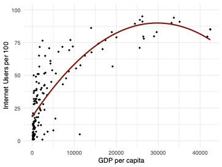

::: {.notes}

- There you have the best fitting parabola
- You
    can see that it definitely looks closer to the data than the line.
    The fit is actually slightly worse 
:::

## Interpreting the Quadratic Specification
$\widehat{Users} = 18.5 + .0048\ GDP - 8.0\cdot 10^{-8}\ GDP^2$
$\frac{\partial \widehat{Users}}{\partial GDP} = .0048  - 1.6\cdot 10^{-7}\ GDP$

  Example 1: If 
$GDP = 10,000$
, then
  
$\frac{\partial \widehat{Users}}{\partial GDP} = .0032$
.
  
  (Extra 
\$
1,000 in GDP associated with 3.2 extra users)
  
  Example 2: If 
$GDP = 20,000$
, then
  
$\frac{\partial \widehat{Users}}{\partial GDP} = .0016$
.
  
  (Extra 
\$
1,000 in GDP associated with 1.6 extra users)
  

::: {.notes}

- Here's the equation with the fitted coefficients
- What's the interpretation of this equation?
- Let's look at the slope... we get a function - the partial
    depends on GDP
:::

## Higher-Order Polynomials

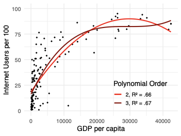

::: {.notes}

- what
    happens if we increase the order of our polynomial?
- Here you can see the best fitting cubic function.
    Notice that the 
- The curve looks a little better at the end, it doesn't
    turn downwards.
- How far can we push this?  can we
    keep increasing the order of the polynomial and keep getting
    better and better predictions?
:::

## Higher-Order Polynomials

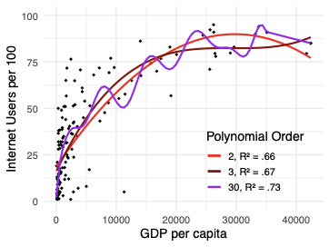

::: {.notes}

- Here, I tried to fit an order 30 polynomial.  Indeed,
    the 
- But the shape doesn't make sense.  Why would internet
    users go up and down with GDP?
- Especially on the right hand side, you can see that the
    curve traces from one point to the next.
- This is a situation called overfitting.  We have a high
    
:::

# Measurement With Controls

## Measurement With Controls
__Note:__
 This is a placeholder slide for an introduction that
  we will provide to the section. We're just placing it here for
  organization.

# Interpreting Indicator Variables

## Example: Measuring the Wage Gap

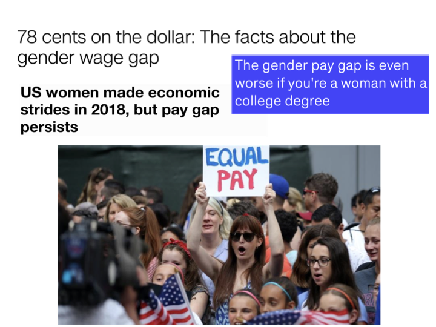

::: {.notes}

- Let's take a look at an example measurement goal.  The
    example we'll use is the wage gap.
- You probably already know about the wage gap -
    newspapers in the US talk about it from time to time.
- In particular, you may have heard this figure: that a
    woman in the US earns 78 cents for every dollar that a man earns
- I hope you agree that this is an important topic - we
    would like to live in a country where people of all genders are
    paid equally
- But how can you actually measure the wage gap?  Should
    we compare all men and all women?  Or men and women in the same
    job?  But is that a fair comparison if people of different genders
    don't get the same job opportunities?  There's really no easy
    answer to these questions. But let's at least try measuring the
    gender gap and see what linear regression techniques may help.
:::

## Example: Measuring the Wage Gap (cont.)
Data: Current Population Survey, 2019 Annual Social and Economic
  Supplement (ASEC)
  
  Key variables:
  
- Status: full-/part-time work status - 1: not in labor force
- 2: full-time hours (35 or more), usually full-time \\ \hspace{2cm} \vdots
- Pay: total wage and salary earnings
- Sex - 1: male
- 2: female

::: {.notes}

- In the survey, there is an income
    variable, and unlike most surveys, it's not binned into ranges,
    it's any integer.
- The survey has no variable for
    gender, and it has one variable labeled sex.  You can see It only
    has two levels, male and female.  This is not a best practice,
    because it means that transgender and non-binary people may feel
    like they don't have an option.  Unfortunately, I have to say that
    we're filming this in 2020, and this is still what most big
    surveys are like. 
:::

## Overall Comparison

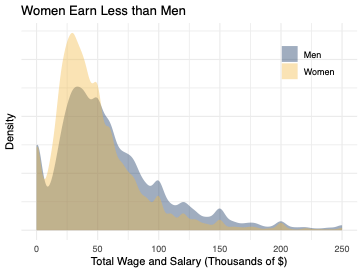

::: {.notes}

- First, let's try the simplest thing we can do: comparing
    all men against all women.
- Actually, we've seen this problem before.  When we
    talked about t-tests, we had two groups, and we wanted to know if
    the means were the same.
:::

## Direct Application of t-Test
Mean for men: 
\$
68,700
  
  Mean for women: 
\$
52,100
  
  Mean difference: 
\$
16,600
  
  (76 cents to the dollar)
  
  
$t = 27.938, df = 61,733, p< 2.2e-16$

::: {.notes}

- Here are the results of that t-test analysis.
- You can see man pay for men about 69K, 52K for women,
- That corresponds to about 76 cents to the dollar
- The t statistic is giant - almost 30, so the null is
    overwhelmingly rejected
- Now, what about linear regression?  Well, it's important
    to realize that this exact analysis can be done in a regression
    framework.
:::

## The Same Analysis in a Regression Framework, Part I
$\widehat{Pay} = \beta_0 + \beta_1 Female$

  For men, 
$\widehat{Pay} = \beta_0 + \beta_1 (0) = \beta_0$
.
  
  For women,
  
$\widehat{Pay} = \beta_0 + \beta_1 (1) = \beta_0 + \beta_1$
.
  
  
$\implies \beta_1$
 represents the difference between groups.
  
  

::: {.notes}

- This may seem like a strange view of regression - aren't
    we supposed to be fitting a line?
:::

## The Same Analysis in a Regression Framework, Part II

:::: {.columns}

::: {.column width="60%"}

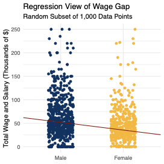
:::

::: {.column width="40%"}

$\Delta Y = \frac{\text{slope}}{\Delta X}$
:::

::::

::: {.notes}

- Well, there is a line.  Here's what the data looks like
    if we plot it, and here's the regression line.  
- (I
    took a small subset and added a little jitter so you can see
    things better.)
- Since we have an indicator variable,
    the only x values are 0 and 1 
- What's the difference
    in in the predicted Y?...
- I can write:
    
:::

## The Same Analysis in a Regression Framework, Part III

\input{./images/model_female.tex}

::: {.notes}

- When we look at our regression output, the coefficient
    for Female will have exactly the same difference in means that we
    say earlier.
- One more thing to note: we usually show
    a standard t-test for each coefficient.  Here, we have 3 stars for
    Female. The null of that test is that the slope is zero, which we
    know means that men and women are the same.  So this is exactly
    the same as the classic t-test for two groups.
- Here's another question to think about: what do the
    stars on the intercept mean?
- Remember that the
    intercept represents the mean pay for men.  This is the test to
    see if men earn 0 dollars.  So that's a very silly test to run.
    But we do put in the stars anyway, just to be consistent.
- How do you know if Women earn zero dollars?  We don't
    have that test here.  we'd have to run a separate command to get
    that test.
:::

# Indicator Variables as Controls

## Controlling for Occupation, Part I

 How can we compare men and women in the same occupation?
  

::: {.notes}

- So far, we've just been comparing men as a whole to
    women as a whole
- But part of the difference we see
    could be that men and women tend to be in different professions
- Now, you might argue, so what?  If the main problem is
    that women are being locked out of high-paying professions, it's
    the overall pay difference that we should be worried about.
- But at least from certain perspectives, it might be more
    fair to compare men and women in the same profession.
- I'm going to try it both ways, because I think we can
    learn from the results
:::

## Controlling for Occupation, Part II
$\widehat{Pay} = \beta_0 + \beta_1 Female + \beta_2 Banker + \beta_3 Engineer + ...$

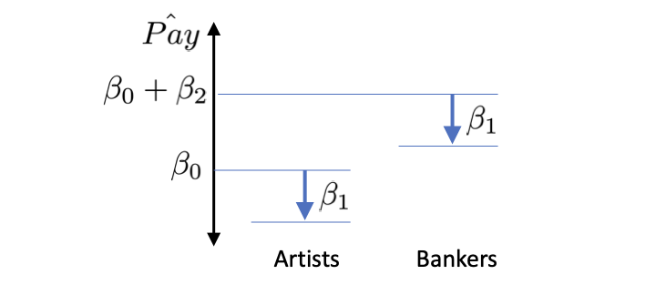

::: {.notes}

- What we need to do, is add an indicator variable for
    every possible occupation (we need a base category, let's make it
    artist).
- What does this do?  Here's a picture of what the model
    looks like.
- If you want to know the predicted pay
    for a female Banker, you start with 
- The thing to notice is that 
:::

## Controlling for Occupation, Part III

\renewcommand{\arraystretch}{0.7}
\input{./images/model_female_occupation_alt.tex}

::: {.notes}

- Inside the survey data, we have an occupation code
    variable with 484 different values.  If you just add it to the
    table directly, you have a problem.
- Of course
    there's not enough room to list every occupation
:::

## Controlling for Occupation, Part IV

\input{./images/model_female_occupation.tex}

::: {.notes}

- So instead we can put in a row to summarize all these
    indicators.
- You can see that actually, the effect
    for Female has shrunk by about 10 percent in this specification.
    That corresponds to about 78 cents to the dollar.
- Why is that?  This suggests, that in part, there are
    more men in occupations with higher pay.  But even within each
    occupation, men are earning more than women.
:::

# Metric Variables as Controls

## Age as a Covariate
Ways to add age to a specification

  

  Linear effect:
  
$\widehat{Pay} = \beta_0 + \beta_1 Female + \beta_2 Age$

  Polynomial effect:
  
$\widehat{Pay} = \beta_0 + \beta_1 Female + \beta_2 Age + \beta_3
  Age^2$

::: {.notes}

- We're trying to measure the pay gap, and
    another variable that we might want to control for is age
- People tend to earn more as they get older, and you
    might wonder if this can explain part of the pay gap that we see.
- How should we enter age into the regression?
- You could put it in directly.  That would make sense if
    you wanted to measure the age effect and wanted a single number to
    summarize the effect.
- If, on the other hand, age is really just a control
    variable, you might want a more flexible specification, just to
    soak up as much variation as you can.  For example, a quadratic
    age term is a ver popular choice.
- Let's use the linear age model to make the equations
    simpler.
:::

## Understanding the Linear Age Effect
For men:
  
$\widehat{Pay} = \beta_0 + \beta_1 (0) + \beta_2 Age = \beta_0 +
  \beta_2 Age$

  For women:
  
$\widehat{Pay} = \beta_0 + \beta_1 (1) + \beta_2 Age = \beta_0 +
  \beta_1 + \beta_2 Age$
\pause

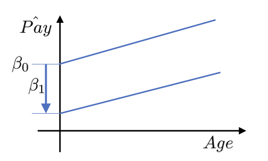

## Controlling for Age

\input{./images/model_female_occupation_age.tex}

::: {.notes}

- Here's the regression table, with the new specification
    added in.  You can see that each year of age is associated with
    
- Also, adding age didn't change the
    gap between men and women at all.
- Does that mean we
    should take this specification out of the table?
- Well, no.  This is all interesting information.  We're
    building up a table that shows how our estimate changes or doesn't
    change depending on our choices.
- If we keep trying
    different specifications and the estimate for Female never changes
    much, we'll say that it's robust.
:::

# Measuring With More Categories

## National Transgender Discrimination Survey

::: {.notes}

- Because of our data source, we had two categories for
    gender - male and female.
- What if you could write
    your own survey - could you make it more inclusive by listing more
    options?
- How would you analyze the data?
- That could be an important question.  I'm showing a
    graph from the National transgender discrimination survey.  This
    is not a nationally representative survey, but out of the trans
    and nonconforming people they were able to reach, 15
:::

## Example of a More Inclusive Question
How would you describe yourself?
  
  
- Female
- Male
- Transgender female
- Transgender male
- Non-binary/nonconforming
- Prefer not to answer

::: {.notes}

- Here's an example of a question with more options.
    We're not claiming this is the best possible set of choices - but
    the intention is to provide options that more people identify
    with.  We would like to see more surveys try to do this.
- 
:::

## Analyzing More Gender Categories

\begin{align*}
       \widehat{Pay} = &\beta_0 + \beta_1 Female + \beta_2 Transgender\_Male + \\
                       & \beta_3 Transgender\_Female + 
                         \beta_4 Nonbinary 
     \end{align*}
$\implies$
 Report each 
$\beta$
 to describe the pay gap for a
     different gender identity.
     
     

::: {.notes}

- Now we need to include each option as an indicator
    variable.  In this case, I'm using male as a base category,
    because then each beta compares a gender against male, which is
    something we're very interested in. 
- Now what could happen here?  It might be that you
       just don't get enough data in some categories.  That would make
       your standard error for those categories too high.  So that
       means that you need to be careful about adding too many
       options.
- If you face this problem, you may be
       able to combine some categories together in order to gain
       accuracy.
:::

## Reporting Overall Effect
Law of total variance:
   
$V[Pay] = V\big[E[Pay|Gender]\big] + E\big[V[Pay|Gender]\big]$

$V[Pay] =$
 Gender-Explained Variance + Other Variance
   
   
$\eta^2 = \frac{\text{Gender-Explained Variance}}{\text{Total Variance}}$
$\text{Gender-Explained Standard Deviation} = \sqrt{V\big[E[Pay|Gender]\big]}$
  F-test: Null is that all genders have equal pay.

::: {.notes}

- On the one hand, you may really be interested in each
       individual 
- One
       idea is to break up the variation in pay and see how much of it
       can be tied to gender.  remember the law of total variance from
       earlier...
- eta squared is defined as a fraction, of the
     gender-explained variance over the total variance.  You can think
     of it as how much of the total variation can be explained through
     gender.
- Another idea is to take the gender-explained variance and
   take the square root, to give gender-explained standard deviation:
- This gives you a single number in dollars, that tells
   you, on the average, how far each gender is away from the overall
   mean pay. 
- Finally, how do you test the statistical significance of
   gender when you have multiple categories?  the right answer is the
   F-test.
:::

# Planning Multiple Specifications

## 

:::: {.columns}

::: {.column width="100%"}

\scalebox{.8}{ Collewet \& Sauermann.
      (2017). \textit{Working Hours and Productivity}}
:::

::::

::: {.notes}

- We've been building up a regression table for our study,
    and so far it has three models in it - we might say three
    specifications.
- That's not at all unusual.
    Actually, if you write articles in some fields, it's common to
    include many more specifications.  Here's a table from a paper on
    working hours and productivity..
- You can see that
    there are 8 specifications.  Model 1 only has a single variable -
    that's the effect that they want to measure.  Then for the most
    part the models on the right have more and more variables.
- What's the purpose of this?
:::

## Why Report Multiple Specifications?
Modeling decisions are tough.
  
  
- Is it worthwhile to control for education, even if standard
    errors increase?
- Is it worth switching from a log to a square root to get a
    much better fit?
- Should we include occupation, even if that absorbs some of the
    concept we want to measure?

  Would your results be different with different choices?

  
$\implies$
Try different paths to see if your results are
  
__robust__
.

## Why Report Multiple Specifications? (cont.)
__Error rate inflation:__
 a tendency for effects to appear
  large (and p-values small), especially when a researcher uses the
  same data for exploration and testing
  
  
__p-Hacking:__
 a deliberate attempt to generate significant
  results by altering the model specification and other researcher
  degrees of freedom
  
  
$\implies$
 Report multiple specifications to guard against error
  rate inflation.

::: {.notes}

- There's a deeper reason that we report multiple
    specifications, and it has to do with reproducibility.
- Let's review two very important terms...
- If you have a lot of data, you may be able to hold out
    some of it, so you can get your final p-values from fresh data.
    But even if you do that, your audience may just expect to see
    multiple specifications, and may be more suspicious if they only
    see one.
:::

## How Should You Think About Specifications?

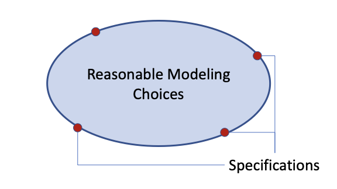

::: {.notes}

- With all that in mind, how should you think about your
    model specifications?
- Imagine a space that
    represents reasonable modeling choices
- They still
    have to reasonable - you shouldn't consider models that can't be
    defended
- Try to select your specifications to
    encircle that space, so your results can represent the larger set
    of choices.
:::

## An Example Specification Table

\input{./images/model_female_occupation_age.tex}

::: {.notes}

- Let's take another look at our own specification table.
- A few things to remember.  First, this is a measurement
    study, and our key variable is Female.  So we place it on the
    first row, and of course it has to appear in every single
    specification.
- One thing you almost always want to
    do is start with a base model, that only has your key variable and
    nothing else.  If you have a very strong reason to put in another
    variable, that's ok, but you want this to be a very minimal
    model.
- It's very common to add variables in blocks
    as you go left to right.  If you do that, then your models will be
    nested, which means that you can run F-tests between them.  But
    you don't have to do that.  if it makes more sense to replace one
    set of variables with another, do that instead.
:::

# Modeling Conditional Effects

# Conditional Effects

## Conditional Effects
Idea: The relationships we measure may be different for different
  people or units.

  
- A vaccine may reduce infection rates more in adults than in
    children.
- Network access may be more associated with loan availability
    in poor countries.
- The pay gap may be different for people of different ages.

::: {.notes}

- Let's take a closer look at that last example...
:::

## Conditional Effects of Age, Part I
__Interaction term:__
 a variable in a regression formed by
  multiplying two other variables together
  
   
$\widehat{Pay} = \beta_0 + \beta_1 Female + \beta_2 Age + \beta_3 Female \cdot Age$

   For men:
   
  
$\quad \widehat{Pay} =$

  For women:
  
  
$\quad \widehat{Pay} =$

::: {.notes}

- There's a simple technique for modeling heterogeneous
    effects.  it's called an interaction term.  An interaction term is
    just two of your variables multiplied together.
- Let's see what this equation looks like for men and for
     women.
- $beta_0 + \beta_1 (0) + \beta_2 Age + \beta_3 (0) Age =  \beta_0 + \beta_2 Age$
- $\beta_0 + \beta_1 (1) + \beta_2 Age + \beta_3 (1) Age = 
  \beta_0 + \beta_1 + (\beta_2 + \beta_3)Age$
- Notice that these are again two different lines.  once
    again, they have different intercepts.  but this time, they also
    have different slopes.
:::

## Conditional Effects of Age, Part II

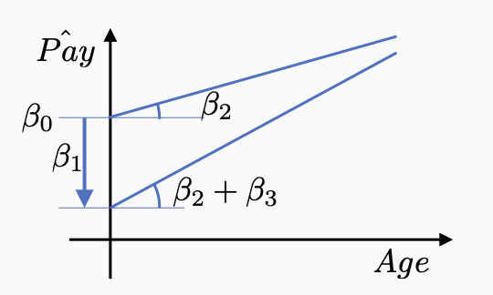

::: {.notes}

- Here's what that looks like.  we're fitting a very
    flexible model, with two different slopes and two different
    intercepts.
-  by the way, how would you test whether
    the effect really is heterogeneous?  that is, how can you test
    whether the slopes really are different?
- The answer
    is that the slopes are the same exactly if 
:::

## Conditional Effects of Age, Part III

\renewcommand{\arraystretch}{0.9}
\input{./images/model_female_occupation_interaction.tex}

::: {.notes}

- Here's our result, and you can see it's pretty
    interesting.  The interaction term is negative and statistically
    significant.  And the wage gap appears larger for older workers.
    With each year of age, the gap increases by about 
:::

# Interaction Terms

## Interactions for Indicator Variables
Use old content: 12.9 Interaction Terms for Indicator Variables,
  Part 1
  
  If there's extra time, I would redo this using the wage gap example.

## Guidelines for Polynomial and Interaction Terms
Use old content: 12.12 Guidelines for Polynomial and Interaction
  Terms
  
  Could redo some of the discussion of goals if there is time.

