# 

## 

\maketitle

# Questions of Causation

## Some Business Questions

- What will happen to coffee sales if we buy a new roaster?
- Will profits be higher if we design a new jet or upgrade our existing one?
- Will more people visit our amusement park if we add a monorail? \note[item]{One feature that ties all these questions together is
   that they are causal questions.  Actually, most business questions
   are causal questions.  They are about making a decision or pulling
   a lever.  how can we approach them?  Of course we want to use
   data...}

::: {.notes}

- Lets start this week by thinking about some business questions.  here's some...
:::

## Amusement Park Daily Visitors

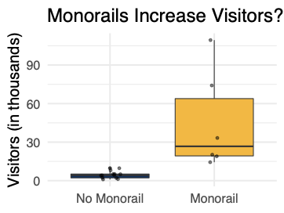

::: {.notes}

- Here's some data!  You can clearly see that amusement
    parks with monorails get a lot more visitors than amusement parks
    without monorails.  Does that answer your question?
- Well, not really.  your question is not about the
    distribution of amusement parks, it's about a single amusement
    park.  Or about the process that leads amusement parks to have more or less visitors
- The question kind of sounds like a prediction problem;
    it kind of sounds like a description problem; but it is
    
- What happens if you change a feature of that one
    datapoint.  Will we really see this huge increase in visitors?
    Maybe and maybe not.
- This data is certainly relevant, but it's not enough to answer the question.
:::

## Amusement Park Daily Visitors (con't)

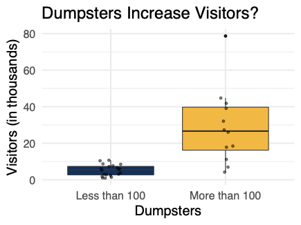

::: {.notes}

- If we were to work 
- If we are willing to conclude that monorails increase
    visitors
- We must also accept that smelly fish guts increase
    visitors.
- Of corse this isn't the case. There must be something
    else that is 
:::

## 
standout

  Correlation 
$\neq$
 Causation
  
  

::: {.notes}

- Of course, the problem is that all we can see in our
    graphs and our tables is that a correlation exists.
- And as I know you've heard many many times...
- So just because monorails are correlated with visitors,
    that doesn't mean that monorails cause visitors; the same with
    dumpsters.
- There could be many other explanations.
- I know this might seem really basic. But really it's a
    mistake that many people and businesses make.
- Example 1: ``What if'' analysis tool at 
- Example 2: Every Dashboard.
- Test Prep services.
:::

## 

__Explanatory modeling:__ How can we test or estimate an
  effect in a causal theory?

::: {.notes}

- In this unit, we're going to look at explanatory modeling, which
  is a branch of data science that attempts to answer causal
  questions.
:::

# Unit Plan

## Plan for the Week
Three sections
  
1. What is explanatory modeling?
2. The one-equation structural model
3. Common violations of the one-equation model - Confounding, omitted variable bias
- Outcome on the RHS
- Simultaneity bias

::: {.notes}

- None
:::

## Plan for the Week (cont.)
At the end of this week, you will be able to:
  
- Recognize major strategies for estimating causal effects
- Understand the assumptions behind the one-equation structural model
- Reason about common violations of the one-equation structural model

# What Is Explanatory Modeling?

## Toward Explanation

  What extra assumptions are needed for OLS regression coefficients to be causal?*
  
  

\flushright
 * Misleading question
  
  

::: {.notes}

- Let's discuss what explanatory modeling is.
- We know that we want to measure causal effects.
- There's a question that a lot of students have at this
    point, and it goes like this
- Well, I'm here to tell you that this isn't the best question.
- It's not technically wrong, but it makes it sound like you
    can transform a descriptive model into a causal model.
- It's a little like asking: What extra assumptions do I need for this
    parachute to work?  The parachute must be designed from the very beginning to slow your descent.
- A lot of econometrics textbooks sound like this.  You
    start from an OLS regression and guess what!  You're modeling
    causality! Now you might have to fix a few issues before you can
    publish.
- This type of narrative blurs the
    distinction between descriptive and explanatory modeling.   But as a data
    scientist, you need a very clear understanding of both modes --
    because there is a tendency for descriptive models to be read as causal.
:::

## The Explanatory Modeling Workflow

::: {.notes}

- So what's a better narrative to have in mind? In this diagram, we've tried to distill four steps that go into an explanatory exercise.
- This is a simplified view.
- There is a lot of variety out there - a lab experiment
      is very different than estimating rates of disease transmission
      - but I still think this picture can help you make sense of
      things
- First, we have to define a causal theory.  That's always
    the starting point, our analysis takes place inside a theory.
- Some theories may be widely accepted, but often we have
    to justify our theory, or parts of it.
- Next, we identify a technique for estimation
- OLS regression is just one possible technique.  we may
    need a different technique or maybe no technique can work.  it
    depends on the causal theory
- Finally, we can estimate parameters, or we can test the theory
- Next, let's take a closer look at each of these steps
:::

## The Explanatory Modeling Workflow

## What Is Causal Theory?

::: {.callout-note title="Causal theory"}

    A _causal theory_ is a statement of beliefs about what
    concepts _do_ and what concepts _do not_ cause other
    concepts.
    % \textbf{Causal theory} - a set of starting assumptions regarding% causal relationships.
:::

- Objective: narrow the range of causal explanations for associations we find in data.

::: {.notes}

- First to do any explanatory modeling you have to start
    with causal theory.  The word theory might sound scary, but here's what we mean
- This can come in many forms.  sometimes it's really a
  Theory with a capital 'T'.  other times, it's really just what we
  call background knowledge
- You're an engineer, so you know that more horsepower causes a car go faster.  You don't need a fancy theory, you don't even have to stop and think about it, you can just start measuring.
:::

## What is Causal Theory? (cont.)

- Joint distributions and cumulative density functions cannot
    identify causal information
- If we begin with causal statements, we can use logic to reach causal conclusions

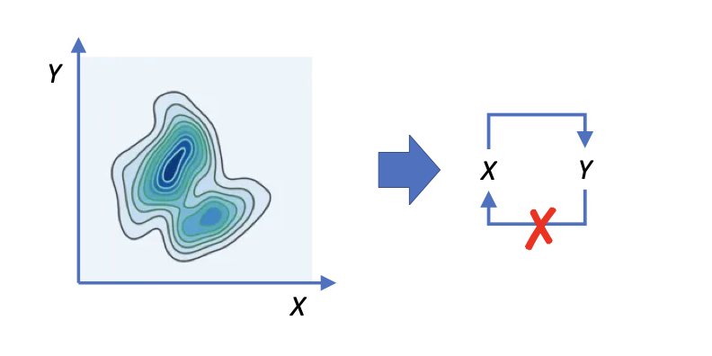

::: {.notes}

- Fundamentally, we need some statement about causality to
    begin with, because we can't get from only statements about the
    distribution to statements about causality.
- Suppose that you are a part of a data science team that
    is working together with a product team to change the purchase
    flow.
- You can observe information about your customers, where
    they browse, what they're interested in; and you can
    
- You might have arrived at this idea inductively; you
    might have heard it from the product team; but now you've got to
    ask, ``How can I evaluate whether this theory is useful for
    predicting behavior.'' This is where the experiments come in.
- You might have noticed that there are seemling byzantine
    tests that are conducted in science -- do we 
:::

## How to Reason About a Causal Theory

## How to Reason About A Causal Theory (cont.)
Creating and eliminating possible causal paths

  
- _Time structure_ - If $X$ happens after $Y$ , then $X$ cannot have caused $Y$ .
- _Domain Knowledge_ - Germ theory of infections disease
- Often formed through past experiments
- _Effectively "random" events_ - Coin flips
- Tropical storms
- pseudorandom generators

::: {.notes}

- Just like we never are 
- When we start, our default belief will be that 
- Remember that we need to narrow down the range of possible causal explanations.
- That means we have to eliminate some causal paths. how do we do that?
- You might use a coin flip in an experiment to decide who gets a treatment and who gets a placebo.  How do you know that a patient being sick doesn't somehow cause the coin to land heads? If you change the velocity of the coin by even a microscopic amount, it might land a totally different way.  So we believe that the coin is effectively random, nothing else can really cause it to land heads.
:::

## How to Identify an Identification Strategy, Part I

## How to Identify an Identification Strategy, Part II
__Goal__
: Produce a consistent estimate of the strength of the
  causal relationship given: 

  
1. Causal theory
2. Data

  No estimator provides estimates that 
_always_
 have a causal interpretation

  

:::: {.columns}

::: {.column width="35%"}

- OLS Regression
- Diff-in-Diff
:::

::: {.column width="65%"}

- Regression discontinuity
- Two-Stage Least Squares
:::

::::

::: {.notes}

- Hopefully this shows you how OLS is not really at the
    center of explanatory modeling.  The causal theory is central, and
    points you toward data and toward an estimation technique.
- If you have a true experiment, yes, ols regression will
    be the right technique.
- If you have observational data, you have to be somewhat
    lucky to have a credible estimation technique at all. And OLS is
    only one out of several possible techniques.
:::

## How to Identify an Identification Strategy, Part III

## How to Estimate Parameters

- Estimate model and interpret coefficients
- Return to reasoning about the causal model and possible
    violations

::: {.notes}

- In explanatory analysis, like other points in the course
    to this point, the estimation is actually very straightforward.
- For example, with experimental data, estimate an OLS.
- However, it is the thinking, designing and interpreting
    that is both (a) important; and (b) hard.
- Standard errors which tell you about statistical
   uncertainty.  But what if your causal theory isn't quite right? We
   don't have an uncertainty measure on our theory.
- At this point, you may have to think through
   possible ways it could be wrong.  This is a kind of sensitivity
   analysis.  If you think there might be an omitted causal pathway,
   for example, you'll try to think through how it would change your
   coefficients.  You may try to invent a way to correct for the
   problem, or run an additional analysis to provide evidence for
   whether it really is a problem.
:::

## The Explanatory Modeling Workflow

::: {.notes}

- So there's the very high level view of what explanatory modeling is. 
- I hope that gives you some idea of how it's very
    distinct from what we've done before.  Explanatory modeling is its own specialized field. Now let's see some more
    details.
:::

## WE SHOULD HAVE AN ACTIVITY HERE
__Note: We should either have a reading, or applied activity
    here.__
- Reading activity

# Pearl and Structural Equation Models

## Toward a Flexible Causal Framework

:::: {.columns}

::: {.column width="60%"}

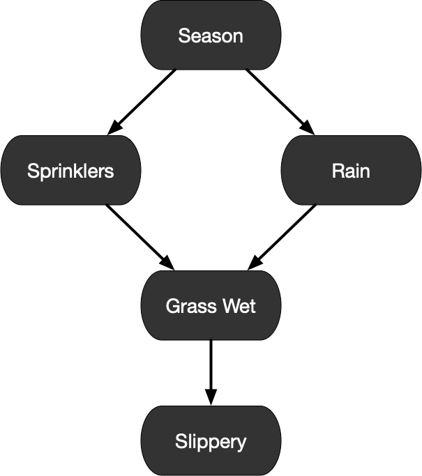_Causality_(2000, 2009)
:::

::: {.column width="40%"}

      Judea Pearl
:::

::::

::: {.notes}

- I'm going to tell you about a specific line of
    causal models, which uses graphs to describe causal pathways.
- The core elements of this field were actually
    written by a computer scientist at UCLA, Judea Pearl. This is an
    ad-hominem attack, but he is 
- Judea Pearl was working at UCLA on expert systems
    and became interested in modeling causality as a tool for
    machines to make decisions or to understand the world.
- This would normally be considered an advanced topic.
    We chose this as a starting point we want to equip you to
    recognize all the causal assumptions 
    that go into an analysis --  we don't want some of those
    assumptions to be hidden or implicit.
- This mode of reasoning will give us a visual way to
    make our assumptions very explicit.
- However, and we will cover this at the end of this
    section, we never get to directly 
:::

## How to Reason About a Causal Theory

::: {.notes}

- If there are no limitations on your causal graph,
    incredible complexity is possible.
- This graph contains only two sets of variables -- one
    set  of``controls'' (age, sex), and another set of confounders.
    Data is measured through time, so some are
    repeated; and the authors have estimated relationships through
    time.
- The point that we want to bring home here is that
    without structure, these quickly reflect the complexity of of the
    world.
:::

## Structural Equation Model (SEM) Basics

:::: {.columns}

::: {.column width="60%"}

__Endogenous variables__- $V$ : Vaccine
- $A$ : Antibodies
- $I$ : Infection__Background variables__- $\epsilon$ : Outside causes % \item Often hidden__Structural equations__- $V = f_V(\epsilon_1)$
- $A = f_A(V, \epsilon_2)$
- $I = f_I(A, \epsilon_3)$
:::

::: {.column width="40%"}

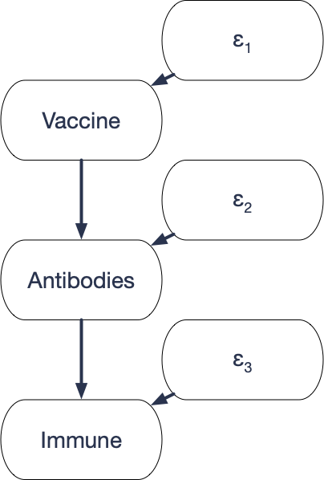
:::

::::

::: {.notes}

- \alex{Lets flip this graph.}
- \alex{Let's also include $\epsilon$}
- Here's what one of these models might look like
- Suppose that we focus on a subset of the variables on
    the directed graph. Each link is a causal effect
- For discussion we can think of two types of variables --
    those that are in focus, and those that we're ``blurring'' out --
    but in fact, they're all the same. Those that are 
- Finally, we have the structural equations.  These
    tell us how each endogenous variable responds to its parents
    in the causal graph
- For example, 
- These functions encode what we call counterfactuals.
    Each patient either has the vaccine or does not have the
    vaccine.  But the function 
:::

## Reading: Alleged Dangers of Cigarette Smoking
__Note: This is a reading call. We're just placing it here for
    organization.__

:::: {.columns}

::: {.column width="70%"}

    Read the two-page article, published in the BMJ in 1957 written by
    Ronald A. Fisher. Some context. R.A. Fisher is- Perhaps the most influential statistician _of all time_
- At the very least, up there with Bayes, Neyman, and the
      canon.
- The student interested in a longer-form profile of this
      content can read the following article written by Pricenomics. \href{https://priceonomics.com/why-the-father-of-modern-statistics-didnt-believe/}{[Link
        here]} .
:::

::: {.column width="30%"}

    Of course, smoking causes lung cancer -- Fisher was dogmatic.
:::

::::

## Example: Execution of an SEM
__Note: This is a whiteboard, we're just placing it here for
    organization.__
- What causes lung cancer?
- Coffee $\rightarrow$ Alertness $\rightarrow$ Work
- Interest $\rightarrow$ Awareness $\rightarrow$ Purchase

## 

## Execution of an SEM

:::: {.columns}

::: {.column width="60%"}

__Step one__- Draw values of $\epsilon_1, \epsilon_2, \epsilon_3$ .
- Assume $\epsilon_{1} \dots \epsilon_{k}$ are independent__Step two__- Assign endogenous variables their values\begin{align*}
        V &= f_V(\epsilon_1) 
 
        A &= f_A(V, \epsilon_2) 
 
        I &= F_I(A, \epsilon_3) 

      \end{align*}% \vspace{1cm}% \footnotesize{Note: If there are cycles, we assume the% equations have a unique solution}\note[item]{There's a lot more to Pearl's theory, but there you
        can see just the basic idea of an SEM.}
:::

::: {.column width="40%"}

:::

::::

::: {.notes}

- How do the variables in an SEM get their values?
- First step, the background variables have their values
    drawn.
- Next, we have to follow the causal pathways and see what 
    values each of the endogenous variables gets. Here, we can start
    with V...
:::

# Statistical Implications of a Causal Graph

## How to Apply an SEM
Causal models require that we write down, clearly, the assumptions
  about the causal process 
_in the data generating process_
.
  
- Evaluate how closely our data matches our _theory_ about the world
- Choose an appropriate estimator for the data and theory

::: {.notes}

- Now you know a little bit about SEMS, but how do you
    apply them?
- One idea is to choose functional forms for each
    structural equation, then fit to data to estimate parameters.  
- This is actually done in some areas.  One classic
    example is estimating supply curves and demand curves.
- But on the whole, these type of models aren't very
    common.  And the reason is that they are so highly specified.  How
    can you convince somebody that the functions you chose are
    accurate depictions of reality?
- There's another approach though, which is to use the
    causal graph to derive statistical assumptions.  So it doesn't
    matter what the functions are!  we just need to make sure we get
    the graph right.
:::

## Causal Graph Definition

::: {.callout-note title="Causal graph"}

    A __causal graph__ is a graph that describes the causal
    pathways among a subset of all variables.
  
:::

  Causal graphs encode our theory about the causal structure: 
  
  
1. If there is an arrow from $X$ to $Y$ , then $X$ has a direct
    causal effect on $Y$ .
2. If there is __no__ arrow from $X$ to $Y$ , $X$ has __no__ direct causal effect on $Y$ .
3. If $X$ and $Y$ have a common cause $Z$ , then $Z$ must be in
    the diagram, even if we cannot measure it.

::: {.notes}

- I put in the word subset, which means that we normally
    don't put in background variables, and we don't have to put in
    every possible variable in the world.  But there are two rules:
- This last condition -- that it go in the diagram even if
    we cannot measure it is a fail-safe that keeps us from being lazy,
    or missing connections that we should be worried about.
:::

## Examples of Causal Graphs

::: {.callout-note title="Example: Direct and indirect effects"}

- $V \rightarrow A \rightarrow I$ .  Vaccines have a direct
      causal effect on Antibodies, but no direct effect on
      Infection.

:::

::: {.callout-note title="Example: Common Causes"}

- Education $\rightarrow$ Wage.  Do we need to include motivation?

:::

## Statistical Implications of a Causal Graph

::: {.callout-note title="Theorem: independence"}

 
   If $X$ and $Y$ have no common ancestors in an
   acyclic SEM, they are independent.
 
:::

:::: {.columns}

::: {.column width="70%"}

\note[item]{\paul{worried this is too much to write}}\note[item]{If $X$ and $Y$ are background variables, true by
       assumption.}\note[item]{Induction: Assume the statement is true for all $X$
       and $Y$ in a set $S$, and let $Z$ be any node whose parents,
       labeled $P_1,P_2,...,P_k$ are all in $S$.  If $X \in S$ and $X$
       and $Z$ have no common causes, then $X$ shares no common causes
       with each $P_i$...}\note[item]{Let's draw a set S on this graph}\note[item]{How would you finish this proof?  $\implies X \indep
       P_i$.  Therefore, $X \indep Z = f_Z(P_1,P_2,...,P_k)$, and the
       statement is true for all $X$ and $Y$ in $S \cup \{Z\}$.}
:::

::: {.column width="40%"}

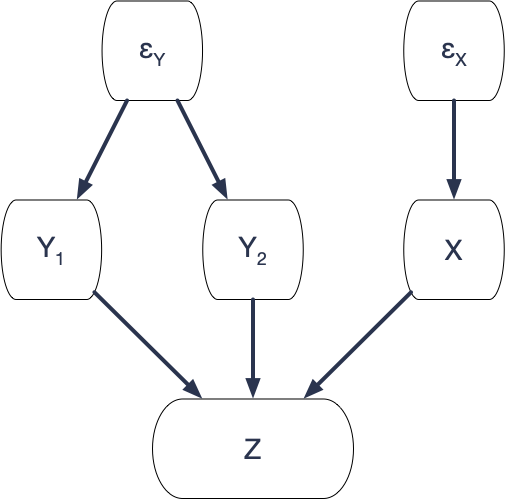
:::

::::

::: {.notes}

- A causal graph is a causal model, but it has statistical 
   implications.
- What is this telling us? In an SEM, associations don't
   happen by accident.  The reason that variables are dependent is
   because of common causes.  The randomness in 
:::

# The One-Equation Structural Model

## The Simplest Causal Graph
One causal relationship:
  
  
- A single outcome: $Max\_Speed$
- A set of background variables that have a causal effect on the
    outcome: $HP$ , $Weight$
- An error term that also has a causal effect on the outcome: $\epsilon$

::: {.notes}

- Let's take a look at the simplest possible causal graph.
    A lot of econometrics textbooks start off like this, but without
    making the assumptions explicit.
- We'll say more about the error term in just a moment.
:::

## The One-Equation Structural Model

\begin{align*}
    Max\_Speed  &= \beta_0 + \beta_1 HP + \beta_2  Weight + \epsilon
                  \tag{S} \\
    \text{Where } E[\epsilon] &= 0
  \end{align*}

::: {.notes}

- We can express this theory as a causal graph.  The only
    arrows are from the inputs to the outcome.
- If we assume the relationship is linear, we can also
    express it as a structural equation.
- This might look like any other linear equation, but it's
    not.  We're inside a causal model, and we're saying this equation
    represents the response of max speed to the inputs.
- If you put in different values of HP and Weight, you get
    a different max speed as a result.  That's what the causal model
    says
- We'll place an S next to structural equations to make
    them clear.
- Now if I manipulate this equation - say I solve for HP -
    it's still a valid equality, but it stops holding any causal
    interpretation.
:::

## The Error Term in Structural Equations
__To a statistician:__
$\epsilon$
 is the difference between the
  target and the prediction 
  
  
__To an explanatory modeler:__
$\epsilon$
 is unmeasured factors
  that have a causal effect on the outcome
  
  

::: {.notes}

- While we were doing pure statistics, we had an error
    term, and it represented the difference between our prediction and
    the target.  It had no special meaning beyond that.
- But that's not how econometricians, or political
    scientists, or epidemiologists look at 
- To them 
:::

## The Error Term in Structural Equations (cont.)
__Thought experiment:__
 Write down any missing variable that
  can affect the outcome. 
  
  
\begin{align*}
    Max\_Speed  = &\beta_0 + \beta_1 HP + \beta_2  Weight \\
                  &+ \underbrace{\beta_3 Air\_Resistance + \beta_4 Tires + ...}_{\mathlarger{\mathlarger{\epsilon}}}
  \end{align*}

::: {.notes}

- Think about the car.  We know that HP and Weight aren't
    the only things that make a car faster or slower.  That's why HP
    and Weight don't predict speed perfectly with zero error.
- Choose some other factor and write it down.  If you
    still can't predict speed perfectly, choose yet another factor and
    write it down.  Keep going an infinite number of times if you have
    to.
- If we could actually write down every possible factor
    that affects the outcome, maybe there would be no error left.
- However, we can't possibly measure all of these factors.
    So we write down 
- What does this mean?  We can't just assume the error
    term behaves the way we want.  we have to think about what factors
    might be inside it, and where they actually go in the causal
    graph.
:::

## Assessing the Causal Graph

  Two things we look for:
  
1. Are there any causal pathways back from $Max\_Speed$ to $HP$ and $Weight$ ?
2. Are there any common ancestors of $HP$ and $Max\_Speed$ or
      of $Weight$ and $Max\_Speed$ ?

::: {.notes}

- Here's what our causal graph looks like again.  Now
    let's think about exactly what we're assuming here. Remember we
    have two rules. 
- First, if there's no arrow somewhere, there's no direct
    effect. So in particular, we're assuming that there's no path from
    Max speed back to HP
- And if there was any common cause of HP and Max speed,
    we would have to add it.  What if we were wrong about air
    resistance,  we thought it only had an effect on max speed, but
    what if it also has an effect on HP?  We're assuming there's no
    variable like that.
- 
- If we believe that this graph is valid, that's really good news for estimation.
:::

## Estimation in the One-Equation Model

::: {.notes}

- Ok, we've done all this work, so that we can write down
    exactly what the one-equation structural model is.
- Now we're ready to estimate its coefficients.  and the
    way we do that is with OLS regression.
- The proof that OLS works is really quick with all the
    machinery we've built...
- $\epsilon$
:::

# Applications for the One-Equation Model

## An Important Question
standout

  When is the one-equation structural model valid?
  
  

::: {.notes}

- We've seen how useful the one-equation structural
    model is. 
- The elephant in the room is that our theory has to
    be true -- a supposition that we will 
- There was a time, when researchers believed in the
    one-equation model a lot - or at least they behaved like they did.
    Running OLS regressions, made small tweaks and supposed their
    results held a causal interpretation.
- But, this is a bit like Emperor Nero fiddling while Rome
    burns or putting a finger in a dike.
- Over time, and with better methods, we've been
    discovering that those old regressions were often far off the
    mark.
:::

## Confounding Variables in Observational Data
b

::: {.notes}

- Let's talk through one example.  A lot of labor
    economists are interested in this relationship.  From education to
    wage.  Suppose you decide to get an extra year of education, will
    that cause your wage to go up, and by how much?
- Is this a valid causal graph?  For it to be valid,
    education and wage can't have any common causes.  If they have
    common causes, we'd need to include them in the graph.
- You can see that the list gets big really quickly:
    
- Now it's true, if we could measure all these factors and
    put them into the regression, we could the problem. 
- The problem is that we can't possibly measure all of the
    possible factors.  I'm not sure we could even think of them all.
    And some of these may be impossible to measure.
- Nowadays, if you try to measure this effect with an ols
    regression, it's just not credible.  you could never publish work
    like that.
- This is really the common case with observational data.
    your default assumption should be that the one-equation model does
    not hold
:::

## When Is the One-Equation Model Credible?

- True experiments
- Some natural experiments
- Differenced panels

::: {.notes}

- So when CAN you believe the one-sample model?
- A few situations make it easy.
:::

## The True Experiment

:::: {.columns}

::: {.column width="60%"}

- Treatment $T$ is randomly assigned (e.g. coin flip) $\implies$ no incoming paths _other than the coin_ .
- Controls $C_1, C_2, C_3$ are either measured or determined before
        treatment - No paths from $T$ to controls, or controls to $T$
- Outcome $Y$ measured after $T$
:::

::: {.column width="40%"}

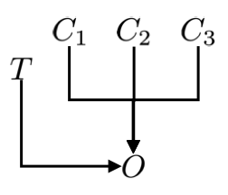
:::

::::

$\implies$
 OLS consistent estimates effect of 
$T$
 on 
$Y$
.

::: {.notes}

- A true experiment is considered the gold standard for
    measuring causal effects.
- One way to think about it, is you're using randomness to
    break links in the causal graph 
- In a true experiment, you can divide variables into
    three classes.
:::

## Some Natural Experiments
__Natural experiment:__
 A scenario in which we can exploit
  naturally occurring variation to estimate structural parameters 
  
  
- Often through instrumental variables, regression discontinuity,
    or other advanced techniques
- May enable OLS to _identify_ causal quantities if
    treatment is random - The Vietnam War lottery
- Tropical cyclones
- Forest fires
- Network outages

::: {.notes}

- There could be general trends, but if we stick to one
    cross section, and compare areas hit by a cyclone against areas
    that aren't hit, we may argue that there can't be many confounding
    variables.
:::

## Differenced Panels

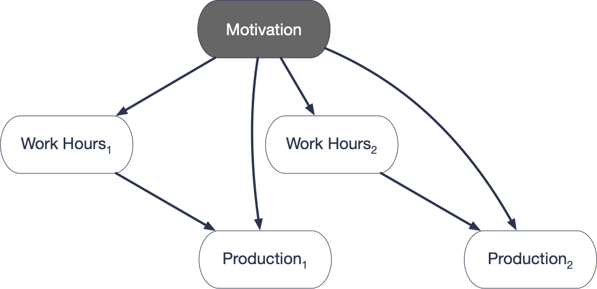

\begin{align*}
    Production_1 &= \beta_0 + \beta_1 Work\_Hours_1 + \beta_2 Motivation + \epsilon_1\\
    -\Bigg[ Production_2 &= \beta_0 + \beta_1 Work\_Hours_2 + \beta_2 Motivation + \epsilon_2 \Bigg]\\
    \hline
    \Delta Production &=  \qquad \beta_1 \Delta Work\_Hours \qquad
                          \qquad + (\epsilon_{1} - \epsilon_{2})
  \end{align*}

::: {.notes}

- This is what we call a diff-in-diff design.  our outcome
    is differences in productivity, and we're looking at the differences
    in that variable across people.  diff-in-diff.
- Confounding variables may be constant over time
- Suppose that we have data for 
- Note:  Cannot eliminate non-constant confounders
- But: what if Motivation in period 2 changes, depending on
    the work hours in period 1?
- So cannot help if the confounders change
- and it cannot help if there is reverse causality.
- But still, this design can be reasonably convincing in
    some scenarios.
:::

# Violations of the One-Equation Structural Model

# Omitted Variables

## Omitted Variables

:::: {.columns}

::: {.column width="50%"}

::: {.callout-note title="Assumed Model"}

      Education causes wages
    
:::
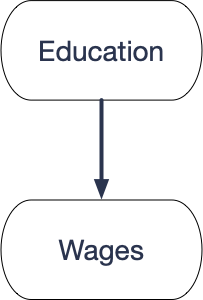
:::

::: {.column width="50%"}

::: {.callout-note title="True Model"}

 
      Motivation causes both education and wages
    
:::
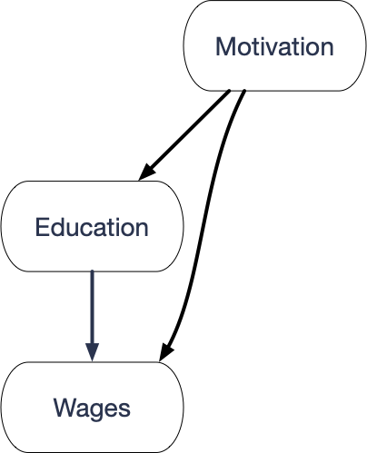
:::

::::

::: {.notes}

- When you do explanatory modeling, you work inside a causal theory.  You want your theory to be right, but you always worry that it may not be exactly right.  In particular, there could be causal pathways that you should have included, that you didn't include.
- That means that there's an extra step in your analysis.  you need to consider what the most likely errors in your causal graph might be.  and reason about how they might bias your estimates.
- In the case of the one-sample model, there are a couple of common violations that you need to watch out for.  The violation is what we call an omitted variable.
- It turns out that when we have an omitted variable, ols regression will not estimate the correct target!
:::

## Omitted Variables

:::: {.columns}

::: {.column width="45%"}

::: {.callout-note title="We fit"}

$W  = \tilde{\beta}_0 + \tilde{\beta}_1  E + \tilde \epsilon$
:::
:::

::: {.column width="55%"}

::: {.callout-note title="True structural equation"}

$W = \beta_0 + \beta_1 E + \beta_2 M + \epsilon$
:::
:::

::::

- We are interested in $\beta_1$ .
- What is the bias, $E[\tilde \beta_1 - \beta_1]$ ?

::: {.notes}

- We want to know this bias.  I'll show you how to calculate it.
:::

## Omitted Variable Bias in Simple Regression

:::: {.columns}

::: {.column width="45%"}

::: {.callout-note title="We fit"}

$W  = \tilde{\beta}_0 + \tilde{\beta}_1  E + \tilde \epsilon$
:::
:::

::: {.column width="55%"}

::: {.callout-note title="True structural equation"}

$W = \beta_0 + \beta_1 E + \beta_2 M + \epsilon$
:::
:::

::::

Regress 
$M$
 on 
$E$
:

$M = \delta_0 + \delta_1 E + \nu$

Consider two quantities

- $\beta_2$ is the effect of $M$ on $W$ .
- $\delta_1$ represents how related $M$ and $E$ are.

__Omitted Variable Bias:__
$\tilde{\beta}_{1}  - \beta_{1} = \beta_{2} \delta_{1}$

## Omitted Variable Bias in Multiple Regression

:::: {.columns}

::: {.column width="45%"}

::: {.callout-note title="We fit"}

$Y = \tilde{\beta}_0 + \tilde{\beta}_1 X_1 + \tilde{\beta}_2 X_2  + ...$$\qquad + \tilde{\beta}_{k-1} X_{k-1}   + \tilde \epsilon$
:::
:::

::: {.column width="55%"}

::: {.callout-note title="True structural equation"}

$Y  = \beta_0 + \beta_1 X_1 + \beta_2 X_2 + ...$$\qquad +\tilde{\beta}_{k-1} X_{k-1} +  \beta_k X_k + \epsilon$
:::
:::

::::

Regress 
$X_k$
 on other 
$X$
's:

$X_k = \delta_0 + \delta_1 X_1 + ... + \delta_{k-1} X_{k-1} + \nu$
__Omitted Variable Bias:__
$\tilde{\beta}_{1} -  \beta_1 =  \beta_{k} \delta_1$

::: {.notes}

- The fit model omits 
- As you can see, the formula for OVB is the same.  Once
      again, you should think about 
- But I should qualify that a little bit.  
:::

## Estimating Omitted Variable Bias

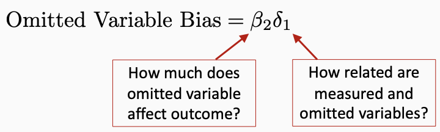

We fit:  
$\widehat{Wage} = \tilde{\beta}_0 + \tilde{\beta}_1 Education$
; 
\hspace{.1cm}
Omitted: 
$Motivation$

::: {.notes}

- By definition, we never know what our omitted variable
    bias is - the omitted variable is omitted.
- But actually, you can sometimes use your background
    knowledge to estimate the bias
- Not very accurately.  But at the least, you can estimate
    whether the bias is positive or negative, and that's actually
    pretty helpful.  You especially want to know if its pushing your
    coefficient towards zero or away from zero.
- In the wage equation, we mivght estimate the 
- The coefficient 
- Take a moment and think about this.  which is worse, bias
  towards zero or away from zero.
- The answer is, it's usually worse to have bias away from
  zero.  That's because the true effect is closer to zero, so we don't
  know how much of the relationship we see is real and how much is
  bias.  it might even be that the real effect is zero, or in the
  other direction. 
:::

## Assessing Omitted Variable Bias

 Which is worse: Bias toward zero or bias away from zero?

# Proof of Omitted Variable Bias

## The Omitted Variable Bias in Simple Regression

:::: {.columns}

::: {.column width="45%"}

::: {.callout-note title="We fit"}

$W  = \tilde{\beta}_0 + \tilde{\beta}_1  E + \tilde \epsilon$
:::
:::

::: {.column width="55%"}

::: {.callout-note title="True structural equation"}

$W = \beta_0 + \beta_1 E + \beta_2 M + \epsilon$
:::
:::

::::

::: {.notes}

- Draw each of the following
- $E[\epsilon] = 0$
- $cov[E,\epsilon] = 0$
- $cov(M,\epsilon) = 0$
- $\tilde{\beta}_1 = \frac{cov[W,E]}{var[E]} =  \frac{cov[\beta_0 + \beta_1 E + \beta_2 M + \epsilon,E]}{var[E]}$
- $\frac{\beta_1 var[E]  + \beta_2 cov[M,E]}{var[E]}  = \beta_1 +  \frac{ \beta_2 cov[M,E]}{var[E]}$
- What is the second term?  it looks like the formula for a regression coefficient.  But what regression?
- $M = \delta_0 + \delta_1 E + v$
- $\tilde\beta_1 = \beta_1 + \beta_2 \delta_1$
:::

# Reverse Causality

## Reverse Causality

:::: {.columns}

::: {.column width="50%"}

::: {.callout-note title="Assumed model"}

      Education causes wages
    
:::

:::

::: {.column width="50%"}

::: {.callout-note title="True model"}

      Education causes wages _and_ wages cause education
    
:::
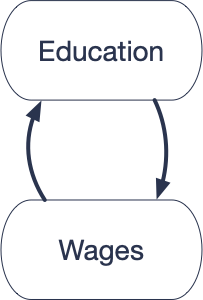
:::

::::

::: {.notes}

- What if having a higher wage allows people to pay for
    more education.
- Feedback
:::

## An SEM Version

:::: {.columns}

::: {.column width="50%"}

      True structural equations:\begin{align}
        W &= \beta_0 + \beta_1 E + \epsilon_1

        E &= \gamma_0 + \gamma_1 W + \epsilon_2
      \end{align}
:::

::: {.column width="50%"}

:::

::::

  Observations
  
- E is a descendant of $\epsilon_1$ .
- $\implies$ $E$ and $\epsilon_1$ are dependent.
- $\implies$ (1) is not the BLP.

  Since OLS estimates the BLP, it can't estimate (1).

::: {.notes}

- If we additionally assume that all the responses are linear, we get an SEM that looks like this.
- In our previous model, the structural equation always coincided with the BLP.  But that's not true here. 
- That's because 
- So what is the BLP?  We have to solve this system of equations...
:::

## Understanding Feedback

:::: {.columns}

::: {.column width="50%"}

      True structural equations:\begin{align*}
        W &= \beta_0 + \beta_1 E + \epsilon_1

        E &= \gamma_0 + \gamma_1 W + \epsilon_2
      \end{align*}
:::

::: {.column width="50%"}

:::

::::

  Suppose 
$\beta_1 > 0$
- Positive feedback $\gamma_1 > 0$ - $\tilde \beta_1 > \beta_1$
- Negative feedback $\gamma_1 < 0$ - $\tilde \beta_1 < \beta_1$

## Understanding the SEM Equilibrium

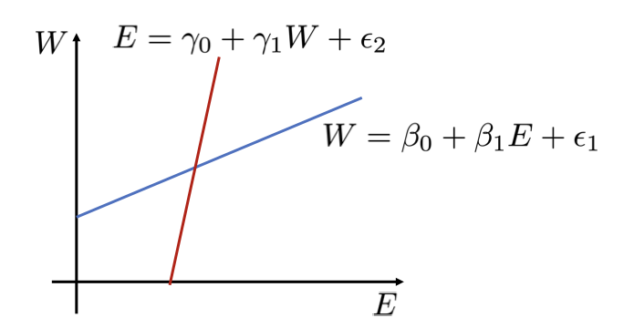

::: {.notes}

- As we're talking through this, we need to highlight the
    following:
- Our theory suspects that these functions are related to
    one another. But, we 
- This means that we have to look for circumstances where
    we have a random shock to the system where we can look at the
    consequences. For example, suppose that we gave out 
:::

## Understanding the SEM Equilibrium

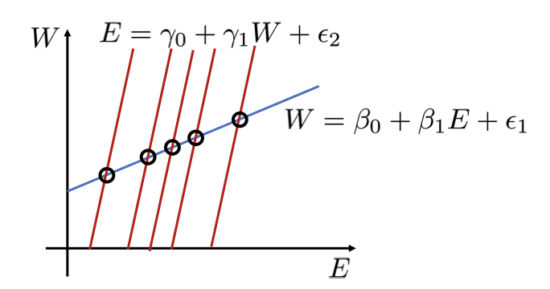

## Understanding the SEM Equilibrium

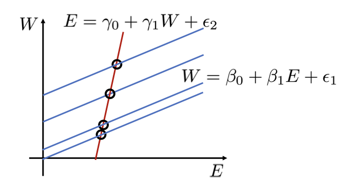

# Outcome Variables on Right-Hand Side

## Outcome Variables on the Right-Hand Side

:::: {.columns}

::: {.column width="50%"}

::: {.callout-note title="Assumed model"}

- Education causes wages
- Contacts in industry cause wages

:::
:::

::: {.column width="50%"}

::: {.callout-note title="True Model"}

- Education causes wages
- Contacts in industry cause wages
- Education creates contacts in industry

:::
:::

::::

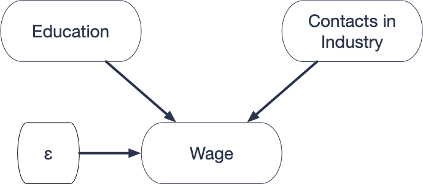

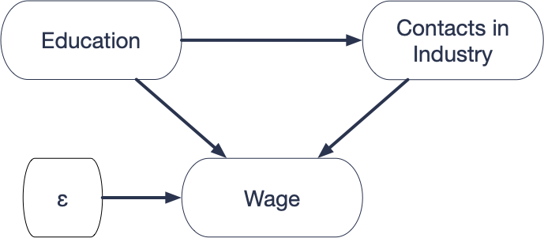

::: {.notes}

- This last violation, is not actually a violation.  But
      it is a tricky situation that you need to be careful with.
- Let's say you record E and W as before, and you also
      have a third variable, 
- Here's the issue.  We assume that the causal graph looks
      like the left one, but what if education causes you to have more
      contacts.  One of the main reasons for going to grad school is to
      build up your network.
- Can we use OLS to estimate the structural parameters?
:::

## Estimating the Structural Parameters

  Structural Equation: 
$W = \beta_0 + \beta_1 E + \beta_2 C + \epsilon \qquad(S)$
$\epsilon$
 and 
$E$
 have no common ancestors. 
$\implies \epsilon$
 and 
$E$
 are independent. 
$\implies cov(E,\epsilon) = 0$
$\implies$
 OLS is consistent for 
$\beta_1$

::: {.notes}

- The answer is yes.  The same proof as before.  I can
    draw in W's background variable 
- OLS is consistent for 
:::

## Interpreting the Structural Coefficient
$\beta_1$
 - The expected increase in Wage, from getting an extra
  year of eduction, holding the number of industry contacts constant. 
  
  

::: {.notes}

- Let's think about what the interpretation is
- But that's strange formulation, right?  Go to school for
    a year, but don't make any contacts?  Of course, that would
    probably limit wages, but why would you do that?  The research
    question we're interested in isn't about specific parts of
    education, it's about a year of education as a whole.  So this is
    probably a bad idea.
:::

## Take Away
standout

  Do not put outcome variables on the right hand side.

#  Explanatory Modeling Wrap-Up

## Take Aways

- Explanatory modeling takes place inside a causal theory.
- The one-equation structural model is usually wrong.
- In special circumstances, advanced techniques can overcome
    omitted variables and reverse causality. - To learn more, try the instrumental variables and
      simultaneous equations chapters in _Introductory
        Econometrics_ (Wooldridge).

::: {.notes}

- First, let me remind you that to do any explanatory
    modeling, you have to work inside a causal theory.  You could rush
    in, linear regressions blazing, but if you don't start with a
    causal theory, it's hard to know what your results mean.  At the
    least, it's worth your while to draw your causal graph, see if you
    can decide what your assumptions are.  It might tell you that you
    can use ols, it might require an advanced method like instrumental
    variables, or it might tell you that estimation is impossible, but
    at least you'll know.
:::

