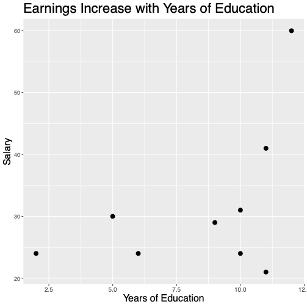
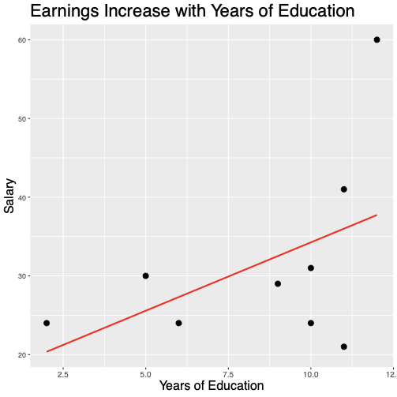
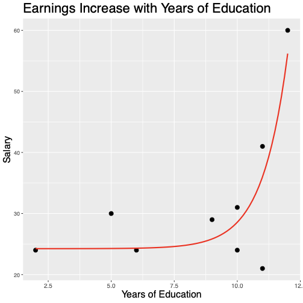
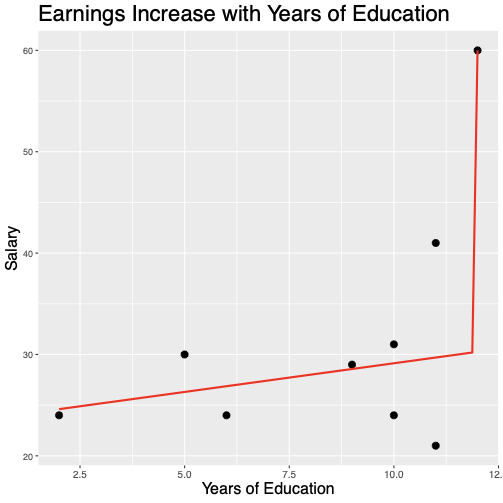

# 

# Properties of Maximum Likelihood Estimators

## Assumptions

1. $(X_1, X_2, X_3...)$ is an infinite sequence of I.I.D. continuous random variables
2. $f(X|\theta)$ is a family of probability density functions, with parameter $\theta$ in a compact space
3. if $\theta_1 \neq \theta_2$ , then the resulting distributions are different ( $P\big(f(X|\theta_1)/f(X|\theta_1) \neq 1 \big) >0$ )
4. $f$ is continuous in $\theta$ .
5. The log-likelihood is integrable ( $\E \big[ | \ln f(X|\theta) | \big] < \infty$ for all $\theta$ )

## MLE: Consistent when the Model is True

::: {.callout-note title="Theorem: Consistency of MLE"}

If $(X_1, X_2, X_3...)$ are drawn from $f(X|\theta_t)$ for some parameter $\theta_t$, then under assumptions 1-5,

$\theta_{MLE} \overset{p}{\rightarrow} \theta_t$
:::

## MLE: "Close" when the Model is False

::: {.callout-note title="Theorem: MLE and KL divergence"}

If $(X_1, X_2, X_3...)$ are drawn from some distribution $g$, and $\theta_c$ minimizes the KL divergence,

$\text{KL} \big[f(\cdot| \theta) \| g  \big] = \int_{-\infty}^\infty f( x | \theta) \log \frac{ f( x | \theta)}{g(x)}dx$
Then under assumptions 1-5,

$\theta_{MLE} \overset{p}{\rightarrow} \theta_c$
:::

## Extra Assumptions

1. The parameter $\theta_0$ that maximizes likelihood is in the interior of the parameter space.
2. Likelihood is twice continuously differentiable.
3. Intergration and differentiation operators are interchangeable for likelihood.
4. The Fisher information, $I(\theta_0) = - \E[ \frac{\partial^2 }{\partial \theta^2} \ln f(X|\theta) | \theta=\theta_0]$ exists and is nonsingular.

## MLE: Asymptotically Normal

::: {.callout-note title="Theorem: MLE is asymptotically normal"}

  Under assumptions 1-9,

  $\frac{\theta_{MLE} - \theta_0 }{\sqrt{n}} \overset{d}{\rightarrow} N\big(0,1/I(\theta_0)\big)$
:::

## MLE: Asymptotically Efficient

::: {.callout-note title="Theorem: MLE is asymptotically efficient"}

      Under assumptions 1-9, $\theta_{MLE}$ is asymptotically efficient.
  
:::

## Summary of MLE Properties

- Consistent when the model is true
- As close as possible when the model is false
- Asymptotically normal
- Asymptotically efficient

# Handling Outliers

## Outliers

::: {.callout-note title="Outlier definition"}

    An _outlier_ is:

  - A data point that is unusual (or unlikely) \pause
- With respect to some statistical model
\note[item]{That second part is very important: you cannot define an
    outlier without first choosing a statistical model.  Let's see
    this with a very simple example.}
:::

## Where is the Outlier? Part I

## Where is the Outlier? Part II

## Where is the Outlier? Part III

## Where is the Outlier? Part IV

## Lessons

- Outliers are interesting.
- An outlier could be telling you something important.
- __Never__ remove a point just because it is an outlier. - This is altering the data to fit your idea of what the model is.

::: {.notes}

- Every blockbuster movie is about an outlier.  The jedi
  protected the galaxy until one day one of them turned to the dark
  side.
- Outliers might be telling you something important, they
  might guide you to a new model specification.
- The thing about altering your data to fit your model is
  that you never know for sure what the true model is - so you need to
  approach outliers with some modesty.
:::

## How to Handle an Outlier
Is the outlier a coding error, measurement error, or
  otherwise not a meaningful value from the distribution being
  studied?

  
- Then, remove the outlier and document your decision.

  Is the outlier a meaningful value?

  
- Do not remove the outlier.

::: {.notes}

- This is where Alex and Paul can have a back and forth
    conversation about these pieces.
:::

## Alternatives to Removing Outliers
What are our options if we do 
_not_
 remove outliers?

  
1. Apply a log or exponential transform to represent non-linearity.
2. Adopt a more flexible functional form (e.g., polynomial terms).
3. Use indicator variables to treat outlying points separately.
4. Compute outlier robust statistics.

::: {.notes}

- There are different modeling choices that you can make,
    and outliers relative to a single model might lead us to be
    careful and critical about refitting a different model.
- Or, you can change your data; but there is an
    artlessness to changing the data. ``I'm just going to put it into
    a different universe is a silly way of resolving the problem.'' 
- You can see that the answer if complicated.  there can
    be different models with strengths and weaknesses. This is
    something that you'll get better at the more you dig into
    statistics.
:::

# Levels of Measurement

## Measuring Soup

:::: {.columns}

::: {.column width="40%"}

\begin{tabular}{c  c}
        Codebook 

        \hline
  1 = Shoyu 

  2 = Shio 

  3 = Miso
  \end{tabular}\begin{tabular}{c | c}
  Observation & Broth

  \hline
  1 & 1 

  2 & 3 

  3 & 1 

  4 & 2 

  5 & 1
  \end{tabular}
:::

::: {.column width="60%"}

:::

::::

_What is the average broth?_

::: {.notes}

- As we turn our attention to working with samples, we have to be think carefully about what operations are valid for our variables
- Here's a simple example: You have a dataset that lists the type of broth ordered at a Ramen restaurant.  You can see that each point is coded as a number.  1 represents Shoyu, 2 represents Shio, 3 represents Miso.
- Now the question: what is the average ramen broth?
- Is that a sensible question?
- You take take these numbers and average them.  But would the result have any meaning?
- Well, not really, because these numbers are arbitrary.  That means that the average is not a valid operation.
:::

## The Random Variable Definition

::: {.callout-note title="Random Variable"}

  Given probability space $(\Omega, S, P)$, a _random variable_ is a measurable function from $\Omega$ to  $\mathbb{R}$.
  
:::

- $\R$ usually means real numbers with field operations ( $+,-,\cdot,...$ ).
- Some operations may not be sensible.

::: {.notes}

- This is something we glossed over earlier.  Our definition of a random variable was a function from a sample space to R.
- When we say R, we usually mean the real numbers, but also all the operations that the numbers have.  you can add them, multiply, and so forth.
- So we assumed up till now that a random variable can do all the same operations that real numbers have.
- That may not make sense, we may need to restrict the things we can do.
:::

## Levels of Measurement

\begin{tabular}{c | c}
  Level & Operations \\
  \hline
  Nominal & = \\
  Ordinal & $<,=,>$ \\
  Interval & $-$, average, weighted average \\
  Ratio & All arithmetic operations
  \end{tabular}

\flushright
  - Stanley Smith Stevens

  

::: {.notes}

- To make sense of this, statisticians have divided variables into classes.
- Another word for these is levels of measurement.  They define the operations that are sensible for a random variable
- There are a lot of ways to do this, and a lot of classification schemes.  I'm going to show you the most famous one, which was developed by pychologist Stanley Smith Stevens
- Stevens defined 4 types of variables.  This is roughly hierarchy, a variable close to the bottom usually has all the operations above it.  It doesn't describe every possible structure that a variable could have.  But it's still useful 95
:::

## Nominal Variables
A 
_nominal variable_
 defines categories

    
- Can check if two values are __equal__ or __not equal__

:::: {.columns}

::: {.column width="45%"}

Other operations may not be defined- $<,>$
- $+,-,\cdot, /$
:::

::: {.column width="55%"}

:::

::::

::: {.notes}

- When you hear nominal, think about the ramen example.  We had broths that aren't related to each other.  We couldn't add them together, we can't even compare them and say that miso is greater than Shoyu.  All we can do is check if two broths are equal or not equal.
- So a bit more formally, nominal means that we have an equality operator that we can use to compare datapoint.
- But that may be the only operation.  Often when we say nominal colloquially, that's what we mean, no other operations.
- You can't use less than or greater than.  you can't add, subtract, multiply.
:::

## What Can You Do with Nominal Variables?

:::: {.columns}

::: {.column width="45%"}

 Valid:- Value Counts
- Mode
Requires more structure:- Median
- Mean
- Variance
:::

::: {.column width="55%"}

:::

::::

::: {.notes}

- What can do you with nominal variables?  One thing you can do is count.  You can generate a table to see how many customers order each type of broth, and then you can analyze that table.
- Pretty much any analysis you do starts with counting.
:::

## Ordinal / Rank Variables

:::: {.columns}

::: {.column width="45%"}

    An_ordinal variable_ defines categories that have an order.- Can apply $<,=,>$
Intervals may not be meaningful.- No $+,-,\cdot,/$
:::

::: {.column width="53%"}

:::

::::

::: {.notes}

- For an example, think of this vintage love meter.
- There are categories, and they have an order.  Burning > Wild, and Wild > Mild.
- That means that we can use 
- But an ordinal variable still doesn't allow arithmetic - no 
- Why not?  You don't know how big the intervals are between the categories
- If I ask you whether Burning - Wild is the same as Wild - Naughty but Nice, you can't tell.
- You can guess, but there's no scientific way to know which interval is bigger.
- Similarly, what's the average of Wild and Mild?  There's no way to know
- What can you do with ordinal variables?  One important thing is you can compute a median.  The median only uses the rank properties, so it's valid.
- You can compute other quantiles.  you can compute probabilities of getting a Wild score on this machine.
:::

## What Can You Do with Ordinal Variables?

:::: {.columns}

::: {.column width="45%"}

Valid:- Median, Quantiles
- Probabilities that A > B, etc.
Requires more structure:- Mean
- $+,-,\cdot, /$
- Notions of "shape" of distribution
:::

::: {.column width="53%"}

:::

::::

## Likert Scales
_The interface was easy to navigate_

\begin{tabular}{|p{1.7cm}|p{1.6cm}|p{1.6cm}|p{1.6cm}|p{1.6cm}|}
Strongly Disagree & Disagree & Neutral & Agree & Strongly Agree \\
\hline
1 & 2 & 3 & 4 & 5
  \end{tabular}

::: {.notes}

- Here's a slightly controversial example: a Likert scale
- You've probably seen one: This is a type of survey instrument, in which a participant evaluates a statement.
- Most often the answers range from strongly disagree, to strongly agree
- What kind of variable is this?  There's an order, 5 is bigger than 4, 4 is bigger than 3.
- But what about the intervals?  Is the difference between Strongly Agree and Agree, the same as between Agree and Neutral?  Maybe, maybe not.  We can guess, but there's no scientific way to argue for that.
- So I would say that this is an ordinal variable.
- If you look at articles, you'll that see a lot of people report means for Likert variables - not supposed to!
- Some people will argue that that's ok, that we can believe the intervals are close enough.
- You can argue one way or the other, but for this class, we want you to be conservative.  If you see a variable like this, it's ordinal, so do not take the mean.
:::

## Interval / Metric Variables

:::: {.columns}

::: {.column width="45%"}

    An_interval variable_ defines categories with consistent intervals- Can apply $-$ , average
May have no notion of zero- No $+,\cdot,/$
:::

::: {.column width="53%"}

:::

::::

::: {.notes}

- Next, we have Interval Variables.
- For an example, think of a temperature scale.
- There is a rank order, but intervals can be compared.  20-10 = 10-0
- That means we can subtract.  we can also average points together.  This is what we call the affine structure of R.
- But the zero point isn't really meaningful. (at least that's true for Celsius.  If you work with Kelvin, the zero has a meaning).
- If it's 80 degrees one day and 85 the next, you can't add them together - the result isn't meaningful.  that's because if you move the zero point, you get a different result.
- Also no 
:::

## What Can You Do with Interval Variables?

:::: {.columns}

::: {.column width="45%"}

Valid:- Mean
- Variance
- Most common statistics
Requires more structure:- Log
- Root-Mean-Square
:::

::: {.column width="53%"}

:::

::::

## Ratio Variables

:::: {.columns}

::: {.column width="45%"}

\note[item]{Finally, we have a ratio variable.  for an example, think about money.}\note[item]{money amounts have meaningful intervals.  An extra dollar is always an extra dollar.}\note[item]{And there's a meaningful zero point - zero dollars really represents zero}\note[item]{You can look at ratios.  a 10\% raise means something.}\note[item]{This means that you have the entire structure of the real numbers as a field.  so all possible operations are valid.}
    A_ratio variable_ defines categories with consistent intervals and a meaningful zero.- Can apply all arithmetic operations.
:::

::: {.column width="53%"}

:::

::::

## Levels of Measurement

\begin{tabular}{c | c}
  Level & Operations \\
  \hline
  Nominal & = \\
  Ordinal & $<,=,>$ \\
  Interval & $-$, average, weighted average \\
  Ratio & All arithmetic operations
  \end{tabular}

\flushright
  - Stanley Smith Stevens

  

::: {.notes}

- As we go forward, most of our statistical techniques will require one of these levels of measurement
- Those are important assumptions, and we'll try to highlight them for you.
:::

